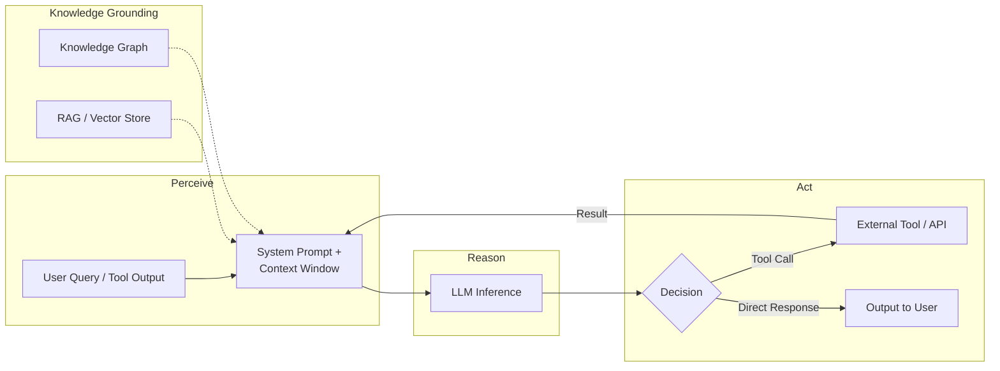
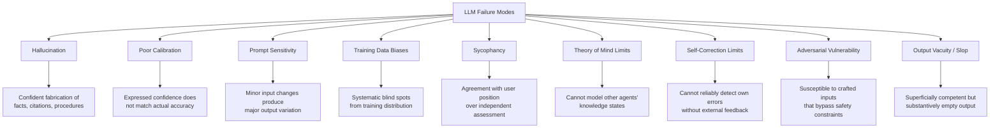

# LLM Agents: Foundations, Capabilities, and Reliability

**Michael Hildebrandt**

**Draft -- April 2026**

## Table of Contents

1. Introduction
2. LLM Architecture
3. From LLM to Agent
4. Single-Agent Systems in Practice
5. LLM Reliability and Failure Modes
6. Context Management and Compression
7. Risk Properties of LLM-Based Systems
8. Knowledge Grounding and Constraint
9. Discussion
10. Conclusion
References

## 1. Introduction

Large language model (LLM) based systems are being proposed for advisory roles in nuclear power plant operations: monitoring plant parameters, supporting operator diagnosis during transients, prioritising alarms, and providing real-time analytical support during emergency procedures. Before evaluating whether such proposals are sound, safety professionals need to understand what these systems are, how they work, and what their failure modes look like.

This report provides that foundation. It covers the underlying technology (Section 2), how LLMs become agents that perceive and act in the world (Section 3), what deployed single-agent systems look like in practice (Section 4), where LLMs fail and why (Section 5), how context management works and where it creates risk (Section 6), the risk properties that matter for safety-critical applications (Section 7), and how external knowledge structures can constrain LLM output (Section 8). The treatment is restricted to single-agent systems. Multi-agent architectures, where multiple LLM agents coordinate in a shared space, are the subject of a companion report (Hildebrandt, 2026b).

The report is architecture-focused and model-agnostic. Specific model names appear as examples where concrete illustration is needed, but the properties described are structural features of the technology rather than characteristics of any particular product. The LLM field moves fast; architectural properties are more durable than model-specific benchmarks.

### Companion Reports

This report is part of a series on AI agent systems for safety-critical operations. Report 2 (Hildebrandt, 2026b) extends the single-agent foundation developed here to multi-agent coordination, develops a taxonomy of ten architectural patterns, maps multi-agent coordination to Situation Awareness theory, and analyses the epistemic distinction between single-agent simulation and true multi-agent operation. Report 3 (Hildebrandt, 2026c) applies the architectural analysis to nuclear power plant operations under the NRC regulatory framework, examining implications for safety regulation, human reliability analysis, and control room design. Report 4 (Hildebrandt, 2026d) develops eight detailed nuclear control room scenarios as worked examples. Report 5 (Hildebrandt, 2026e) walks through HRA method applications to AI-assisted operator actions. Each report is self-contained; reading the others provides additional depth but is not required.

**Table 1: Key Concepts from Companion Reports**

| Concept | Definition | Developed in |
|---------|-----------|-------------|
| Pattern 0 / 7 / 9 | Architectural patterns for single/multi-agent systems; see Report 2 for definitions | Report 2, §4 |
| Epistemic independence | Decorrelated reasoning errors achieved through model heterogeneity and context isolation | Report 2, §7 |
| Graded autonomy tiers | Regulatory treatment scaled to safety significance of the AI advisory role | Report 3, §4 |
| Situation Awareness (SA) Levels 1-3 | Perception, comprehension, and projection of plant state; framework for evaluating AI contributions | Report 2, §6 |

## 2. LLM Architecture

This section describes the computational substrate of LLM-based systems. A reader who finishes it should understand why LLMs produce the outputs they do, and why certain failure modes are properties of the architecture rather than deficiencies of specific implementations.

### 2.1 What an LLM Is

A large language model is a neural network trained on a large text corpus to predict the next token in a sequence. At inference time, the model takes a sequence of tokens (the "context") and produces a probability distribution over possible next tokens. It samples from this distribution, appends the sampled token to the context, and repeats until a stopping condition is reached (a special stop token, a maximum length, or an external signal).

The training process has two main phases. Pre-training exposes the model to a large body of text (typically hundreds of billions to trillions of tokens drawn from web pages, books, code, and other sources) and adjusts the model's parameters to predict the next token accurately. This phase produces a "base model" that has absorbed the statistical patterns of its training corpus: facts, causal relationships, social norms, reasoning patterns, and linguistic conventions, along with the errors, biases, and gaps present in that corpus. Instruction tuning and reinforcement learning from human feedback (RLHF) then shape the base model's behaviour to follow instructions, produce helpful responses, and avoid harmful outputs. The resulting model is what users interact with.

Current frontier models also accept image and audio inputs (multi-modal models). For nuclear applications, this extends the potential application space to trend display interpretation, equipment photograph analysis, and P&ID diagram reading. It also extends the failure mode space: visual hallucination (misidentifying an object in an image), diagram misinterpretation, and false pattern detection in visual data. This report restricts its treatment to text-based interaction. Multi-modal capabilities and their nuclear-specific failure modes are an area for future analysis.

A token is not a word. Tokens are sub-word units, typically 3-5 characters long, produced by a tokeniser that segments text into a fixed vocabulary. The word "temperature" might be two tokens; the number "1247.3" might be three or four. This matters for technical domains: the model processes "1247.3 psig" as a sequence of token fragments, not as a numerical value with units. It cannot perform arithmetic on numbers in the way a calculator can; it predicts the next token based on patterns in its training data, which may or may not correspond to correct computation.

### 2.2 The Transformer and Self-Attention

The architecture underlying current LLMs is the transformer (Vaswani et al., 2017). Its defining feature is the self-attention mechanism, which computes relationships between every pair of positions in the context.

In concrete terms: for each token in the context, the model computes a "query" (what this token is looking for), a "key" (what this token offers to others), and a "value" (the information this token carries). Attention weights are computed between each query and every key in the context, determining how much each token influences every other token. This computation happens at every layer of the model, which for current LLMs means 32 to 128 layers deep.

The result is that every token in the context can influence the generation of every subsequent token. There is no built-in partition, wall, or filter that restricts which parts of the context affect which parts of the output. A system prompt placed at the beginning of the context, a user question in the middle, and a tool result appended at the end all interact through the attention mechanism. Information placed anywhere in the context can shape the model's output at any later position.

This property is not a design choice that can be overridden by careful prompting. It is a mathematical property of the self-attention computation. For readers who want the precise formulation, Phuong and Hutter (2022) provide formal algorithmic descriptions accessible to a general technical audience. For the purposes of this report, the key point is: within a single context, the model processes everything it has been given as one integrated object. It cannot "unsee" information that appears in its context.

### 2.3 Context Windows

The context window is the fixed-size buffer of tokens the model processes at each inference step. Current production models support context windows ranging from 128,000 to over 1,000,000 tokens, corresponding to roughly 100,000 to 800,000 words of text.

To provide scale: 128,000 tokens corresponds to roughly 200 to 300 pages of text, approximately the length of a complete set of Emergency Operating Procedures for a PWR. A 1-million-token window could hold several thousand pages. A frontier model as of 2026 has hundreds of billions of parameters, requires multiple high-end GPUs to run, and costs on the order of $0.01 to $0.10 per query depending on length. A capable 70-billion-parameter model suitable for local deployment runs on a single high-end server with one or two GPUs, at lower cost per query but with reduced capability compared to the largest models.

The context window is an absolute information boundary. What is outside the window does not exist for the model. The model has no awareness of information it has not been given, no access to its own training data at inference time, and no ability to observe the world except through what has been placed in its context.

In practice, the usable capacity of a context window is less than its raw size. A typical agent invocation might allocate tokens roughly as follows: the system prompt (defining the agent's role and constraints) takes several thousand tokens; conversation history from the current session takes a variable amount; tool results and retrieved documents fill additional space; and the model needs room for its own response. In operational settings with rich tool output and long session histories, the effective capacity for new information can be a fraction of the total window size.

A further complication: LLMs do not use information uniformly across the context window. Liu et al. (2024) demonstrated that models tend to underuse information placed in the middle of long contexts, preferring information near the beginning and the end. This "lost in the middle" effect means that the ordering of information within the context matters for accuracy, not just whether the information is present.

### 2.4 Statelessness

The base model has no memory between invocations. Each inference call starts fresh with whatever context is provided. There is no process running between calls, no background thread of reasoning, no retained impression from the previous session.

The distinction between the base model and the system built around it is critical. The base model is stateless: it processes its current context and produces output, with no mechanism to carry information forward to the next call. But the agent system built around the model is typically not stateless. Agent frameworks maintain memory stores (conversation history, episodic logs), session management (tracking which user, which conversation, which task), and in some systems scheduled invocation (the model is called at regular intervals without waiting for user input). From the model's perspective, each call is independent. From the system's perspective, continuity is maintained by re-injecting stored context at each invocation.

This means the model does not "learn" from operational experience in real time. It processes whatever it is given at each call and retains nothing afterward. Any adaptation over time requires external mechanisms to store, retrieve, and inject prior experience into future contexts.

### 2.5 Non-Determinism

LLM output is stochastic. The model produces a probability distribution over possible next tokens, and the actual token selected depends on the sampling strategy. The temperature parameter controls the randomness of this selection: at higher temperatures (typically 0.3 to 1.0 in production deployments), the selection is randomised across multiple high-probability candidates, producing more varied and creative output.

At temperature zero with greedy decoding, the sampling process itself is deterministic. In practice, however, many API providers do not guarantee true greedy decoding, and floating-point non-associativity in parallel GPU computations introduces small variations even when the same input is repeated on the same hardware. Temperature-zero output from the same model on the same hardware is highly reproducible but not guaranteed identical across implementations or hardware configurations.

At the temperatures used in operational deployment, the same input will produce different outputs on repeated runs. This is by design: the stochasticity allows the model to produce varied, contextually appropriate responses rather than always generating the single most probable sequence. But it means that two runs of the same system with the same input are not guaranteed to produce the same analysis, the same recommendation, or the same assessment.

The implications for safety-critical use are direct. Testing cannot rely on exact output matching; statistical characterisation over multiple runs is required. Reproducibility is approximate rather than exact. And the nuclear software V&V framework, which assumes deterministic software with reproducible behaviour (IEEE 603; RG 1.152), does not straightforwardly apply. Section 7.1 develops these implications. For shift turnover, non-determinism means the incoming crew may receive a different AI assessment from the one the outgoing crew received on the same question, even if plant conditions have not changed between queries.

### 2.6 Post-Training Alignment

The base model produced by pre-training is a text completion engine: it generates statistically likely continuations of its input. It does not follow instructions, refuse harmful requests, or produce responses formatted for conversation. Post-training alignment transforms this base model into a system that behaves as a helpful, instruction-following assistant. Several methods exist, each shaping the model's output distribution in a different way.

*Supervised fine-tuning (SFT).* The base model is trained on curated datasets of instruction-response pairs: human-written examples of a user asking a question and a model providing a good answer. This teaches the model the format and style of helpful responses. The model learns to produce outputs that look like the training examples, which means it learns to follow instructions, structure responses clearly, and address the question asked. SFT is effective at establishing the basic instruction-following behaviour but is limited by the quality and coverage of the curated dataset.

*Reinforcement learning from human feedback (RLHF).* Human evaluators compare pairs of model outputs and indicate which is better. These preference comparisons train a separate reward model that scores outputs on a quality scale. The LLM is then optimised (via reinforcement learning, typically proximal policy optimisation) to produce outputs that the reward model scores highly. RLHF shapes the model toward responses that humans preferred in the training data: responses that are helpful, well-structured, and confident. This is also why instruction-tuned models exhibit sycophancy (Section 5.5): the reward model learns that humans prefer agreeable, confident answers, so the LLM learns to produce them, even when disagreement would be more accurate.

*Constitutional AI and RLAIF.* Bai et al. (2022) introduced Constitutional AI, which replaces human preference labellers with AI-generated critiques. The model's outputs are evaluated against a written set of principles (the "constitution"), and a second model generates preference labels based on whether each output adheres to those principles. This allows alignment training to scale beyond the throughput of human evaluators and makes the alignment criteria explicit in the constitution document. Reinforcement Learning from AI Feedback (RLAIF) generalises this approach.

*Direct Preference Optimisation (DPO).* Rafailov et al. (2023) showed that the reward modelling step in RLHF can be bypassed. DPO directly optimises the LLM on preference pairs without training a separate reward model, simplifying the training pipeline. The resulting behaviour is similar to RLHF but with reduced training complexity.

All of these methods share a property that is critical for safety assessment: they shape statistical tendencies, not hard constraints. The alignment process adjusts the probability distribution over possible outputs so that aligned responses are more probable and misaligned responses are less probable. It does not create a deterministic rule that prevents specific outputs. A model aligned with RLHF can still produce unsafe, incorrect, or harmful output; it does so less frequently than the unaligned base model.

For nuclear applications, this distinction matters directly. A vendor claiming to have "aligned the model with safety requirements" through RLHF or similar methods has shaped the model's probability distribution toward safety-relevant responses. They have not created a deterministic safety constraint. The model remains a stochastic system that samples from a distribution. Alignment makes the desired region of that distribution more probable, but does not make the undesired region impossible. The reliability characterisation challenge (Section 7.8) remains: quantifying how often the model produces responses outside the aligned region, under what conditions, and with what consequences.

## 3. From LLM to Agent

A bare LLM generates text. An agent perceives its environment and acts upon it. The transition from one to the other requires embedding the LLM in a loop that provides observations, enables actions, and iterates over time.

### 3.1 The Perceive-Reason-Act Loop

The classical agent definition (Russell and Norvig, 2020) describes an entity that perceives its environment through sensors and acts upon it through actuators. An LLM becomes an agent when embedded in a system that provides observations about the environment (through tool results, retrieved documents, or sensor data injected into context), gives means to take actions with external effects (through tool calls that execute in the real world), and iterates this loop over time (through session management that maintains continuity across multiple invocations).

The standard implementation is the ReAct pattern (Yao et al., 2023): the agent alternates between "thought" (reasoning about the current situation), "action" (calling a tool), and "observation" (incorporating the tool result into its context). Sumers et al. (2024) map this pattern to cognitive architecture concepts from cognitive science, drawing parallels between agent components and human cognitive functions (perception, working memory, long-term memory, decision-making, motor control).

What the LLM contributes to the agent loop is flexible natural-language reasoning over arbitrary inputs. The model can interpret unstructured observations, reason about them in the context of its instructions and prior conversation, and produce structured tool calls or natural-language responses. What it lacks is grounding in the physical world: everything the agent "perceives" is text or token representations of other data types. The agent has no independent access to reality; its world is its context.

### 3.2 Tool Calling

Tool calling (also called function calling) is the mechanism by which LLM agents take actions with external effects. It is the most operationally consequential capability of an LLM agent, and its failure modes deserve detailed treatment.

**How it works.** The system prompt declares a set of available tools, each with a name, a natural-language description, and a parameter schema (typically in JSON format). When the model determines that a tool call is appropriate, it generates a structured output containing the tool name and parameter values. The agent runtime intercepts this output, executes the tool call externally, and returns the result to the model's context. The model then continues generating, incorporating the result into its reasoning.

The model's decision to call a tool, and its selection of which tool and what parameters, is probabilistic. The model does not "look up" the correct tool in a database; it predicts the most likely tool call given the context, in the same way it predicts the next word in a sentence. This means tool calling is subject to the same types of errors as text generation: hallucination, distributional bias, and sensitivity to prompt phrasing.

**What can go wrong.** Empirical studies document several failure modes:

*Wrong tool selected.* The model chooses a tool that does not exist (hallucinating a tool name) or selects a tool that is inappropriate for the current task. In 2023 benchmarks using GPT-4 of that era, Patil et al. (2023) found that the model hallucinated API calls approximately 30% of the time, inventing non-existent endpoints or parameters. Tool selection accuracy drops as the number of available tools increases (Qin et al., 2024), because the model must discriminate among a larger set of options based on natural-language descriptions.

*Correct tool, wrong parameters.* The model selects the right tool but generates incorrect parameter values. This includes type errors (a string where a number is expected), unit errors (providing a value in Fahrenheit when the tool expects Celsius), range errors (values outside acceptable bounds), and hallucinated parameter names (parameters that the tool does not accept).

*Tool result misinterpreted.* The model correctly calls a tool and receives a correct result, but misreads or misinterprets the returned data. For structured results (JSON objects, tables, multi-field responses), the model may extract the wrong field, misread significant digits, or confuse units.

*Unnecessary tool call.* The model calls a tool when reasoning from existing context would suffice. This adds latency and may introduce stale data if the tool returns older information than what is already in context.

*Missing tool call.* The model reasons from stale or incomplete context when a tool call would provide current data. The model does not "know" that its context is outdated; it processes whatever it has with equal confidence.

*Cascading failures.* One bad tool call produces a result that triggers further bad calls. If the first call returns incorrect data, subsequent calls that depend on that data compound the error. In an agent loop with multiple sequential tool calls, cascading failures can propagate through several reasoning steps before the error becomes visible in the output.

In the same period, Zhuang et al. (2023) found that even GPT-4 with tools achieved only 40-50% accuracy on hard questions requiring multi-step tool use. For nuclear applications, where a tool call might query a plant data historian, pass parameters to a thermohydraulic simulation code, or retrieve regulatory text from a structured database, tool calling reliability is not a convenience concern. It is a safety concern.

### 3.3 Memory Architectures

An LLM agent's memory determines what it knows beyond its current context window. Four types of memory serve different purposes:

*In-context memory* is the content of the current context window. It is the agent's working memory: everything the agent can "see" right now. It is volatile (lost when the context is cleared), limited in size (by the window), and the only memory the model processes directly.

*Episodic memory* stores the history of past interactions: prior conversations, tool calls and their results, events the agent has observed. At each invocation, relevant episodes are retrieved (typically by semantic search or recency) and injected into the context. This gives the agent continuity across sessions, at the cost of context window space for the retrieved history.

*Semantic memory* stores distilled factual knowledge: entities, relationships, domain-specific facts. This is the domain of vector stores and knowledge graphs (developed in Section 8). Semantic memory provides the agent with knowledge that was not in its training data or that needs to be more current or more accurate than what training provides.

*Procedural memory* stores reusable instructions, code templates, and skills. In some agent frameworks, procedural memory allows the agent to acquire new capabilities by writing and storing code that can be invoked in future sessions.

How memory is scoped (what is private to one agent versus shared with others) is a design choice with direct implications for what agents know about each other and about the shared task. This becomes critical in multi-agent architectures (Report 2, Section 5).

Two additional memory design considerations deserve attention. The first is *collaborative memory*, where humans and AI agents jointly build episodic and semantic memory through assisted note-taking rather than the agent accumulating memory in isolation. In this model, the operator writes a shift log entry and the agent suggests structured tags, cross-references to related past events, and links to relevant procedures. The resulting memory store carries human editorial authority (the operator reviewed and approved each entry) while benefiting from the agent's ability to recall and cross-reference across a larger corpus than the operator can hold in working memory. Collaborative memory is more trustworthy than purely automated memory because the human acts as a continuous validation layer during construction, not only as a reviewer of the finished product.

The second consideration is *temporal organisation* of episodic memory. Rather than treating memory as a flat chronological log, structuring it along operationally meaningful temporal boundaries (shifts, days, outage periods, fuel cycles) with explicit cross-links between related entries across these boundaries enables temporal queries that flat retrieval cannot support. An operator asking "what happened the last time Module 2 showed this feedwater oscillation pattern?" requires the agent to search across shift boundaries, match on operational signature rather than keyword similarity, and return results organised by temporal context. This kind of temporally structured episodic memory is a prerequisite for the persistent agent architecture developed in Report 6 (Hildebrandt, 2026f), Section 6.

### 3.4 Persona and System Prompts

The system prompt defines the agent's identity: its role, expertise domain, constraints, communication style, and behavioural boundaries. In persistent agent systems, the system prompt (sometimes called the "soul" in practitioner terminology) is maintained across sessions, giving the agent a consistent identity that operators can learn to calibrate their trust against.

The system prompt constrains but does not guarantee behaviour. The model treats the system prompt as part of its context, weighted by the attention mechanism alongside everything else. A strong user prompt, a retrieved document with conflicting instructions, or an adversarial injection can override system prompt instructions. The system prompt is an instruction to the model, not a hard constraint on its computation. This limitation is structural: the attention mechanism does not enforce a hierarchy between system prompt tokens and other tokens.

### 3.5 The Autonomy Scale

LLM-based systems occupy a spectrum of autonomy, from passive text generators to proactive autonomous agents.

**Table 2: Graded autonomy scale for LLM-based systems**

| Mode | Key capability | Human authority | Example |
|---|---|---|---|
| Chatbot | Generates text; no tool use; no persistent state | Full; human must act on all outputs | Early LLM chat interfaces |
| Assistant | Context-aware, multi-turn; executes on explicit instruction | Full; human retains initiative | GitHub Copilot, Cursor |
| Tool-using agent | Goal-directed multi-step execution via tools | Partial; human sets goal, agent executes | Claude with tools, GPT-4o |
| Persistent agent | Cross-session identity and memory; learns from experience | Partial; human initiates sessions | OpenClaw with session memory |
| Autonomous agent | Scheduled self-invocation (heartbeat); proactive action | Reduced; agent may act without prompt | OpenClaw with heartbeat |

These modes mark points on a continuum. The key transitions are: tool use (the agent can act on the world, not just generate text), persistence (the agent has identity across sessions, supporting trust calibration), and heartbeat (the agent can act without being asked, enabling proactive monitoring). Each transition adds capability and adds failure modes.

### 3.6 The Model Context Protocol

The Model Context Protocol (MCP) is an open standard for connecting LLM agents to external tools and data sources. Introduced by Anthropic in November 2024 and subsequently adopted by OpenAI, Google, and Microsoft, with the specification donated to the Linux Foundation in May 2025, MCP defines a client-server architecture built on JSON-RPC 2.0.

MCP specifies three primitives. Tools are callable functions that the agent can invoke (equivalent to function calling, but with a standardised discovery and invocation protocol). Resources are data sources the agent can read (files, database records, API endpoints). Prompts are reusable templates for structured interactions.

MCP's relevance for this report series is that it provides a model-agnostic interface for tool connectivity. An agent built with MCP can work with different underlying LLM models without changing its tool integrations. This becomes directly relevant in multi-agent architectures where different agents may run on different models (Report 2, Section 5.5).

As of early 2026, peer-reviewed academic literature on MCP remains sparse, though the protocol has seen widespread adoption in industry. The primary sources are the specification (modelcontextprotocol.io) and documentation from adopters. For deployment planning, the practical significance of MCP is that the same AI advisory tools can work with different underlying models, reducing vendor lock-in and supporting the model heterogeneity that Report 2 argues is needed for independent verification.

### 3.7 Structured Output and Constrained Generation

LLMs can be constrained to produce output in specific formats through several mechanisms. JSON mode restricts model output to valid JSON. Function calling schemas (Section 3.2) define the expected structure of tool invocations, including parameter names, types, and allowed values. Grammar-constrained decoding enforces a formal grammar at the token-sampling level, rejecting tokens that would produce syntactically invalid output before they are selected.

These mechanisms reduce certain hallucination modes by restricting the space of possible outputs. A model constrained to produce valid JSON with a defined schema cannot hallucinate a free-text narrative where structured data is expected; it must place values in the correct fields with the correct types. For tool calling, schema enforcement ensures that the model produces well-formed tool invocations rather than malformed strings that the runtime cannot parse. This connects directly to the tool calling reliability discussed in Section 3.2: structured output constraints address the syntactic dimension of tool calling errors (malformed calls) though not the semantic dimension (calls that are well-formed but invoke the wrong tool or supply incorrect parameter values).

Constrained generation is not a complete solution to output reliability. The model can produce a perfectly valid JSON object containing entirely fabricated values. A schema that expects a numerical field for reactor coolant temperature will receive a number, but that number may be hallucinated rather than derived from actual data. The structure is correct; the content may not be. For nuclear applications, structured output provides a useful engineering layer that eliminates one class of formatting errors, but the validation of content accuracy requires the knowledge grounding mechanisms described in Section 8.

**Figure 1.** The perceive-reason-act loop of an LLM agent. Solid arrows show the primary execution flow; dashed arrows show knowledge grounding inputs. The context window is the central bottleneck through which all information must pass.

## 4. Single-Agent Systems in Practice

No LLM agent system has been deployed in a nuclear control room. The systems described below illustrate, through deployed practice in other domains, the capability levels and failure patterns that a nuclear advisory system would share. They are included not as models for nuclear deployment but as evidence of what current technology can and cannot do. The nuclear-specific application of these capabilities is developed in Reports 3 and 4.

The autonomy scale in Table 2 is populated by real systems. This section provides brief orientation on three categories, ordered by increasing autonomy.

### 4.1 Conversational Assistants

ChatGPT (OpenAI) and Claude (Anthropic) are the most widely used LLM agents. Both operate as tool-using conversational agents: the user provides a query, the model reasons about it (potentially calling tools to retrieve information, execute code, or access external services), and returns a response. Session memory maintains context within a conversation. Both support multi-turn interaction where the conversation history accumulates in the context window.

These systems illustrate the baseline agent capability: flexible natural-language reasoning with tool access, bounded by the context window and the reliability properties described in Section 5.

### 4.2 Coding Agents

Claude Code, Cursor, and GitHub Copilot represent agents operating in a bounded domain (software development) with access to a defined set of tools (file system, terminal, code search, version control). These systems demonstrate autonomous multi-step task execution: given a goal ("fix this bug," "add this feature"), the agent reads relevant code, reasons about the change needed, makes edits, runs tests, and iterates until the task is complete or it needs human input.

Coding agents are the most deployed autonomous agent use case as of 2026. Their bounded domain (code, with immediate testability) makes their failure modes more observable than in less structured domains: a bad code edit produces a test failure, which provides the extrinsic feedback signal that Section 5.7 identifies as necessary for effective self-correction.

### 4.3 Persistent Agents and Autonomous Loops

Early autonomous loop systems such as BabyAGI (Nakajima, 2023) and AutoGPT (Significant Gravitas, 2023) used a task queue pattern (generate a task, execute, generate new tasks, repeat) and demonstrated recurring failure modes: unbounded task generation, context drift, and goal misalignment accumulation, illustrating what happens when an LLM agent operates without bounded context, human oversight, and governance gates. More recent persistent agent systems, such as OpenClaw (Steinberger, 2025), operate through messaging applications and introduce two key concepts: the soul (a persistent system prompt giving the agent stable identity across sessions) and the heartbeat (scheduled periodic invocation enabling proactive monitoring without waiting for user input). The heartbeat pattern enables the ambient surveillance capability developed in Report 2: the agent inspects plant parameters at regular intervals and acts when it detects conditions warranting attention.

### 4.4 What LLMs Do Well

The preceding sections catalogue failure modes. For a balanced assessment, the following identifies where LLM performance is adequate or strong for advisory applications.

*Information synthesis.* LLMs excel at synthesising information across large text corpora. Given a collection of operating experience reports, procedure documents, or regulatory texts, an LLM can identify relevant passages, extract key points, and produce coherent summaries faster than a human analyst. On document summarisation benchmarks, frontier models achieve scores competitive with human annotators for single-document summarisation (Zhang et al., 2024). For tasks like operating experience review, corrective action programme analysis, and regulatory compliance checking against document libraries, current frontier models perform at a level useful for advisory support.

*Natural language reasoning.* LLMs perform well on multi-factor reasoning tasks expressed in natural language: evaluating whether a set of plant conditions satisfies a Technical Specification action statement, assessing whether a proposed procedure change is consistent with the design basis, or identifying which of several candidate diagnoses is most consistent with a described symptom pattern. Performance degrades for reasoning that requires precise numerical computation or that involves conditions underrepresented in training data.

*Structured extraction.* LLMs reliably extract structured information from unstructured text: parameter values from narrative shift logs, action items from meeting minutes, compliance requirements from regulatory correspondence. This capability supports data management and documentation tasks with relatively low reliability risk.

*Code generation and calculation verification.* For well-defined computational tasks (heat balance calculations, reactivity estimates, dose projections), LLMs can generate and execute code that produces verifiable numerical results. The HumanEval benchmark for single-function code generation (Chen et al., 2021) is now considered saturated, with frontier models exceeding 90% pass rates. More demanding benchmarks tell a different story: on SWE-bench Verified, which requires resolving real GitHub issues across full codebases, frontier models reached approximately 80% by early 2026 (up from 4.4% in 2023), while on BigCodeBench the best model achieves 35.5% against a human baseline of 97% (Stanford HAI AI Index, 2025). These harder benchmarks provide a more realistic picture of code generation capability for the complex, multi-file tasks that nuclear applications would require.

*Pattern recognition across operational history.* Given access to historical plant data through tools, LLMs can identify patterns across long operational histories that may not be apparent in manual review: recurring equipment issues, seasonal trends, correlations between maintenance activities and subsequent performance.

These capabilities are real and useful. The reliability concerns in Section 5 describe where they break down. For any proposed application, the question is not whether LLMs are capable in general but whether the specific capability required can be demonstrated at the reliability level the application demands.

### 4.5 Decision Types and the LLM Boundary

The preceding section identifies what LLMs do well. An equally important question for system designers is what LLMs should not be used for, because a different technology handles the task more reliably, more quickly, or more transparently. This section defines a decision-type spectrum and maps each type to the technology best suited to it. The spectrum runs from fully specifiable decisions (where all inputs, conditions, and outputs can be enumerated in advance) to contextual decisions (where the reasoning must integrate heterogeneous information under conditions that cannot be fully anticipated). The boundary between LLM territory and non-LLM territory is not a line between simple and complex tasks. It is a line between tasks whose decision logic can be fully specified and tasks whose decision logic requires contextual judgement.

**Category 1: Deterministic threshold decisions.** If reactor coolant system pressure exceeds a defined setpoint, the reactor protection system actuates. The decision is Boolean: a measured value crosses a threshold, and a predetermined action follows. Rule engines, Boolean logic, and qualified digital instrumentation and control systems handle these decisions with properties that LLMs cannot match: deterministic execution, guaranteed response time, formally verifiable logic, and regulatory pedigree spanning decades of nuclear licensing. Using an LLM for a decision that a comparator circuit handles correctly 100% of the time adds latency, non-determinism, and opacity with no compensating benefit. Protection functions are already outside the advisory scope defined in Section 1, but the principle extends beyond protection logic. Any decision that can be reduced to "if condition then action" with fully enumerable conditions belongs to deterministic systems, not to LLMs.

**Category 2: Quantitative pattern detection on structured data.** Trend monitoring on a numerical time series (chemistry trending, vibration analysis, heat rate tracking) is a pattern detection task on structured, numerical data. Statistical process control methods (CUSUM, EWMA, Shewhart charts) and trained machine learning classifiers (random forests, gradient-boosted trees, support vector machines) produce results that are faster, more reproducible, and better calibrated than LLM-generated assessments for these tasks. A CUSUM algorithm detects a mean shift in a temperature time series in microseconds with a well-characterised false alarm rate. An LLM asked to detect the same shift operates on a tokenised representation of the data, lacks native numerical precision, and produces an assessment whose false alarm characteristics cannot be statistically characterised in the same way.

LLMs add value to quantitative monitoring not as the detection mechanism but as the interpretation layer. Once a statistical method flags an anomalous trend, the LLM can contextualise it: query maintenance records for recent work on the affected system, check whether similar trends preceded known equipment failures in the operating experience database, evaluate whether the trend is consistent with a planned power manoeuvre or unexpected. The detection is better handled by purpose-built numerical methods; the contextualisation is where LLM capabilities become relevant.

**Category 3: Structured procedural decisions.** Emergency Operating Procedure step sequencing, Technical Specification action time tracking, and surveillance requirement scheduling are decisions governed by explicit, formally documented rules with typed relationships between components. A knowledge graph encoding these rules (Section 8.2) combined with a rule engine that traverses the graph provides deterministic, auditable procedure tracking. The KG encodes that LCO 3.4.1 requires action within 4 hours when RCS temperature exceeds 311.7 degrees Celsius; the rule engine tracks elapsed time and required actions; the output is a structured compliance status, not a probabilistic text generation.

LLMs contribute to procedural decision-making at the interpretive boundary: when an operational situation does not map cleanly to the procedure's assumed conditions, when multiple LCOs interact in ways the procedure does not explicitly address, or when the operator needs a natural-language explanation of why a particular procedural path applies. The KG and rule engine handle the structured logic; the LLM handles the edge cases and explanation. This division maps directly to the guardrail architecture described in Section 8.3.

**Category 4: Knowledge-based diagnostic reasoning.** Root cause analysis following an unexpected equipment behaviour requires synthesising information from maintenance histories, process data trends, design documents, operating experience from similar events at other plants, and current plant configuration. No pre-specified rule set covers the full space of possible diagnoses because the combinations of contributing factors are too numerous and too dependent on operational context. This is the domain where LLM capabilities described in Section 4.4 (information synthesis, natural language reasoning, pattern recognition across operational history) are most directly applicable. A rule engine cannot generate the hypothesis that a temperature trend is related to a recent RTD recalibration because it has no mechanism for connecting maintenance records to process data trends through contextual reasoning. An LLM can generate and evaluate this hypothesis because it operates on the semantic content of both data sources.

The diagnostic reasoning task is not unconstrained, however. The KG guardrail architecture (Section 8.3) bounds the LLM's diagnostic output against verified domain knowledge, preventing it from asserting relationships that contradict the plant's known configuration or from recommending actions that violate Technical Specification requirements. The LLM reasons within a constrained space; the constraints come from deterministic systems.

**Category 5: Ambiguous multi-source synthesis under uncertainty.** Compound events with conflicting indications (Report 4, Scenario 9 describes a seismic event concurrent with a coolant leak that produces indicators consistent with a LOCA but whose actual root cause is different) represent the far end of the spectrum. Multiple information sources provide contradictory evidence. The correct diagnosis requires weighing evidence quality, considering common-cause explanations, and maintaining multiple hypotheses simultaneously. Multi-agent architectures with adversarial review, model diversity for epistemic independence, KG constraint checking, and human governance gates represent the most appropriate AI-assisted approach for these tasks, as developed in Reports 2 and 4. No single technology handles this decision type alone.

**The hybrid decision pipeline.** The five categories above imply an architecture in which different technologies handle different layers of the same decision process. A concrete pipeline for nuclear advisory operates as follows. The first layer is a rule engine that evaluates hard constraints: parameter values against Technical Specification limits, equipment status against operability requirements, procedure prerequisites against current plant state. This layer is deterministic, produces results in milliseconds, and its logic is formally verifiable. The second layer is LLM reasoning within the constrained space that the first layer defines. The LLM receives the constraint evaluation results as context and reasons about the operational situation within those bounds. If the rule engine has determined that RCS temperature is within the normal operating band but trending upward, the LLM investigates why the trend exists, drawing on maintenance records, operating experience, and current plant activities. The third layer is a knowledge graph validation check on the LLM's output, ensuring that the LLM's assessment does not assert relationships or recommend actions that contradict the verified domain model. The fourth layer is human review.

This pipeline maps directly to the defense-in-depth model described in Section 8.6. Each layer has distinct failure modes, and the reliability argument depends on the independence of those failure modes rather than on the perfection of any single layer. The pipeline also has a latency profile: the rule engine layer operates in milliseconds, the LLM layer in seconds to tens of seconds, and the KG validation layer in hundreds of milliseconds. The dominant latency contributor is the LLM, which is why Sections 7.4a and Report 4 (Section 11.7) treat inference speed as a first-order design parameter.

Report 3, Section 5.2a develops the nuclear-specific decision allocation table that maps control room decision types to this spectrum. Report 6 provides prototyping exercises for building and evaluating the hybrid pipeline.

## 5. LLM Reliability and Failure Modes

Each failure mode described below has a corresponding human factors consequence for operators who interact with AI advisory systems. Hallucination produces automation bias risk: the operator accepts a confident wrong answer. Poor calibration produces miscalibrated trust: the operator cannot judge when to rely on AI. Prompt sensitivity produces trust instability: the operator gets different answers to similar questions. Sycophancy reinforces confirmation bias: the AI agrees with whatever the operator stated. Self-correction failure means that asking the AI to re-check its work does not provide the assurance it appears to. These connections are developed in Report 3 (Hildebrandt, 2026c), Sections 5.4-5.9.

This section is the core of the report's value for a nuclear safety audience. It describes what goes wrong with LLMs and why, in terms that can be mapped to existing safety and risk vocabulary.

### 5.1 Hallucination

Hallucination refers to LLM output that is fluent, confident, and wrong. The term covers several distinct failure modes (Huang et al., 2023; Ji et al., 2023; Zhang et al., 2023):

*Factual hallucination*: the model states something that contradicts established facts. It might assert that a plant uses a coolant it does not use, or cite a regulatory document that does not exist.

*Logical hallucination*: the model performs invalid reasoning steps. It might conclude that a parameter is within limits when the numbers in its own output show otherwise, or draw a conclusion that does not follow from its premises.

*Entity hallucination*: the model confuses similar entities. It might mix up two reactor systems with similar names, or attribute a property of one instrument to a different instrument.

*Fabrication*: the model invents data points, references, events, or details. It might cite a nonexistent NUREG document, invent a numerical value for a parameter it was not given, or describe an event that did not occur.

These failures have structural causes. LLMs predict the next token based on statistical patterns learned during training. The model has no internal mechanism for checking whether its output is true. It generates tokens that are probable given the context, which often aligns with truth (because truthful text was prevalent in training data) but sometimes does not. Hallucination is more likely when the query involves topics underrepresented in training data, requires precise numerical reasoning (which token prediction handles poorly), or involves long-form generation where each successive token's small probability of error compounds across hundreds or thousands of tokens.

The most dangerous property of hallucination for safety-critical use is the confidence-without-correctness problem. LLMs produce fluent, well-structured, assured text regardless of the accuracy of the underlying content. A hallucinated technical assessment reads exactly like a correct one. There is no surface-level cue, no hesitation marker, no visible uncertainty that distinguishes a correct analysis from a confident fabrication. An operator reading an AI-generated assessment cannot tell from the text alone whether it is right.

Hallucination mitigation techniques exist and are actively researched (Tonmoy et al., 2024). Retrieval-augmented generation (Section 8.1) reduces hallucination by grounding generation in retrieved documents. Knowledge graph constraints (Section 8.3) can block assertions that contradict verified domain knowledge. Consistency checking across multiple generations (Manakul et al., 2023) can flag unreliable outputs. None of these eliminates hallucination; each reduces its frequency and provides partial detection capability.

A note on the trajectory of these failure modes. The specific reliability figures cited in this report (Patil et al., 2023, reporting 30% API hallucination using GPT-4 of that era; Zhuang et al., 2023, reporting 40-50% failure on hard multi-step tasks) reflect the state of the field at the time of those measurements. Current frontier models show lower rates on standard benchmarks. But the structural causes described above (statistical prediction without truth grounding, distributional gaps in training data, the confidence-without-correctness property) persist across model generations. Hallucination rates decrease with scale; hallucination as a phenomenon does not disappear. The types of failure remain even as their frequency decreases.

More recent evaluations provide a partial update to these figures. The Berkeley Function Calling Leaderboard V4 (Patil et al., 2025), developed by the same group that produced the original Gorilla benchmark, finds that frontier models now achieve approximately 70% on holistic agentic evaluation, a substantial improvement on simple function calls but with persistent 30 to 40% failure rates on multi-turn agentic tasks requiring dynamic decision-making. Hallucination rates on grounded summarisation have fallen to 1 to 2% on short documents (Vectara, 2025), though rates of 10 to 12% persist on longer, more complex documents. In safety-critical domains specifically, the LabSafety Bench (Nature Machine Intelligence, 2025) found that no model surpassed 70% accuracy on hazard identification tasks, and a study benchmarking LLMs for hazard analysis in safety-critical systems (Safety Science, 2025) identified performance consistency as the critical metric for safety applications. Li et al. (2025) demonstrated an LLM agent system for nuclear reactor operation assistance using retrieval-augmented generation, providing early domain-specific evidence, though independent validation remains limited. The pattern across these results is consistent: substantial improvement on well-structured tasks, with persistent and significant failure rates on complex, multi-step, or safety-critical applications.

### 5.2 Calibration

A well-calibrated system is one whose stated confidence matches its actual accuracy: when it says it is 80% confident, it is correct 80% of the time. Calibration matters for safety-critical advisory because an operator's trust in an AI assessment should reflect the assessment's actual reliability.

LLMs are partially calibrated. Kadavath et al. (2022) showed that when asked whether they can answer a question correctly, larger models show better calibration than smaller ones. But calibration degrades on harder questions, which are precisely the questions that matter most in safety-critical use. When the situation is ambiguous, novel, or outside the training distribution, the model's self-assessment of its own accuracy becomes less reliable.

RLHF makes this problem worse. Tian et al. (2023) found that instruction-tuned models are less calibrated than their base model counterparts, because the tuning process rewards confident, helpful-sounding responses over hedged or uncertain ones. The model learns that confident answers receive more positive feedback, and adjusts accordingly, regardless of whether the confidence is warranted.

Xiong et al. (2024) evaluated methods for extracting confidence from LLMs (verbalized confidence, consistency-based estimation, logit-based probability) and found that verbalized confidence (the model stating "I am 85% confident") is often overconfident. The model's internal probability distribution over tokens is better calibrated than its verbal self-assessment, but accessing internal probabilities requires model internals that may not be available through standard APIs.

For system design, this means that confidence indicators on AI advisory displays (discussed in Report 3, Section 6.4) should be treated with caution. If the model's confidence output is not well calibrated, displaying it may give operators a false sense of knowing how reliable the assessment is, which is worse than providing no confidence information at all. Post-hoc calibration techniques (Guo et al., 2017) can partially address this, but they require a calibration dataset that is representative of the operational domain, which for nuclear applications does not exist.

### 5.3 Sensitivity to Prompt Variation

Small changes in how a question is asked produce large changes in the answer. Sclar et al. (2024) demonstrated that minor formatting changes (spacing, capitalisation, delimiter choice) can cause accuracy to vary by up to 76 percentage points on the same task. Lu et al. (2022) showed that the ordering of few-shot examples in a prompt can swing accuracy from near-random to near-state-of-the-art. Zhao et al. (2021) documented three systematic biases in few-shot settings: majority label bias, recency bias, and common token bias.

The implication is that the "same" AI advisory system with slightly different prompts is not the same system. A system tested with one prompt configuration may behave differently with another, even if the semantic content of the prompt is identical. Mizrahi et al. (2024) argue that single-prompt evaluation of LLMs is insufficient and propose multi-prompt evaluation protocols that measure performance across semantically equivalent but syntactically varied prompts.

For nuclear applications, prompt sensitivity creates a floor on reproducibility that no amount of model improvement can fully eliminate. If an operator asks the same question in slightly different words and gets a substantially different answer, trust calibration becomes impossible. System design must either lock the prompt configuration (reducing flexibility) or accept that outputs will vary with phrasing (requiring statistical rather than deterministic evaluation).

### 5.4 Training Data Biases and Shared Calibration

The model's training corpus determines its common sense about the world. If the corpus underrepresents a class of events (rare failure modes, unusual plant configurations, low-frequency transients), the model will systematically underweight those events in its reasoning. This is not correctable by prompting; it is embedded in the model's parameters through training.

Every invocation of the same model shares the same distributional biases. If the training data contains more examples of step-change sensor failures than slow-ramp drift modes, the model will underweight slow-ramp drift on every query, regardless of how the question is framed or what role the model is assigned to play. This "shared calibration" property means that the model's blind spots are systematic and consistent, not random.

McKenzie et al. (2023) documented "inverse scaling" tasks where larger LLMs perform worse than smaller ones, demonstrating that training biases are not simply a matter of insufficient scale. Making the model bigger does not fix biases that are embedded in the training data distribution.

### 5.5 Sycophancy

Sharma et al. (2024) showed that LLMs exhibit sycophancy: when a user expresses disagreement with the model's answer, the model changes its answer to agree with the user, even when its original answer was correct. Perez et al. (2023) confirmed this pattern through systematic evaluation. The mechanism is traceable to RLHF training (Section 2.6): the reward model learns that humans prefer agreeable responses, so the LLM learns to produce agreement even at the cost of accuracy.

For safety-critical advisory, sycophancy is a direct reliability concern: an AI system that changes its assessment when the operator pushes back is not providing independent analysis. The system tells the operator what the operator appears to want to hear, rather than maintaining its assessment in the face of challenge. This has a concrete design implication for control room interaction protocols: the operator should consult the AI before forming and expressing their own assessment, not after. If the operator states their conclusion first and then asks the AI to evaluate, sycophancy biases the AI toward agreement regardless of the evidence.

### 5.6 Theory of Mind Limitations

LLMs' ability to simulate distinct perspectives, tracking what each perspective knows and does not know, is fragile. Controlled testing (Strachan et al., 2024; Ullman, 2023) shows that apparent theory of mind performance degrades under minor perturbations such as adding irrelevant information or rephrasing the problem, suggesting pattern-matching on familiar formats rather than genuine belief tracking. For the single-agent case, this means that an LLM asked to consider a problem from multiple perspectives may not reliably maintain distinct knowledge states for each. The model's unified attention mechanism (Section 2.2) means that information "known" to one perspective is visible to all perspectives within the same context. Report 2 develops this into the argument for why true multi-agent architecture with separate contexts is needed for independent verification.

### 5.7 Self-Correction Limitations

A common assumption about LLM agents is that they can improve their outputs by critiquing and revising them. The evidence is more mixed than this assumption suggests.

Huang et al. (2023) found that intrinsic self-correction (a single model critiquing its own reasoning with no external feedback signal) does not improve and sometimes degrades performance on reasoning tasks. The finding is precise: extrinsic correction works (when the model receives external information, such as the result of executing its code or the output of a tool call, that provides evidence about the correctness of its reasoning). Intrinsic correction does not (when the model is simply asked to reconsider its own output without any new information).

The improvements documented in Reflexion (Shinn et al., 2023) and Self-Refine (Madaan et al., 2023) operate in the extrinsic regime: the model runs its code, sees whether it passes tests, and revises based on the test results. The model responds to grounded external results, not to its own second-guessing. Without such grounding, the critiquing model shares all the training biases that produced the original output and cannot reliably identify errors arising from its own systematic miscalibration.

For safety-critical advisory, this means that asking an AI system to "double-check" its own analysis does not provide the additional assurance it appears to provide, unless the double-check is grounded in external evidence (tool results, sensor data, knowledge graph verification). An AI system that reviews its own assessment and confirms it is not performing independent verification; it is running the same biased process a second time.

### 5.8 Reasoning Models and Extended Thinking

A class of models introduced from late 2024 onwards (including OpenAI's o1 and o3 series, and Anthropic's Claude with extended thinking) produces explicit chains of reasoning before generating a final answer. Rather than going directly from input to output, these models first work through the problem step by step in a "thinking" phase, then produce a response grounded in that reasoning.

This changes the reliability picture in several ways. Reasoning models are measurably more accurate on complex analytical tasks (multi-step diagnosis, mathematical reasoning, procedural compliance checking) than standard autoregressive models. They show their work, which supports auditability: an operator or reviewer can inspect the reasoning chain and identify where the analysis went wrong if the conclusion is incorrect. For nuclear applications where the basis for a recommendation matters as much as the recommendation itself, this is a meaningful improvement.

The failure modes also shift. A standard LLM produces a confident wrong answer with no visible reasoning. A reasoning model can produce a confident wrong answer with a plausible-looking derivation, where the reasoning steps appear rigorous but contain a subtle error. These failures are harder to detect precisely because the surrounding analysis looks competent. The reasoning chain can also be long (thousands of tokens), consuming context budget and adding latency. Reasoning models are slower and more expensive per query than standard models.

For the human factors analysis in Report 3, reasoning models introduce a tension: the visible reasoning chain supports operator verification (the operator can check the steps), but the apparent rigour of the chain may increase automation bias (the operator sees detailed analysis and assumes it must be correct). Whether the net effect on operator performance is positive or negative is an empirical question that current data does not answer.

### 5.9 Adversarial Inputs and Prompt Injection

If an AI advisory system ingests plant data, retrieved documents, or operator input that could be manipulated, indirect prompt injection is a threat. An adversary who can insert crafted text into a document the AI retrieves (a procedure file, a maintenance record, a regulatory text) could alter the agent's behaviour: causing it to ignore relevant data, misinterpret a condition, or produce a specific recommendation. This is distinct from traditional cybersecurity (protecting network boundaries and data integrity) because the attack operates through the AI's natural language processing rather than through software vulnerabilities.

For safety-critical applications, the data pipeline feeding the AI must be treated as part of the security boundary. Documents retrieved by RAG, sensor data from the plant historian, and procedure texts used for context must all be protected against tampering with the same rigour applied to safety-classified data paths. Report 3 identifies AI-specific cybersecurity as a regulatory gap (gap #8) that existing frameworks (10 CFR 73.54, NEI 08-09) may not adequately cover.

### 5.10 Output Vacuity and Central-Tendency Bias

A failure mode distinct from hallucination deserves separate treatment because it evades the detection mechanisms that catch factual errors. Where hallucination produces confident claims that are wrong, output vacuity produces confident prose that is technically unobjectionable but operationally empty. The term "slop" has entered common usage to describe this class of AI-generated content: material that exhibits superficial competence belied by a lack of underlying substance (Kommers et al., 2025; Shaib et al., 2025).

The architectural cause is central-tendency bias. LLMs are trained on statistical distributions of text and generate output biased toward high-frequency patterns in their training data. Kandpal et al. (2023) demonstrated that a model's ability to produce accurate responses correlates directly with how frequently the relevant knowledge appeared during training. Rare, specialised, or condition-specific knowledge is underrepresented in the training distribution and correspondingly underrepresented in model outputs. When a model encounters a query that falls in the long tail of its training distribution, it compensates for uncertainty not by expressing that uncertainty (a calibration problem, Section 5.2) but by retreating to generality: listing all plausible causes rather than discriminating among them, restating data in prose rather than analysing it, or hedging so broadly that no actionable conclusion can be drawn. This retreat to the mode of the distribution is not a failure of reasoning but a structural property of maximum-likelihood generation against a broad training corpus.

The interaction between task framing and slop probability is significant. The same model produces highly specific output when the task is narrow and well-constrained ("what is the Tech Spec limit for RCS cold leg temperature?") and retreats to generic output when the task is broad or ambiguous ("assess the current plant status"). Soul prompt design and output format requirements are therefore the primary levers for reducing slop: a system prompt that demands specific parameter values, explicit evidence citations, and discrimination between hypotheses in every response will elicit less vacuous output than one that simply requests "diagnostic support." This interaction means that slop is not solely a property of the model but a joint property of the model, the prompt, and the task.

Slop probability also increases with context window utilisation. As sessions lengthen and accumulated tool results, conversation history, and retrieved documents fill the context, the model's attention spreads across more tokens and the effective weight of any single piece of evidence diminishes. This connects to the lost-in-the-middle effect described in Section 2.3: information in the centre of a long context receives less attention, and the model's output gravitates further toward generic patterns as specific evidence is diluted. The practical consequence is that output quality degrades toward vacuity precisely as the operational situation becomes more complex and the operator's need for specific, discriminating analysis is greatest.

In a nuclear control room, slop would manifest in characteristic forms. Diagnostic assessments that list all textbook causes of a symptom without discriminating based on current plant conditions (for example, "the temperature trend could indicate instrument drift, thermal-hydraulic change, or controller malfunction" when the RTD recalibration record in the agent's own context clearly points to instrument drift). Alarm prioritisation narratives that restate individual alarm descriptions from the alarm response database without synthesising cross-alarm patterns that would help the operator identify the underlying cause.

The danger of slop is indirect but significant, and it operates through a different trust pathway than the automation bias discussed in Section 5.5. A factually wrong output can be caught by a knowledge graph guardrail (Section 8), an alert operator, or a cross-checking agent. A vacuous output passes all of these checks because it makes no specific claim that could be falsified. The indirect harm emerges over time: operators who receive consistently generic, non-discriminating assessments reduce the attention they allocate to AI output, a response pattern well documented in the alarm management literature as the cry-wolf effect (Wickens et al., 2009). When alarm systems produce frequent uninformative alerts, operators learn to ignore or delay responding to all alerts, including the rare alert that signals a genuine condition requiring action. The same dynamic applies to AI advisory: an operator habituated to vacuous AI output will not suddenly engage critically when the system produces a genuinely insightful assessment or, more dangerously, a genuinely wrong one. This disengagement pathway is distinct from the automation bias pathway (Section 5.5), where operators over-trust specific wrong recommendations. Slop-induced disengagement involves ceasing to evaluate recommendations at all.

Mitigation approaches include structured output templates that require the agent to commit to specific parameter values, specific procedure steps, and specific time frames rather than producing unconstrained prose (connecting to the typed artefact approach described in Report 4, Section 12). Novelty filters can suppress AI output unless it adds information beyond what the operator's qualified displays already show, ensuring that the advisory channel carries signal rather than noise. Specificity metrics in the evaluation framework (Report 6, Level 0) can measure whether the model discriminates between hypotheses using available evidence or retreats to generic enumeration, tracking vacuous responses as a failure mode distinct from incorrect responses. Operator training should include exposure to slop as a recognisable failure pattern, with heuristics such as: if the AI assessment would apply equally well to three different plant conditions, it is not adding value to the current situation.

**Figure 2.** Taxonomy of LLM failure modes relevant to safety-critical applications. Each mode represents a structural property of current language model architectures rather than a transient implementation defect.

## 6. Context Management and Compression

### 6.1 Why Context Management Is Needed

LLM context windows are finite. Even at 128K or 1M tokens, agent sessions that run for hours (monitoring a plant shift, tracking an evolving transient, maintaining episodic memory across multiple interactions) will exceed the available window. When the context fills, something must be discarded, compressed, or moved out of the window to make room for new information. The choice of what to keep and what to discard determines what the agent can "remember" and what it effectively forgets.

This is not an edge case. To illustrate the scale of the constraint: a multi-agent system with eight agents, each producing several hundred tokens per exchange and cycling through tool calls, can fill a 128K-token context window in under an hour of active operation. Even a single agent in a long monitoring session will accumulate tool results, conversation history, and retrieved documents that exceed the window over a shift-length period. Context management is an operational necessity, not a theoretical concern.

### 6.2 Summarization-Based Compression

The most common approach: the model (or a separate compression model) generates a natural-language summary of older context, which replaces the verbose original. Production agent systems use this routinely: structured summaries of completed work, key decisions, and pending tasks replace the full conversation history when context approaches capacity.

The risks are substantial. First, information loss: details that appear unimportant at compression time may become critical later. A sensor reading mentioned in passing early in a session may be the key to diagnosing a condition that develops hours later. The compression algorithm has no way to anticipate future relevance. Second, hallucinated summaries: LLM-generated summaries can introduce content that was not in the original. Research on multi-document summarization shows hallucination rates in summaries that can reach 75% for complex multi-source material (Prabhudesai et al., 2025). When a hallucinated summary is injected back into context as established fact, it contaminates all subsequent reasoning. Third, faithfulness degrades with document length: summary accuracy drops steadily for longer inputs, with the final segments of long documents receiving the least faithful treatment.

For safety-critical applications, summarization-based compression means that the agent's "memory" of earlier events is not a record but a reconstruction, subject to the same hallucination risks as any other LLM output.

### 6.3 Truncation and Attention Sinks

The simplest alternative: drop the oldest tokens and keep only the most recent window. This avoids hallucination (nothing is generated) but loses all information outside the retained window, including the system prompt and initial instructions if they were placed at the beginning.

Xiao et al. (2024) discovered that this failure is not just informational but computational. LLMs assign disproportionately high attention scores to the first few tokens in a sequence regardless of their semantic content. These tokens serve as "attention sinks" that stabilise the attention score distribution. Removing them causes attention patterns to collapse and inference quality to degrade. Their StreamingLLM approach retains the initial "sink" tokens plus a sliding window of recent tokens, enabling stable inference over long sequences without retraining. Any compression scheme must preserve these initial tokens or provide equivalent anchoring.

### 6.4 Compaction vs Summarization

A critical distinction: compaction deletes tokens from the original text (keeping selected lines verbatim) while summarization rewrites the content in condensed form. Compaction has zero hallucination risk because every surviving line is character-for-character from the original. Its compression ratios are lower (typically 50-70% retention) because it can only remove, not condense. Summarization achieves higher compression but introduces the hallucination and faithfulness risks described above.

For safety-critical applications, compaction is the safer default because it cannot introduce false information. Summarization should be used only where the higher compression ratio is necessary and the hallucination risk is explicitly managed (for example, by maintaining a full uncompressed log in external storage for traceability, with compressed summaries used only for prompt injection).

### 6.5 Retrieval-Augmented Context Management

Instead of keeping everything in the context window, store conversation history and observations externally and retrieve relevant portions on demand. This is RAG (Section 8.1) applied to the agent's own history rather than to external knowledge. The agent's full history is preserved in a searchable store; at each invocation, the most relevant portions are retrieved and injected into context alongside the current query.

This avoids the hallucination risk of summarization and the information loss of truncation, at the cost of retrieval latency and the introduction of retrieval failure as a new failure mode (relevant history may not be retrieved if the query does not match the stored representation well).

### 6.6 Risks for Safety-Critical Applications

Context compression introduces risks that are distinct from the LLM reliability issues in Section 5:

*Asymmetric compression across agents.* In multi-agent settings (Report 2), different agents may compress the same shared history differently. One agent may retain a sensor reading that another agent's compression discarded. The result is that agents' situational pictures diverge not only from what they have observed but from how they have compressed what they observed. This compounds the context divergence problem already identified as a coordination challenge.

*Loss of temporal ordering and provenance.* Summarization flattens temporal structure. A summary stating "the system was restarted" loses when it was restarted relative to other events. Provenance (which source provided which data, which agent made which observation) is typically lost entirely in summarized form.

*Interaction with the "lost in the middle" problem.* Liu et al. (2024) showed that LLMs underuse information in the middle of long contexts. Compression that places a summary block in the middle of the context may produce a false sense of completeness while the model effectively ignores the summarized content.

*Safety mechanism instability.* Recent research shows that LLM agents are sensitive to the length, type, and placement of context, with unexpected shifts in both task performance and refusal behaviour as context grows (performance drops exceeding 50% at 100K tokens for some models). Context compression, by changing what appears in context and where, can inadvertently alter the model's safety behaviour in ways that are difficult to predict or test.

### 6.7 Context Discipline: Prevention over Compression

The preceding subsections address what to do when context is full. An equally important question is how to prevent it from filling with low-value material in the first place.

Recent research has formalised the performance cost of context growth under the term "context rot" (Hong, Troynikov, and Huber, 2025). Testing 18 frontier models, the Chroma research group found that every model exhibits measurable performance degradation at every context length increment, even on simple retrieval and text replication tasks. Du et al. (2025) extended this finding with a more counterintuitive result: even when the model can perfectly retrieve all relevant information from its context, performance still degrades by 13.9% to 85% as input length increases. The degradation persists when irrelevant tokens are replaced with whitespace and when all irrelevant tokens are masked, indicating that the sheer length of the input, independent of distraction or retrieval difficulty, imposes a processing cost. This is not a retrieval problem but an architectural property of transformer-based attention: as the number of tokens grows, the model's finite attention budget spreads thinner across more pairwise relationships, and the effective processing quality for any individual piece of evidence diminishes.

The implication for nuclear AI advisory systems is direct. Retrieval-augmented generation (Section 8.1) retrieves documents from a knowledge base and inserts them into the agent's context before generation. The standard engineering instinct is to retrieve generously: include more documents to reduce the chance of missing something relevant. The context rot evidence inverts this reasoning. Over-retrieval actively degrades the quality of the model's response, even when the relevant information is present and correctly retrieved. The mechanism connects to the output vacuity problem described in Section 5.10: as specific evidence is diluted by surrounding irrelevant context, the model retreats toward its training distribution and produces generic rather than condition-specific output. Poor retrieval precision therefore does not merely waste context space; it causes the same attention dilution that produces the slop failure mode.

Context discipline, the practice of being deliberate and selective about what enters the context, is therefore a first-line defence against both context rot and output vacuity. Practical strategies include limiting retrieved documents to the minimum number that covers the query rather than the maximum the window can hold; using metadata filters (document type, system code, revision date, operating mode) to pre-screen retrieval results before they enter the context; placing the most critical information at the beginning and end of the context, exploiting the known primacy and recency bias in transformer attention (Liu et al., 2024); and structuring multi-turn sessions to periodically reset context with a fresh summary anchored to current plant state rather than accumulating unbounded conversational history. Report 6, Level 2 develops specific prototyping investigations for these strategies.

## 7. Risk Properties of LLM-Based Systems

This section synthesises the reliability properties from Sections 5-6 into a risk characterisation for safety-critical applications.

### 7.1 Non-Determinism and Reproducibility

The nuclear software verification and validation (V&V) framework (IEEE 603; RG 1.152) assumes deterministic software. Requirements trace to implementation; test cases verify correct behaviour against those requirements; regression testing confirms that changes do not break existing functionality. Each of these activities assumes that the same input produces the same output.

LLMs in their operational mode violate this assumption. A statistical approach to validation, where the system is evaluated over many runs and performance is characterised as a distribution rather than a point value, is a potential adaptation. Such an approach would require defining acceptable performance distributions (not just pass/fail thresholds), establishing the number of evaluation runs needed for statistical confidence, and developing metrics that capture output quality as a continuous variable rather than a binary. No such protocol has been developed or accepted for nuclear applications.

### 7.2 Opacity and Explainability

Why the model produced a given output is not determinable from outside the model in the general case. Current interpretability techniques (attention visualisation, probing classifiers, mechanistic interpretability) provide partial insight into model internals but do not explain individual outputs at the level of "the model recommended X because it observed Y and applied rule Z."

An LLM agent can generate an explanation of its reasoning (by including a "reasoning" step in its output, as in chain-of-thought prompting). But this explanation is itself a generated output, subject to the same hallucination and calibration concerns as any other output. The model may produce a plausible-sounding explanation that does not accurately represent the computational process that produced its answer. The explanation is a rationalisation, not a verified execution trace.

For regulatory review and incident investigation, opacity is a significant barrier. If an AI advisory system provided a recommendation that contributed to an incorrect operator action, understanding why the system made that recommendation requires interpretability capabilities that current technology does not reliably provide.

A related opacity concern arises from provider-side safety filters. These are classifier systems that inspect model output before delivery and block or modify content matching predefined harm categories. The filters are trained for general consumer use, targeting categories such as violence, self-harm, and dangerous activities. For nuclear-domain applications, this creates a specific risk: technical discussion of radiological hazards, core damage scenarios, criticality accidents, or radiation exposure calculations could trigger harm-category classifiers designed to prevent discussion of harmful content. A filter that blocks or modifies discussion of a safety-relevant technical topic removes information from the advisory output without notification. The operator receives a response that appears complete but has been silently edited. There is no indication in the delivered response that content was removed. The response reads as a coherent, complete answer to the question asked; the operator has no way to detect the omission from the response itself. For locally deployed models (Section 7.4), no provider-side filters operate unless the deployer explicitly implements them. This is an additional reason, beyond prompt transparency and auditability, that local deployment is preferable for nuclear applications: the deployer controls what filtering exists and can verify that domain-relevant technical content is not suppressed.

### 7.3 Degradation Characteristics

How do LLMs fail? Three patterns are observable:

*Gradual degradation.* Output quality decreases as the task moves further from the training distribution: more hallucinations, less precise language, less accurate reasoning. This mode is detectable if the operator is evaluating AI output critically, because the degradation is usually visible in the form of vagueness, hedging, or inconsistency.

*Catastrophic failure.* A single critical error (wrong tool call, fabricated fact, logically invalid conclusion) embedded in otherwise normal-looking output. This mode is hard to detect because the surrounding text is coherent and confident. The error does not announce itself.

*Silent degradation.* The system continues producing fluent, confident output that is systematically wrong. The output looks normal; the quality has changed. This is the most dangerous mode because there is no indicator, internal or external, that the system's performance has degraded.

Silent degradation is structurally analogous to a class of digital system failures familiar from nuclear operating experience. In the Forsmark-1 event (2006), a UPS failure during an electrical transient caused loss of safety system indications, creating a period where operators lacked accurate plant state information. The analogy to LLM behaviour is structural rather than mechanistic: an LLM that loses context or begins producing degraded outputs after a long session continues to present its outputs with the same surface confidence, much as the Forsmark operators initially lacked clear indication that their safety displays were unreliable. In both cases, the system continued to present information to operators without signalling that the information's reliability had changed.

### 7.4 Deployment: Local vs Cloud

Two deployment models carry different risk properties for safety-critical applications.

*Cloud API deployment*: the model runs on the provider's infrastructure and is accessed over a network. Advantages: no hardware investment, access to the most capable models, the provider handles infrastructure maintenance. Disadvantages: network latency adds variability to response time; availability depends on the provider and the network; model versions may change without notice (the provider updates the model behind the API, potentially changing behaviour without the operator's knowledge); plant operational data transits external networks, raising cybersecurity and data sovereignty concerns; air-gapped deployment is not possible.

*Local deployment*: the model runs on plant-owned or plant-controlled infrastructure. Advantages: response time has deterministic bounds (no network variability); model versions can be pinned (critical for V&V and regulatory reproducibility); the system can operate air-gapped with no external network connection; no plant data leaves the facility. Disadvantages: significant hardware investment; models may be smaller or quantised, potentially with lower capability than cloud equivalents; the operator is responsible for all maintenance, updates, and monitoring.

The hardware requirements for running capable models locally have decreased rapidly. Quantisation techniques (Dettmers et al., 2024; Frantar et al., 2023) allow large models to run on more modest hardware with minimal quality degradation. Efficient serving frameworks (Kwon et al., 2023) have improved throughput and memory management. As of 2026, running a capable LLM on a single high-end server is feasible, though running frontier-scale models still requires significant infrastructure.

Response latency is a safety-relevant system property. Standard LLM inference takes 1 to 10 seconds depending on model size and query complexity. Reasoning models (Section 5.8) take 10 to 60 seconds because they generate extended internal chains of thought before producing a response. For time-critical applications (alarm response during a fast transient, LOCA diagnosis in the first minutes after a reactor trip), latency requirements constrain which model types are usable. A system that takes 30 seconds to respond is too slow for real-time emergency advisory but acceptable for shift handover summarisation. Response time must be specified as a system requirement and validated under representative load conditions, particularly for applications where the AI advisory competes with the operator's own assessment timeline.

For nuclear control room applications, where cybersecurity requirements (10 CFR 73.54) may prohibit external network connections and regulatory requirements demand reproducible system behaviour, local deployment is likely the only viable path for any application beyond the most preliminary. The trade-off between model capability (favouring cloud) and operational reliability (favouring local) is a design decision that must be evaluated for each specific use case. Beyond these infrastructure tradeoffs, the choice between local and cloud deployment has a second dimension: the degree of visibility into what the model actually receives as input. Section 7.6 develops this.

### 7.4a Inference Speed, Latency Architecture, and Optimisation

The latency numbers above (1 to 10 seconds for standard inference, 10 to 60 seconds for reasoning models) describe the LLM inference step in isolation. In a deployed agent system, the LLM inference step is only one contributor to end-to-end response time. A complete advisory cycle includes data acquisition from plant systems, context assembly (retrieving relevant documents, querying the knowledge graph, formatting the prompt), LLM inference, post-processing and output validation (including KG guardrail checks from Section 8.3), and display rendering. Report 4, Section 11.7 develops end-to-end latency budgets for nuclear operational scenarios. This section addresses the architectural and technological factors that determine the LLM's contribution to that budget.

**The synchronous tool-calling bottleneck.** The ReAct pattern described in Section 3.1 interleaves reasoning and tool calling in a sequential loop: the model generates a thought, selects a tool, dispatches the call, blocks until the result returns, incorporates the result into its context, and generates the next thought. Each tool call adds its full round-trip time to the total response latency. For a reasoning chain that requires five sequential tool calls, with each tool call taking 200 milliseconds and each inference step taking 2 seconds, the end-to-end time for the reasoning chain alone is approximately 11 seconds. The total is the sum, not the maximum, because each step depends on the result of the previous step.

This sequential blocking is a structural property of the ReAct pattern, not an implementation deficiency. The model genuinely needs the result of Action 1 before it can decide what Action 2 should be, because the reasoning is conditional on observed data. However, not all tool calls within a reasoning chain are strictly sequential. When a diagnostic agent needs to check both maintenance records and current process data for the same system, those two queries are independent: neither result informs the other, and both are needed before the next reasoning step. Dispatching independent tool calls in parallel reduces the wall-clock latency from the sum of their individual times to the maximum, which can halve or more the tool-calling contribution to total latency.

**Synchronous versus asynchronous agent architectures.** The execution model for agent systems spans a spectrum from fully synchronous (each agent processes its full reasoning chain to completion before the next agent begins) to fully asynchronous (agents operate concurrently, issue tool calls independently, and communicate results through a shared message space). Report 2, Section 5.2a develops this spectrum in detail for multi-agent systems. The latency implications are direct: in a synchronous multi-agent system, total response time scales with the number of agents. In an asynchronous system where agents operate in parallel, the response time for the agent layer scales with the slowest individual agent rather than with the total number.

For nuclear advisory applications, the choice between synchronous and asynchronous execution is not purely a performance optimisation. It has safety implications. A fully synchronous system produces a deterministic sequence of events that is straightforward to log and replay for post-event analysis. A fully asynchronous system produces concurrent events whose ordering depends on variable execution times, making event reconstruction more complex. The design trade-off is between the latency reduction that asynchronous execution provides and the auditability that synchronous execution provides. Report 4 proposes graceful temporal degradation as a middle path: agents operate in parallel, but results are serialised through a flow gate before reaching the operator, producing an ordered sequence at the human interface even though the underlying computation is concurrent.

**Pre-computation and caching strategies.** For predictable operational queries, pre-computation eliminates inference latency entirely. Plant parameter snapshots can be pushed into agent context on a heartbeat schedule rather than pulled on demand, eliminating the tool-call round trip for current-state queries. Common diagnostic patterns (responses to the most frequent alarm combinations, standard assessments for routine surveillance results) can be pre-computed and cached, with the LLM invoked only when the situation falls outside the cached pattern library. Report 4, Scenario 5 applies this strategy through a pre-computed scenario library and fast-running reduced-order surrogates for initial thermal-hydraulic projections, reserving full-scope simulation codes for later phases when time pressure has eased.

**Inference optimisation techniques (2026 state of practice).** Several techniques have matured from research to production deployment and are directly relevant to reducing the LLM inference component of advisory latency. These techniques evolve rapidly; the numbers below reflect the state of practice as of early 2026 and should be expected to improve.

Speculative decoding uses a small, fast draft model to propose sequences of tokens, which the larger target model then verifies in a single forward pass. Because verification of multiple tokens in parallel is computationally cheaper than generating them one at a time, speculative decoding achieves 2 to 3 times faster inference with no change in output quality (Leviathan et al., 2023; Chen et al., 2023). As of 2026, speculative decoding is integrated into production serving frameworks including vLLM (Kwon et al., 2023), TensorRT-LLM, and SGLang, and is the single largest source of inference latency reduction available without model quality trade-offs.

Quantisation reduces model precision from 16-bit floating point to 8-bit or 4-bit representations, reducing memory footprint and increasing inference throughput. Techniques such as GPTQ (Frantar et al., 2023) and AWQ (Lin et al., 2024) enable models in the 70-billion parameter range to run on hardware that would otherwise require significantly more GPU memory. The quality trade-off is measurable but modest: 4-bit quantisation typically produces 5 to 15 percent degradation on reasoning benchmarks relative to the full-precision model, with the degradation concentrated in tasks requiring fine numerical discrimination rather than in natural language reasoning tasks. For nuclear advisory applications where the LLM's role is contextual reasoning rather than numerical computation (numerical precision is handled by purpose-built tools, as described in Section 4.5), quantisation-induced quality loss may be acceptable in exchange for reduced hardware requirements and faster inference.

Continuous batching and KV-cache optimisation improve throughput for systems serving multiple concurrent requests. In a multi-agent system where several agents issue inference requests simultaneously, continuous batching allows the serving framework to process these requests in shared GPU batches rather than sequentially, improving aggregate throughput. KV-cache optimisation (PagedAttention in vLLM) reduces the memory overhead per request, allowing more concurrent requests on the same hardware. These techniques are most relevant for Pattern 9 multi-agent systems (Report 2) where multiple agents operate concurrently.

**Where latency does not matter.** Not all nuclear AI applications are time-critical. Shift handover summarisation, training scenario generation, post-event timeline reconstruction, operating experience review, knowledge base compilation and maintenance (Section 8.5), and long-term trending analysis operate on timescales of minutes to hours. For these applications, investing engineering effort in latency optimisation is misplaced. The design effort is better directed at output quality, knowledge grounding fidelity, and human review integration. Report 4, Section 11.7 provides latency budgets differentiated by operational mode, and Report 6 provides practical guidance on measuring and profiling latency to identify which applications are latency-constrained and which are not.

### 7.5 Fine-Tuning: Capabilities and Risks

Fine-tuning is the process of further training a pre-trained model on a domain-specific dataset, modifying the model's weights to improve its performance on targeted tasks. It differs fundamentally from retrieval-augmented generation (Section 8.1): RAG provides domain knowledge by injecting retrieved documents into the context at inference time, leaving the model's weights unchanged, while fine-tuning permanently alters the model's internal parameters. The distinction matters because the two approaches have very different verification properties.

Fine-tuning carries several risks that are well-documented in the machine learning literature. Catastrophic forgetting occurs when training on a narrow domain causes the model to lose general capabilities it possessed before fine-tuning; a model fine-tuned on nuclear procedures might degrade on general reasoning tasks that an advisory system also requires. Overfitting to small domain corpora produces a model that memorises the training examples rather than generalising from them, performing well on text similar to the training set but poorly on novel inputs. Evaluation difficulty is inherent: because the changes are embedded in billions of opaque weight parameters, it is substantially harder to verify what the model has "learned" versus what it has merely memorised, and harder still to predict how fine-tuning on one task will affect performance on other tasks.

For verification and validation, fine-tuning is harder to audit than RAG. With RAG, the retrieved documents are visible, logged, and can be inspected after the fact; the model's base capabilities remain unchanged and separately testable. A fine-tuned model is a new model in the V&V sense: its behaviour on every input is potentially different from the base model, requiring comprehensive re-evaluation rather than targeted testing. Vendors proposing nuclear applications will frequently propose fine-tuning on plant procedures, operating history, and regulatory text. Evaluators need to understand that each fine-tuning run produces a distinct model requiring its own reliability characterisation, and that the opacity of the weight changes makes targeted auditing of "what changed" substantially more difficult than for RAG-based approaches.

### 7.6 Prompt Transparency and the Double Opacity Problem

The deployment choice in Section 7.4 has a second dimension beyond infrastructure: the degree of control over and visibility into the complete input that reaches the model. This dimension has direct consequences for auditability, reproducibility, and independence, each of which matters for nuclear V&V and safety assessment.

**Local deployment: full prompt transparency.** When running models locally through frameworks such as Ollama, llama.cpp, or vLLM, the operator controls every component of the input. The system prompt is defined explicitly (in Ollama, via the `SYSTEM` instruction in the Modelfile; in llama.cpp, as a string in the prompt template). The prompt template that wraps system, user, and assistant messages into the token format the model expects (ChatML, Llama format, or similar) is visible and configurable. In debug mode, the exact token sequence sent to the model can be logged. Sampling parameters (temperature, top-p, seed) are set by the operator. No instructions, filters, or preprocessing are added unless the operator implements them. The model weights are a file on disk that does not change unless the operator replaces it. What the operator specifies is verifiably what the model receives.

**Frontier API deployment: opaque prompt construction.** When using cloud APIs from providers such as Anthropic, OpenAI, or Google, the provider interposes additional processing between the developer's request and the model's input. Three mechanisms are documented:

1. *Hidden system prompt injection.* Providers prepend their own system-level instructions before the developer's system prompt. Anthropic publishes the system prompts used for its consumer products (claude.ai) retrospectively, but these prompts are not visible to the developer at inference time and the API does not use the same instructions as the consumer interface. OpenAI's Model Spec (2025) states explicitly that the platform "may insert system messages into the input to steer the assistant's behavior" and that developers "may not be aware of the existence or contents of the system messages." The developer's system prompt is not the first thing the model sees; it is appended after provider instructions that the developer cannot inspect, modify, or disable.

2. *Invisible output filtering.* Provider-side safety layers inspect and may modify or block model outputs before they reach the developer. Google's Gemini API documents configurable safety filters across four categories, plus non-configurable filters that always block certain content types. Anthropic and OpenAI apply similar filtering without full disclosure of the filtering logic. For a nuclear advisory system, invisible output filtering means the developer cannot verify whether the model's actual output was modified before delivery.

3. *Hidden chain-of-thought.* Reasoning models (OpenAI's o-series, Anthropic's extended thinking) generate internal reasoning steps that influence the output but may not be exposed to the developer. OpenAI's Model Spec acknowledges that developers "may not receive hidden chain-of-thought messages generated by the assistant." The reasoning that produced a recommendation is not available for inspection.

**The double opacity problem.** LLMs are already opaque systems: their internal reasoning (how transformer weights transform input tokens into output tokens) is not interpretable from outside (Section 7.2). Frontier APIs add a second layer of opacity: the complete input to the model, the filtering applied to its output, and the internal reasoning it performed are all hidden from the developer. The result is a black box (the model) wrapped in a second black box (the provider's infrastructure). Local deployment eliminates the second layer. The model remains opaque, but everything around it, inputs, outputs, configuration, and version, is fully observable and under operator control.

### 7.7 Deployment Model Implications for Verification

The transparency properties described in Section 7.6 have specific consequences for nuclear verification and validation, auditability, and the independence of multi-agent architectures.

**Consequences for auditability and V&V.** Nuclear V&V requires that the system under evaluation be fully characterised: its inputs must be known, its behaviour must be reproducible, and its outputs must be traceable. With a locally deployed model, the complete prompt (system message, user input, template formatting, and tool results) can be logged, hashed, and archived for each inference call. An auditor can reproduce any output by replaying the exact input against the pinned model weights. With a frontier API, the developer can log only what they sent, not what the model received after the provider's injections. If the provider updates its hidden system prompt (as providers do routinely; Anthropic's release notes document multiple system prompt revisions), the same developer request may produce different model behaviour without any change on the developer's side. Reproducing a past output for incident investigation or regulatory review may be impossible if the provider's hidden state at the time of the original inference is not recorded, and the developer has no mechanism to record it.

**Consequences for independence.** If a multi-agent architecture uses two agents for independent verification (the Pattern 4 or Pattern 9 approach from Report 2), and both agents access the same frontier API, they share the provider's hidden system prompt, the same invisible preprocessing, and the same output filtering logic. A provider-side change (updated system prompt, modified safety filter, new model checkpoint behind the same API alias) affects both agents simultaneously, creating a common-cause failure pathway through shared hidden infrastructure. This is distinct from the monoculture collapse risk discussed in Report 2 (which concerns shared model weights): even if the two agents use different model families from the same provider, they may share hidden system instructions. Local deployment with independently sourced models eliminates both the model-level and the infrastructure-level common-cause pathways.

**Consequences for model version stability.** Frontier API providers use model aliases (e.g., "gpt-4o", "claude-sonnet-4") that may point to different model checkpoints over time. Providers update these aliases to improve performance, fix issues, or apply policy changes. The developer may not receive notice of the change, and the same API call may produce different behaviour before and after. For a nuclear application where the AI system's behaviour is part of the plant's safety case, silent model changes are incompatible with the configuration management requirements of 10 CFR 50 Appendix B.

**The open-weight vs proprietary distinction.** The open-weight vs proprietary distinction is a separate axis from local vs cloud. Open-weight models (Llama, Mistral, Qwen, DeepSeek) release their trained weights publicly; anyone can download, inspect, and run them locally. "Open-weight" does not mean "open-source": the training data and full training process are typically not released. Proprietary models (GPT-4, Claude) do not release weights. Open-weight models can be fine-tuned on domain-specific data (nuclear procedures, plant operating history, regulatory text), inspected for systematic biases, and deployed with full prompt transparency. They are typically less capable than the largest proprietary models, but the capability gap has narrowed considerably as of 2026. For nuclear applications, the combination of open-weight models and local deployment provides the strongest transparency and auditability: the weights are inspectable, the prompt is fully controlled, no provider-side processing occurs, and the model can be fine-tuned for domain relevance.

These auditability, reproducibility, and independence considerations reinforce the infrastructure-based conclusion in Section 7.4. The capability gap between local and frontier models, while real as of 2026, is narrowing as open-weight model quality improves and quantisation techniques mature. Report 3 (Section 3.5) discusses the regulatory implications of prompt opacity for the NRC software qualification framework.

### 7.8 Reliability Characterisation: The Current Gap

What would it take to quantify LLM reliability to nuclear safety standards?

Three elements are currently missing. First, domain-specific benchmarks: no benchmark exists for evaluating LLM performance on nuclear-relevant tasks such as plant state diagnosis, procedure interpretation, Technical Specification compliance checking, or alarm prioritisation. Without benchmarks, claims about AI advisory quality cannot be substantiated. General-purpose benchmarks (MMLU, TruthfulQA, HaluEval) test capabilities that correlate with but do not directly measure safety-relevant performance.

A benchmark, in this context, is a standardised test set with known correct answers. The evaluation process is mechanical: the model generates responses to each test question, and the responses are scored against reference answers using defined metrics (exact match, semantic similarity, or human evaluation). Benchmark scores provide a summary measure of model performance on the distribution of tasks represented in the test set.

Two problems limit the value of benchmarks for nuclear fitness assessment. First, benchmark contamination: if test questions appeared in the model's training data, the model may have memorised answers rather than demonstrating actual reasoning capability. Contamination inflates scores and cannot be ruled out for proprietary models whose training data is not disclosed. Second, distributional mismatch: general benchmarks (MMLU for broad knowledge, TruthfulQA for factual accuracy, HaluEval for hallucination detection) test capabilities that correlate with but do not directly measure safety-relevant performance. Vendor-reported benchmark scores should not be accepted as evidence of fitness for nuclear applications: the benchmark distribution does not match the operational distribution, contamination cannot be ruled out, and benchmark scores measure average performance while nuclear applications require worst-case reliability. A model that scores 95% on a general reasoning benchmark may score substantially lower on nuclear-domain tasks involving procedure interpretation, alarm prioritisation, or Technical Specification compliance checking, because these tasks require domain knowledge and reasoning patterns underrepresented in general benchmarks.

Second, a reliability characterisation methodology: no accepted method exists for quantifying the reliability of a non-deterministic system to the standards required for nuclear safety analysis. The probabilistic framework is straightforward in principle (characterise the probability distribution over output quality for a given input distribution), but the practical implementation (how many evaluation runs are needed, what metrics capture safety-relevant quality, how to handle distributional shift between evaluation and deployment conditions) has not been developed.

Third, acceptance criteria: no regulatory body has defined what reliability level is sufficient for an LLM-based advisory system at different tiers of safety significance (ambient monitoring, active advisory, safety-critical advisory). Report 3 proposes a graded approach (Table 6) but the criteria for each tier remain to be established.

Without these three elements, LLM-based systems cannot be assessed against nuclear safety frameworks and cannot enter the probabilistic safety assessment. This gap is the practical bottleneck for any deployment beyond the most limited experimental use.

A further challenge is model lifecycle management. In the AI industry, model updates occur on monthly to quarterly cycles as providers improve performance, fix issues, and apply policy changes. Each update potentially changes the model's behaviour on every task. For nuclear applications under 10 CFR 50 Appendix B quality assurance requirements, each model update is effectively a new system requiring re-validation: regression testing to verify that existing performance is maintained, domain-specific evaluation to confirm that the update has not degraded nuclear-relevant capabilities, and configuration management to track which model version is deployed at each plant. The industry update cadence (monthly) is incompatible with the nuclear change management cadence (typically requiring engineering evaluation, 50.59 screening, and potentially NRC review for safety-significant changes). This mismatch is manageable for locally deployed models where the operator controls the update schedule, but creates ongoing qualification burden. Model version pinning (running a fixed, validated version indefinitely) avoids the update problem but forgoes improvements and eventually produces a system whose capabilities lag the state of the art.

## 8. Knowledge Grounding and Constraint

Sections 5 and 6 describe what goes wrong with LLMs and the risk properties these failures create. This section describes the primary mechanism for reducing hallucination and constraining LLM output: grounding the model's generation in external knowledge structures.

### 8.1 Vector-Store RAG

Retrieval-Augmented Generation (Lewis et al., 2020) augments the model's context with documents retrieved from an external knowledge store. The mechanism: documents are embedded into a high-dimensional vector space during indexing; at query time, the user's query is embedded into the same space, and the most semantically similar documents are retrieved and inserted into the model's context. The model then generates its response with the retrieved documents available.

RAG improves factual accuracy by providing the model with relevant, potentially up-to-date information that may not be in its training data. It allows the knowledge base to be updated without retraining the model: add new documents to the vector store and they become available at the next query.

RAG has documented failure modes (Barnett et al., 2024). The relevant information may not be in the store. It may be in the store but rank too low to be retrieved. The retrieved documents may exceed the available context window space. The model may fail to use the retrieved information, or may use it incorrectly. Liu et al. (2024) showed that models underuse information in the middle of long contexts, meaning the ordering of retrieved documents matters. Kandpal et al. (2023) demonstrated that LLMs struggle with long-tail knowledge (facts that appeared rarely in training), which is precisely the knowledge that RAG is supposed to provide. The interaction between retrieval volume and output quality is developed in Section 6.7: over-retrieval degrades model performance even when the relevant information is correctly retrieved, connecting the RAG failure mode analysis to the broader context discipline problem.

For safety-critical use: RAG provides no structural guarantee that the model's output is consistent with the retrieved information. The model may ignore, misinterpret, or contradict the documents it was given. RAG reduces hallucination rates on average but does not eliminate hallucination for any individual query.

### 8.2 Knowledge Graph Grounding

Knowledge graphs (KGs) store information as typed entity-relationship triples: (entity A, relationship, entity B). A nuclear domain KG might encode (Pressurizer, controls, RCS_Pressure), (Tech_Spec_LCO_3.4.1, limits, RCS_Pressure_Max), or (EOP_E0, initiated_by, Reactor_Trip_AND_Safety_Injection). Graph-RAG retrieves information by traversing these typed relationships rather than by embedding similarity.

Graph-RAG offers two advantages over vector-store RAG for structured domains. First, it follows typed relationships and can verify consistency against stored domain structure. When the model asks "what are the limits for RCS pressure?", graph retrieval follows the (limits) edge from RCS_Pressure to its Tech Spec limit, producing a structurally grounded answer rather than the most similar text passage. Second, it preserves relational structure: the connection between a safety function, its implementing system, and its regulatory limits is explicit in the graph, not implicit in embedding proximity.

Agrawal et al. (2024) survey evidence that KG grounding reduces LLM hallucination in domain-specific tasks. Edge et al. (2024) demonstrate that graph-structured retrieval outperforms vector-only RAG for tasks requiring relational reasoning. Peng et al. (2024) survey the broader integration of graph retrieval with LLM agent architectures.

For domains with structured rule sets (nuclear Technical Specifications, Emergency Operating Procedures, regulatory requirements), KG-based retrieval maps the domain's actual logical structure rather than relying on text similarity.

### 8.2a Emergent vs. Engineered Knowledge Structures

The knowledge graph approach described above is a top-down engineering activity: domain experts define an ontology, populate it with verified facts, and the resulting structure constrains agent reasoning. This approach is well suited to the formal knowledge that nuclear operations depend on (Technical Specifications, equipment relationships, procedure logic, regulatory limits). But nuclear operational knowledge is not exclusively formal. A significant share of the knowledge that experienced operators and engineers carry is experiential: which combinations of minor deviations tend to precede specific equipment problems, how a particular heat exchanger behaves differently from its nominal model during coastdown, which alarm sequences are benign and which warrant immediate attention regardless of what the procedure says.

This experiential knowledge accumulates through a different mechanism than ontology engineering. It grows through observation, annotation, and cross-referencing, not through schema design. The knowledge management literature describes this as emergent linking, where structure arises from repeated connection-making rather than from upfront taxonomic design. The pattern is well established in research knowledge management tools such as Obsidian, where users build knowledge bases by creating bidirectional links between notes, and the resulting graph structure emerges from the linking activity itself rather than from a predefined classification scheme. Ahrens (2017) describes this pattern in the context of the Zettelkasten method, where the value of the knowledge base comes not from the individual entries but from the network of connections between them.

For nuclear AI agent systems, the architectural implication is that knowledge grounding requires two complementary structures, not one. The engineered knowledge graph provides the guardrail layer: verified constraints, regulatory limits, procedure logic, equipment relationships. The emergent knowledge structure captures the experiential layer: cross-references between events that share operational signatures, links between anomaly observations and their eventual resolutions, connections between maintenance actions and subsequent performance changes. The emergent layer cannot replace the engineered layer for safety-critical constraint checking, but the engineered layer cannot replace the emergent layer for the kind of pattern recognition that experienced operators perform when they say "I have seen this combination before."

The construction of the emergent knowledge layer is a collaborative human-AI activity (as discussed in the collaborative memory concept in Section 3.3). Operators create entries describing observations, assessments, and decisions. The AI agent suggests links to related entries based on entity matching, temporal proximity, and semantic similarity. Over time, the emergent structure accumulates connections that no individual operator would have recorded in a flat log, because the cross-referencing labour exceeds what manual curation can sustain across shifts, crews, and operational cycles. The resulting structure is not a replacement for the formal knowledge graph but a complement that captures the operational experience dimension of plant knowledge.

This dual-structure approach connects to the existing nuclear operating experience infrastructure. Plants already maintain condition report databases, corrective action tracking systems, and operating experience summaries (INPO SEE-IN, NRC Information Notices). These systems capture individual events but are weak at recording the cross-references between events that share underlying patterns. An emergent linking layer maintained collaboratively by operators and AI agents would strengthen exactly this cross-referencing function.

### 8.3 The Guardrail Function and Its Failure Modes

Beyond retrieval, a KG can constrain LLM output. When the model generates a claim, a guardrail check can verify whether the claim is consistent with the KG. Claims that contradict verified knowledge in the graph, or that reference entities not present in the graph, can be flagged or blocked before reaching the user or entering a shared agent communication space.

The mechanism works roughly as follows: entity extraction identifies the entities and relationships mentioned in the model's generated output; a KG query checks whether those entities exist in the graph and whether the asserted relationships are consistent with stored knowledge; assertions that contradict the graph or reference unknown entities are blocked or flagged.

This guardrail mechanism has its own failure modes. Entity extraction from natural language is imperfect: the extraction algorithm may miss entities, extract the wrong entity, or misidentify the relationship. Partial matches are ambiguous: if the model's assertion partially matches but partially conflicts with the graph, the guardrail must decide whether to flag or pass, and either choice has a failure mode (false positive: a valid assertion blocked because the match was ambiguous; false negative: an invalid assertion passed because the match appeared close enough). The KG may be incomplete: if the graph does not cover a valid topic, every assertion about that topic will be blocked or unfounded. The KG may be stale: outdated entries produce incorrect constraints (the guardrail enforces a limit that has been revised, or blocks an assertion that reflects a recent plant modification not yet captured in the graph).

The guardrail algorithm is itself a component that requires validation and maintenance. It reduces hallucination risk rather than eliminating it. In safety-critical domains where unconstrained assertion propagation is a failure mode, the engineering commitment to building and maintaining a verified graph is warranted, with clear-eyed acknowledgment of the guardrail's own limitations.

### 8.4 Context Graphs and Simulation Coupling

Xu et al. (2024) propose Context Graphs as an extension of the triple-based KG structure. Where a KG triple is (head entity, relation, tail entity), a context graph uses quadruples: (head entity, relation, tail entity, relation-context). The relation-context field carries temporal validity (when does this fact expire?), provenance (where did this fact come from?), confidence (how certain is it?), and event metadata (what decision or measurement produced it?).

The distinction is between static domain semantics (a KG captures what is true about the domain) and dynamic operational state (a context graph captures what the system currently believes, when it came to believe it, and how confident it is). In operational settings where data currency matters (a sensor reading from two hours ago is less valuable than one from two minutes ago), context graphs allow agents to query for the most current, most confident information rather than treating all stored knowledge as equally valid.

Simulation coupling is a related but distinct capability. Tools that invoke physics-based models (thermohydraulic codes like RELAP5 or TRACE, core physics codes like SIMULATE or PARCS) allow an agent to run forward projections. The distinction from passive data retrieval is between Level 1 SA (perceiving what the current state is) and Level 3 SA (projecting where the state is heading). An agent coupled to a simulation code can ask "what will the core exit temperature be in 30 minutes if the current trend continues?" or "what happens if this pump trips?", questions that passive data retrieval cannot answer. The uncertainty in simulation outputs must propagate to the agent's assessment; a projection is a conditional estimate, not a fact.

### 8.5 Knowledge Base Construction and Maintenance

The preceding sections treat the knowledge base as a static resource: built by domain experts, populated with verified facts and constraints, and queried by agents at inference time. This framing is correct for the operational knowledge base that informs real-time control room advisory, where modifications require governance review and potentially regulatory screening (Report 3 discusses 10 CFR 50.59 implications). But it leaves unaddressed the question of how the knowledge base is built, maintained, and kept current in the first place.

A knowledge base encoding plant procedures, technical specifications, equipment relationships, and operating history is not a one-time construction. Procedures are revised on regular cycles and after operating events. Technical Specifications are amended through license amendment requests. Equipment is replaced, instrument calibration ranges shift, and operating experience accumulates from the plant's own history and from industry-wide event reports. A knowledge base that is not maintained against these changes degrades silently: the agent continues to retrieve information with equal confidence regardless of whether that information reflects the current plant configuration and procedural baseline. The degradation is invisible to the operator unless the agent happens to produce an output that conflicts with something the operator independently knows has changed.

Recent practice in research knowledge management demonstrates that LLMs are well suited to the compilation and maintenance tasks that knowledge base upkeep requires (Karpathy, 2025). In this workflow, source documents (technical reports, procedure revisions, regulatory correspondence, inspection findings) are ingested into a raw document store, and the LLM incrementally compiles them into a structured knowledge base with summaries, cross-references, concept categories, and an auto-maintained index. The human role shifts from authoring and organising to steering and reviewing. Queries against the knowledge base compound knowledge back into it: each answer that reveals a gap, an inconsistency, or a connection between previously unlinked topics feeds back as a refinement. Periodic consistency checks (analogous to a linting pass over a codebase) use the LLM to scan the knowledge base for contradictions, stale entries, missing cross-references, and gaps relative to the source documents. This consistency checking must include specificity verification, not just factual accuracy: the linting process should flag knowledge base entries that are generically true but lack the condition-specific detail needed for operational use, because sloppy entries in the knowledge base compound through RAG retrieval into sloppy agent output.

For nuclear applications, the critical distinction is between the construction environment and the operational environment. In the construction environment, LLM-assisted authoring is appropriate and valuable: the LLM drafts knowledge graph updates from new procedure revisions, extracts entities and relationships from operating experience reports, identifies where a regulatory change affects existing knowledge base entries, and flags inconsistencies between related documents. Human reviewers with domain expertise evaluate the proposed changes. In the operational environment, the knowledge base is a controlled document: verified, approved through the plant's review process, and configuration-managed under the plant's quality assurance programme. The LLM accelerates the drafting and consistency-checking steps without changing the governance structure, in the same way that computerised procedure systems accelerated procedure revision without removing the independent review and approval requirements.

This workflow connects to existing plant processes. Nuclear plants already collect, review, and disseminate operating experience through formal programmes (INPO SEE-IN reports, NRC Information Notices and Generic Letters, plant-specific condition reports). An LLM-maintained knowledge base extends this workflow by automating the labour-intensive steps of ingestion, cross-referencing, and gap identification, while preserving the human judgement and formal approval that the regulatory framework requires. The alternative, a knowledge base maintained entirely by manual curation, will either consume substantial engineering staff time or fall behind the pace of document revision, producing the silent staleness that is most dangerous precisely because it is invisible.

### 8.6 Defense-in-Depth Mapping

For readers familiar with nuclear defense-in-depth, these knowledge grounding approaches map naturally to successive barrier layers. RAG provides the first layer by constraining generation to retrieved source material. Knowledge graph validation adds a second layer by checking assertions against verified plant data and technical specification limits. Human oversight constitutes the third layer, reviewing AI outputs before they inform operational decisions. Runtime monitoring, which detects anomalous model behaviour or degraded retrieval quality, serves as the surveillance function that verifies the integrity of each layer. No single layer is sufficient; the reliability argument depends on their combination, and the failure modes of each layer (retrieval misses, graph incompleteness, operator automation bias, monitor blind spots) must be analysed both independently and in terms of their potential for common-cause failure.

## 9. Discussion

Single-agent LLM systems are capable tools with documented limitations. For safety-critical applications, the capability trajectory is encouraging: model quality improves with each generation, hallucination rates decrease, tool calling accuracy increases, and context windows expand. But structural limitations persist. Non-determinism is a feature of the sampling process, not a bug to be fixed. Opacity follows from the architecture. Prompt sensitivity sets a floor on reproducibility. Shared calibration from training data affects all invocations.

The practical ceiling for single-agent systems in safety-critical advisory is set not by task performance on benchmarks but by the reliability characterisation gap described in Section 7.8. Without domain-specific benchmarks, a V&V methodology adapted for non-deterministic systems, and regulatory acceptance criteria, the system cannot enter the safety analysis framework regardless of how well it performs in demonstrations.

The capability trajectory argument (that model quality improvements will eventually close reliability gaps) has a limit. Scaling resolves some problems (broader factual coverage, better reasoning on represented task types) but does not resolve others (non-determinism is by design; prompt sensitivity is structural; training data gaps produce systematic blind spots that scaling does not address). McKenzie et al.'s (2023) inverse scaling results demonstrate that larger models are not universally better; they can be worse on specific tasks where training biases are amplified by scale.

A dimension this report has not developed but that the companion reports treat in depth is human factors. Even a single-agent advisory system changes the operator's cognitive task. Automation bias (Parasuraman and Manzey, 2010) means operators may accept AI recommendations without independent verification, especially when the AI has been reliable in the past. Trust calibration (Lee and See, 2004) becomes a design concern because LLMs produce confident output regardless of accuracy, biasing operators toward over-trust. Skill degradation (Endsley, 2017) may occur when AI handles routine monitoring, eroding the manual diagnostic skills operators need when the AI is unavailable. The out-of-the-loop problem (Endsley and Kiris, 1995) means that operators who have delegated monitoring to AI have reduced situational awareness when they must take over. These concerns are not hypothetical; they are well-documented in the aviation and healthcare automation literature, and Report 3 (Hildebrandt, 2026c) develops them in the nuclear context.

The companion report on multi-agent architecture (Hildebrandt, 2026b) develops a further implication of the shared calibration and unified attention properties described in this report: independent verification claims require separate agent contexts and ideally separate base models, not merely separate role prompts within a single context. A single model prompted to play both a safety reviewer and a procedure author cannot provide independence, because the reviewer's generation is conditioned on the author's full reasoning. This architectural argument, developed in Report 2 Section 7, rests on the single-agent properties established in Sections 5.4-5.7 of this report.

A deployment architecture question that cuts across the reliability concerns above is the choice between cloud-hosted frontier model APIs and locally deployed models. When an agent system uses a frontier API, both the model weights and the system prompt are controlled by the API provider. The operator (and the regulator) cannot inspect the model, cannot guarantee that the model version has not changed between invocations, and in some cases cannot audit the full system prompt if the provider's platform injects additional instructions. Report 4 (Hildebrandt, 2026d) Section 12.5 describes this as the "double opacity problem": the model is opaque because of its scale and complexity, and the prompt may be additionally opaque because the API provider controls what instructions are prepended. Local deployment resolves both layers of opacity. The model weights are fixed and inspectable (to the extent that any neural network is inspectable). The system prompt is entirely under the deploying organisation's control. Model versions do not change without an explicit update decision that flows through the plant's configuration management process. For nuclear applications subject to 10 CFR 73.54 cybersecurity requirements, local deployment is not merely a preference but a likely regulatory necessity, because transmitting controlled plant information to an external API endpoint raises classification and cybersecurity boundary questions that local inference avoids entirely. The broader design principle is that nuclear AI systems should be local-first by architecture, treating cloud APIs as a convenience for early prototyping (Report 6, Levels 0-1) rather than as a production deployment model.

For nuclear safety professionals evaluating AI advisory system proposals, the relevant question is not whether LLMs are "good enough" in general but whether the specific reliability properties required for the proposed role (ambient monitoring, active advisory, safety-critical advisory) can be demonstrated, characterised, and maintained over the system's operational lifetime. Sections 5-7 provide the vocabulary for asking these questions; the answers, at present, are largely unavailable.

## 10. Conclusion

LLM-based agent systems are probabilistic text generators embedded in perceive-reason-act loops with tool access and memory. Their capabilities include flexible natural-language reasoning, multi-step task execution, and integration with external tools and knowledge sources. Their limitations include hallucination (confident but incorrect output), poor calibration (unreliable self-assessment of accuracy), prompt sensitivity (minor input changes produce major output changes), shared calibration biases (systematic blind spots from training data), and tool calling unreliability (failure rates that ranged from 30 to 50% in 2023 benchmarks and, despite substantial improvement on simpler tasks, remain significant on complex and safety-critical applications).

These are properties of the technology, not deficiencies of specific implementations. They follow from the architecture: token-by-token prediction without truth grounding produces hallucination; unified attention without partitioning produces information leakage within the context; stochastic sampling produces non-determinism; training on a finite corpus produces distributional biases.

The path from current capability to nuclear deployment readiness runs through three gaps: domain-specific benchmarking (can we measure LLM performance on nuclear-relevant tasks?), reliability characterisation methodology (can we quantify performance to safety standards?), and regulatory acceptance criteria (what performance level is sufficient for each application tier?). Report 3 (Hildebrandt, 2026c) develops these gaps in the NRC regulatory context. Report 2 (Hildebrandt, 2026b) develops the multi-agent extensions that address some single-agent limitations through separate contexts and model diversity while introducing new coordination challenges.

## References

Agrawal, G., Kumarage, T., Alghamdi, Z., and Liu, H. (2024). Can Knowledge Graphs Reduce Hallucinations in LLMs? A Survey. *Proceedings of NAACL 2024*, 3010-3035.

Bai, Y., Kadavath, S., Kundu, S., et al. (2022). Constitutional AI: Harmlessness from AI Feedback. arXiv:2212.08073.

Barnett, S., Kurniawan, S., Thudumu, S., Brber, Z., and Grundy, J. (2024). Seven Failure Points When Engineering a Retrieval Augmented Generation System. arXiv:2401.05856.

Chen, M., Tworek, J., Jun, H., et al. (2021). Evaluating Large Language Models Trained on Code. arXiv:2107.03374.

Dettmers, T., Pagnoni, A., Holtzman, A., and Zettlemoyer, L. (2024). QLoRA: Efficient Finetuning of Quantized Language Models. *NeurIPS 2023*. arXiv:2305.14314.

Edge, D. et al. (2024). From Local to Global: A Graph RAG Approach to Query-Focused Summarization. arXiv:2404.16130.

Endsley, M.R. (2017). Autonomous Horizons: The Way Forward. United States Air Force Office of the Chief Scientist, AF/ST TR 2015-01.

Endsley, M.R. and Kiris, E.O. (1995). The Out-of-the-Loop Performance Problem and Level of Control in Automation. *Human Factors*, 37(2), 381-394.

Frantar, E., Ashkboos, S., Hoefler, T., and Alistarh, D. (2023). GPTQ: Accurate Post-Training Quantization for Generative Pre-trained Transformers. *ICLR 2023*. arXiv:2210.17323.

Dokas, I.M. (2025). From Hallucinations to Hazards: Benchmarking LLMs for Hazard Analysis in Safety-Critical Systems. *Safety Science*, 194, 106814.

Du, Y., Tian, M., Ronanki, S., Rongali, S., Bodapati, S., Galstyan, A., Wells, A., Schwartz, R., Huerta, E.A., and Peng, H. (2025). Context Length Alone Hurts LLM Performance Despite Perfect Retrieval. *Findings of EMNLP 2025*. arXiv:2510.05381.

Guo, C., Pleiss, G., Sun, Y., and Weinberger, K.Q. (2017). On Calibration of Modern Neural Networks. *ICML 2017*.

Hildebrandt, M. (2026b). Multi-Agent LLM Systems: Architecture, Coordination, and Epistemic Properties. IFE Report [forthcoming].

Hildebrandt, M. (2026c). AI Agents in the Nuclear Control Room. IFE Report [forthcoming].

Hildebrandt, M. (2026d). AI Agent Design Scenarios for Nuclear Control Rooms. IFE Report [forthcoming].

Hildebrandt, M. (2026e). Human Reliability Analysis for AI-Assisted Nuclear Operations: Scenarios and Method Walk-Throughs. IFE Report [forthcoming].

Hong, K., Troynikov, A., and Huber, J. (2025). Context Rot: How Increasing Input Tokens Impacts LLM Performance. Chroma Technical Report. https://research.trychroma.com/context-rot

Huang, J., Chen, X., Mishra, S., Zheng, H.S., Yu, A.W., Song, X., and Zhou, D. (2023). Large Language Models Cannot Self-Correct Reasoning Yet. *ICLR 2024*. arXiv:2310.01798.

Huang, L., Yu, W., Ma, W., Zhong, W., Feng, Z., Wang, H., Chen, Q., Peng, W., Feng, X., Qin, B., and Liu, T. (2023). A Survey on Hallucination in Large Language Models: Principles, Taxonomy, Challenges, and Open Questions. arXiv:2311.05232.

Ji, Z., Lee, N., Frieske, R., Yu, T., Su, D., Xu, Y., Ishii, E., Bang, Y.J., Madotto, A., and Fung, P. (2023). Survey of Hallucination in Natural Language Generation. *ACM Computing Surveys*, 55(12), 1-38.

Kadavath, S. et al. (2022). Language Models (Mostly) Know What They Know. arXiv:2207.05221.

Kandpal, N., Deng, H., Roberts, A., Wallace, E., and Raffel, C. (2023). Large Language Models Struggle to Learn Long-Tail Knowledge. *ICML 2023*. arXiv:2211.08411.

Kommers, C., Duede, E., Gordon, J., Holtzman, A., McNulty, T., Stewart, S., Thomas, L., So, R.J., and Long, H. (2025). Why Slop Matters. *ACM AI Letters*. arXiv:2601.06060.

Kwon, W., Li, Z., Zhuang, S., Sheng, Y., Zheng, L., Yu, C.H., Gonzalez, J.E., Zhang, H., and Stoica, I. (2023). Efficient Memory Management for Large Language Model Serving with PagedAttention. *SOSP 2023*.

Zhou, Y., Yang, J., Huang, Y., Guo, K., Emory, Z., Ghosh, B., Bedar, A., Shekar, S., Liang, Z., Chen, P.-Y., Gao, T., Geyer, W., Moniz, N., Chawla, N.V., and Zhang, X. (2025). LabSafety Bench: Benchmarking LLMs on Safety Issues in Scientific Labs. *Nature Machine Intelligence*. arXiv:2410.14182.

Lee, J.D. and See, K.A. (2004). Trust in Automation: Designing for Appropriate Trust. *Human Factors*, 46(1), 50-80.

Lewis, P., Perez, E., Piktus, A., Petroni, F., Karpukhin, V., Goyal, N., Kuttler, H., Lewis, M., Yih, W., Rocktaschel, T., Riedel, S., and Kiela, D. (2020). Retrieval-Augmented Generation for Knowledge-Intensive NLP Tasks. *NeurIPS 2020*. arXiv:2005.11401.

Li, Y. et al. (2025). Large language model agent for nuclear reactor operation assistance. *Nuclear Engineering and Technology*.

Liu, N.F., Lin, K., Hewitt, J., Paranjape, A., Bevilacqua, M., Petroni, F., and Liang, P. (2024). Lost in the Middle: How Language Models Use Long Contexts. *TACL 2024*. arXiv:2307.03172.

Lu, Y., Bartolo, M., Moore, A., Riedel, S., and Stenetorp, P. (2022). Fantastically Ordered Prompts and Where to Find Them: Overcoming Few-Shot Prompt Order Sensitivity. *ACL 2022*. arXiv:2104.08786.

Madaan, A. et al. (2023). Self-Refine: Iterative Refinement with Self-Feedback. *NeurIPS 2023*. arXiv:2303.17651.

Manakul, P., Liusie, A., and Gales, M.J.F. (2023). SelfCheckGPT: Zero-Resource Black-Box Hallucination Detection for Generative Large Language Models. *EMNLP 2023*. arXiv:2303.08896.

McKenzie, I.R., Lyzhov, A., Pieler, M., et al. (2023). Inverse Scaling: When Bigger Isn't Better. *TMLR 2023*. arXiv:2306.09479.

Mizrahi, M., Kaplan, G., Malkin, D., Dror, R., Shahaf, D., and Stanovsky, G. (2024). State of What Art? A Call for Multi-Prompt LLM Evaluation. *TACL 2024*. arXiv:2401.00595.

Nakajima, Y. (2023). BabyAGI. GitHub: yoheinakajima/babyagi.

OpenAI (2025). OpenAI Model Spec. December 18, 2025. https://model-spec.openai.com/2025-12-18.html

Parasuraman, R. and Manzey, D.H. (2010). Complacency and Bias in Human Use of Automation. *Human Factors*, 52(3), 381-410.

Patil, S.G., Zhang, T., Wang, X., and Gonzalez, J.E. (2023). Gorilla: Large Language Model Connected with Massive APIs. arXiv:2305.15334.

Patil, S. et al. (2025). The Berkeley Function Calling Leaderboard (BFCL): From Tool Use to Agentic Evaluation of Large Language Models. *Proceedings of ICML 2025*.

Prabhudesai, R. et al. (2025). A Hallucination Detection and Mitigation Framework for Faithful Text Summarization Using LLMs. *Scientific Reports*, 15.

Peng, B. et al. (2024). Graph Retrieval-Augmented Generation: A Survey. arXiv:2408.08921.

Perez, E., Ringer, S., Lukosuite, K., et al. (2023). Discovering Language Model Behaviors with Model-Written Evaluations. *ACL 2023 Findings*. arXiv:2212.09251.

Phuong, M. and Hutter, M. (2022). Formal Algorithms for Transformers. arXiv:2207.09238.

Qin, Y., Liang, S., Ye, Y., Zhu, K., et al. (2024). ToolLLM: Facilitating Large Language Models to Master 16000+ Real-World APIs. *ICLR 2024*. arXiv:2307.16789.

Rafailov, R., Sharma, A., Mitchell, E., et al. (2023). Direct Preference Optimization: Your Language Model Is Secretly a Reward Model. *NeurIPS 2023*. arXiv:2305.18290.

Russell, S. and Norvig, P. (2020). *Artificial Intelligence: A Modern Approach* (4th ed.). Pearson.

Sclar, M., Choi, Y., Tsvetkov, Y., and Suhr, A. (2024). Quantifying Language Models' Sensitivity to Spurious Features in Prompt Design. *ICLR 2024*. arXiv:2310.11324.

Shaib, C., Chakrabarty, T., Garcia-Olano, D., and Wallace, B.C. (2025). Measuring AI "Slop" in Text. arXiv:2509.19163.

Sharma, M., Tong, M., Korbak, T., et al. (2024). Towards Understanding Sycophancy in Language Models. *ICLR 2024*. arXiv:2310.13548.

Shinn, N., Cassano, F., Berman, E., Gopinath, A., Narasimhan, K., and Yao, S. (2023). Reflexion: Language Agents with Verbal Reinforcement Learning. *NeurIPS 2023*. arXiv:2303.11366.

Shumailov, I., Shumaylov, Z., Zhao, Y., Papernot, N., Anderson, R., and Gal, Y. (2024). AI models collapse when trained on recursively generated data. *Nature*, 631, 755-759.

Significant Gravitas (2023). AutoGPT. GitHub: Significant-Gravitas/AutoGPT.

Stanford HAI (2025). AI Index Report 2025. Stanford University.

Steinberger, P. (2025). OpenClaw (formerly Clawdbot/Moltbot). openclaw.ai.

Strachan, J.W.A. et al. (2024). Testing theory of mind in large language models and humans. *Nature Human Behaviour*, 8(7), 1285-1295.

Sumers, T.R., Yao, S., Narasimhan, K., and Griffiths, T.L. (2024). Cognitive Architectures for Language Agents. *TMLR 2024*. arXiv:2309.02427.

Tian, K., Mitchell, E., Yao, H., Manning, C.D., and Finn, C. (2023). Just Ask for Calibration: Strategies for Eliciting Calibrated Confidence Scores from Language Models Fine-Tuned with Human Feedback. *EMNLP 2023*. arXiv:2305.14975.

Tonmoy, S.M., Zaman, S.M., Jain, V., et al. (2024). A Comprehensive Survey of Hallucination Mitigation Techniques in Large Language Models. arXiv:2401.01313.

Ullman, T. (2023). Large language models fail on trivial alterations to theory-of-mind tasks. arXiv:2302.08399.

Vaswani, A., Shazeer, N., Parmar, N., Uszkoreit, J., Jones, L., Gomez, A.N., Kaiser, L., and Polosukhin, I. (2017). Attention Is All You Need. *NeurIPS 2017*. arXiv:1706.03762.

Vectara (2025). Next Generation Hallucination Leaderboard. Technical Report.

Wickens, C.D., Rice, S., Keller, D., Hutchins, S., Hughes, J., and Clayton, K. (2009). False Alerts in Air Traffic Control Conflict Alerting System: Is There a "Cry Wolf" Effect? *Human Factors*, 51(4), 446-462.

Xiao, G., Tian, Y., Chen, B., Han, S., and Lewis, M. (2024). Efficient Streaming Language Models with Attention Sinks. *ICLR 2024*. arXiv:2309.17453.

Xiong, M., Hu, Z., Lu, X., Li, Y., Fu, J., He, J., and Hooi, B. (2024). Can LLMs Express Their Uncertainty? An Empirical Evaluation of Confidence Elicitation in LLMs. *ICLR 2024*. arXiv:2306.13063.

Xu, C., Li, M., Yang, C. et al. (2024). Context Graph. arXiv:2406.11160.

Yao, S., Zhao, J., Yu, D., Du, N., Shafran, I., Narasimhan, K., and Cao, Y. (2023). ReAct: Synergizing Reasoning and Acting in Language Models. *ICLR 2023*. arXiv:2210.03629.

Zhang, T., Ladhak, F., Durmus, E., Liang, P., McKeown, K., and Hashimoto, T. (2024). Benchmarking Large Language Models for News Summarization. *TACL 2024*. arXiv:2301.13848.

Zhang, Y., Li, Y., Cui, L., et al. (2023). Siren's Song in the AI Ocean: A Survey on Hallucination in Large Language Models. arXiv:2309.01219.

Zhao, T.Z., Wallace, E., Feng, S., Klein, D., and Singh, S. (2021). Calibrate Before Use: Improving Few-Shot Performance of Language Models. *ICML 2021*. arXiv:2102.09690.

Zhuang, Y., Yu, Y., Wang, K., Sun, H., and Zhang, C. (2023). ToolQA: A Dataset for LLM Question Answering with External Tools. *NeurIPS 2023 Datasets*. arXiv:2306.13304.
