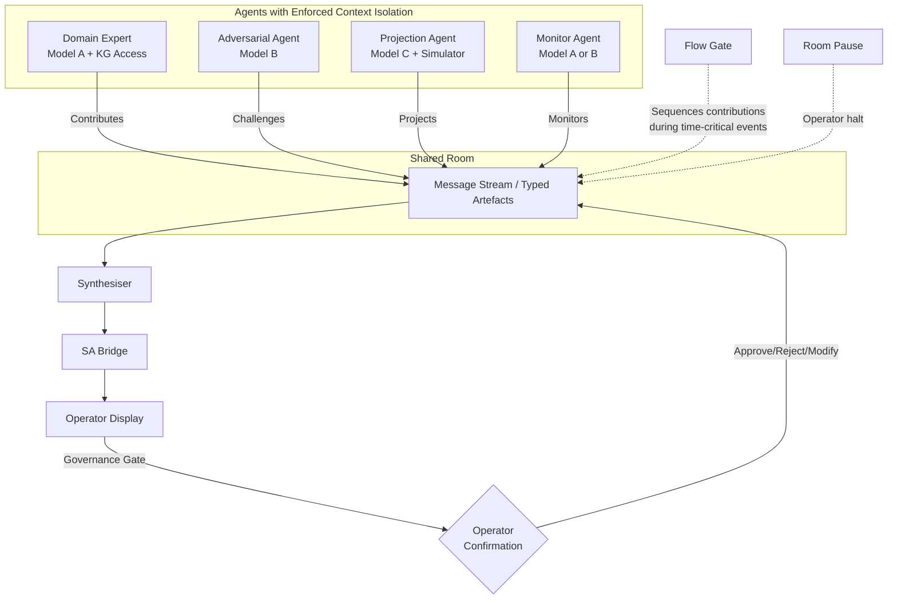
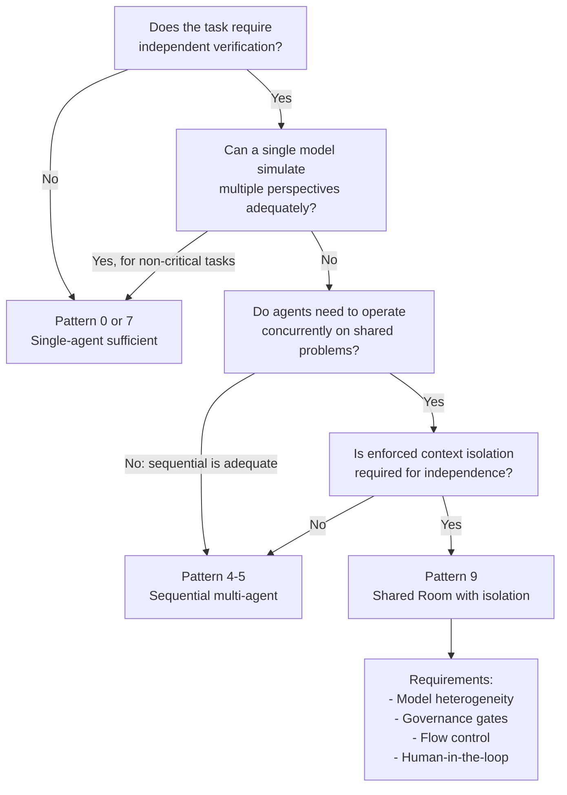

# Multi-Agent LLM Systems: Architecture, Coordination, and Epistemic Properties

**Michael Hildebrandt**

**Draft -- April 2026**

## Table of Contents

1. Introduction
2. Concepts and Definitions
3. A Survey of Multi-Agent Systems
4. A Taxonomy of Multi-Agent Architectural Patterns
5. Pattern 9 and General Multi-Agent Design Principles
6. The Human in Multi-Agent AI Systems
7. Empirical Evidence and Independence Properties
8. Open Design Questions
9. Practical Decision Guide
10. Discussion
11. Conclusion
References

## 1. Introduction

### 1.1 The Terminology Problem

The term "multi-agent" is applied to LLM systems with substantially different architectures and properties. Sequential pipelines, role-playing prompts within a single context, orchestrator-worker hierarchies, and concurrent conversational architectures are all described with the same label. The properties of a system, including its failure modes, coordination requirements, relationship to human authority, and behaviour under load, differ depending on which pattern is actually implemented. If a system architect or safety analyst cannot determine which pattern a proposed system uses, design decisions and safety assessments lack a sound basis.

A deeper issue underlies the terminology problem. Whether running multiple LLM agents concurrently, with separate identities and bounded information access, produces different behaviour in kind from running a single agent instructed to "simulate" a multi-agent interaction is an open question. The answer has direct implications for systems that claim to provide independent verification, parallel expert analysis, or collaborative decision support.

### 1.2 Four Questions

This report works through four questions:

1. What are the relevant concepts for multi-agent LLM systems, and how are they defined?
2. How do existing systems implement multi-agent coordination, and what patterns emerge?
3. What does concurrent multi-agent operation require, technically and operationally?
4. Under what conditions does the distinction between single-agent simulation and concurrent multi-agent operation matter?

### 1.3 Methodology

The architectural taxonomy presented in Section 4 is derived inductively from the survey of current systems in Section 3. Twelve multi-agent systems and frameworks were examined, selected to represent the range of coordination mechanisms in current use. From the coordination mechanisms observed across these systems, four discriminating dimensions emerged: concurrency (whether agents operate simultaneously), context isolation (whether agents have access to each other's internal state), human participation mode (what role the human plays), and turn-taking mechanism (how agent responses are sequenced). The ten patterns in the taxonomy represent the distinct combinations of these dimensions that the surveyed systems instantiate. The taxonomy was validated by confirming that every surveyed system maps to one or more patterns, and that no surveyed system requires a pattern not in the taxonomy.

The analysis draws additionally on experience with a prototype multi-agent platform developed to explore coordination problems in safety-critical process monitoring. That experience exposed recurring design problems: context divergence between agents after extended exchanges, delivery conflicts when heartbeat-triggered agents entered mid-conversation, and threading asymmetry producing divergent situational pictures within single sessions. These are reported as qualitative observations, not controlled experimental results.

### 1.4 Foundations from Report 1

This report builds on properties of individual LLMs established in the companion report (Hildebrandt, 2026a). Five properties are directly relevant:

1. *Unified attention.* A single model holds all simulated perspectives in unified attention, an architectural limitation developed in Section 4.6.

2. *Shared calibration.* All invocations of the same model share the same training-derived biases. If the training corpus underrepresents a class of failure modes, every "agent" running on that model will underweight those modes regardless of role assignment. LLMs also exhibit sycophancy, changing correct answers when users disagree (Sharma et al., 2024).

3. *Theory of mind limitations.* LLMs' ability to track another entity's belief state separately from their own is fragile and degrades under minor perturbations (Kosinski, 2024; Strachan et al., 2024; Ullman, 2023).

4. *Self-correction limits.* Intrinsic self-correction (a model critiquing its own reasoning without external feedback) does not improve and sometimes degrades performance on reasoning tasks. The critiquing process shares the training biases that produced the original. Extrinsic correction, grounded in external evidence, works (Huang et al., 2023).

5. *Tool calling unreliability.* LLM tool calling is probabilistic. In 2023 benchmarks, Patil et al. (2023) documented approximately 30% API hallucination rates, and Zhuang et al. (2023) found 40 to 50% failure on hard multi-step tasks. More recent evaluations using the Berkeley Function Calling Leaderboard V4 (Patil et al., 2025) show substantial improvement on simple function calls but persistent 30 to 40% failure rates on multi-turn agentic tasks. The compounding nature of tool-call errors remains the central reliability concern for multi-agent systems where each agent may issue multiple sequential tool calls.

The distinction between single-agent simulation and concurrent multi-agent operation is architectural, not behavioural, as developed in Section 4.6.

### 1.5 Key Concepts from Report 1

The following table summarises concepts from Report 1 that are used throughout this report without further definition. Concepts introduced in this report are defined at their point of first use.

**Table 1: Key concepts carried forward from Report 1**

| Concept | Definition | Source |
|---------|-----------|--------|
| Context window | The fixed-size token buffer that an LLM processes in a single inference pass; determines maximum input/output length | Report 1, §2.3 |
| Hallucination | Fluent, confident output that is factually incorrect or fabricated; arises from statistical pattern completion | Report 1, §5.1 |
| RAG | Architecture that retrieves documents from an external knowledge base and inserts them into the context before generation | Report 1, §8.1 |
| Knowledge graph | Structured database of entities and relationships that can enforce hard constraints on model outputs | Report 1, §8.3 |
| Tool calling | The mechanism by which an LLM invokes external functions or APIs; probabilistic and subject to hallucinated parameters | Report 1, §3.2 |
| Calibration | The degree to which expressed confidence matches actual accuracy | Report 1, §5.2 |
| Sycophancy | Tendency to agree with the user's position rather than provide independent assessment | Report 1, §5.5 |

### 1.6 Contributions

This report makes four contributions. First, a taxonomy of ten architectural patterns (Patterns 0-9) that distinguishes patterns currently treated as equivalent. Second, a systematic mapping between multi-agent LLM coordination mechanisms and Situation Awareness theory at the architectural level. Third, an analysis of the epistemic distinction between single-agent simulation and concurrent multi-agent operation, with implications for common-cause failure. Fourth, a practical decision guide for when multi-agent architecture is justified, when it is overkill, and when it is a correctness requirement.

## 2. Concepts and Definitions

### 2.1 Key Terms

**Table 2: Core concepts in LLM-based multi-agent systems**

| Concept | Definition | Status |
|---|---|---|
| **Agent** | An LLM embedded in a perceive-reason-act loop with tool access and real-world effect capability. Key properties: autonomy, goal-directedness, multi-step execution, tool use. | Stable; threshold contested |
| **Tool** | A defined callable function exposed to the LLM via a structured API. The LLM generates an invocation; execution happens externally; the result returns to context. | Stable consensus |
| **Memory** | Information available to an agent beyond the current context window. Four types: in-context, episodic, semantic, procedural. | Partial consensus |
| **Soul / Persona** | The persistent system prompt defining an agent's identity, expertise, and behavioural constraints. Maintained across sessions. | Practitioner terminology |
| **Heartbeat** | A scheduled, periodic invocation of an agent without a user trigger. Enables proactive behaviour. | Practitioner terminology |
| **Orchestrator** | An agent that decomposes goals into subtasks, delegates to worker agents, and synthesises results. | Stable consensus |
| **Worker / Subagent** | An agent executing a bounded subtask as delegated by an orchestrator. | Stable consensus |

Report 1 (Hildebrandt, 2026a) develops the LLM, Tool, and Memory concepts in depth, including tool calling mechanics, memory architectures, and the Model Context Protocol (MCP) for standardised agent-tool connectivity. Additional coordination concepts (governance gate, delivery modes, shared artefacts, speaker selection, actor model, monoculture collapse) are defined at their point of first use in Sections 3-5 below.

### 2.2 Terminological Fragmentation

The concepts above are not consistently defined across systems or papers. "Agent" in particular is used to mean anything from "a prompted LLM with a name" to "an autonomous process with persistent memory and real-world tool access." This fragmentation obscures architectural differences that matter for safety, reliability, and coordination. The inconsistency predates LLMs: classical multi-agent systems research (Wooldridge and Jennings, 1995) developed formal agent definitions and communication protocols (FIPA ACL, KQML, coalition formation algorithms) that have not carried over into LLM-based practice, where terms are re-introduced independently by each framework. The taxonomy in Section 4 grounds the discussion in structural rather than definitional terms.

## 3. A Survey of Multi-Agent Systems

This survey covers multi-agent systems representative of the coordination patterns identified in Section 4. It is not exhaustive. It complements existing surveys (Xi et al., 2023; Guo et al., 2024; Masterman et al., 2024) by focusing on coordination mechanisms and architectural patterns rather than task performance. Single-agent systems (conversational assistants, coding agents, autonomous loops, personal agents) are surveyed in Report 1, Section 4. The systems described here reflect the state of the field as of early 2026; the coordination patterns they embody are expected to be more durable than the specific implementations.

### 3.1 AutoGen (Conversational Multi-Agent)

AutoGen (Wu et al., 2024) is a Microsoft Research framework where agents exchange messages in a GroupChat with LLM-driven speaker selection. AutoGen v0.4 overhauled the architecture to an actor model with asynchronous message passing, enabling concurrent operation while the high-level API preserves sequential semantics. Limitation for nuclear applications: no built-in circuit breaker for unproductive exchanges or speaker selection loops. *Concurrency: architecturally supported in v0.4; API typically sequential.*

### 3.2 CrewAI and MetaGPT (Role-Based Crews)

CrewAI (Moura, 2024) organises agents into crews with role/goal/backstory triads and process-driven coordination (sequential, parallel, hierarchical). MetaGPT (Hong et al., 2024) simulates a software company with structured SOP communication and a shared message pool. Both treat roles as fixed at design time. Limitation for nuclear applications: rigid role structures cannot accommodate tasks that cross predefined role boundaries. *Concurrency: partial (CrewAI parallel process); none (MetaGPT SOP).*

### 3.3 LangGraph (Graph-Based State Routing)

LangGraph (LangChain, 2024) represents agent workflows as directed graphs with a centralised StateGraph managing shared state, supporting sequential chains, conditional branching, fan-out/fan-in parallelism, and iterative cycles. It is infrastructure rather than a framework, providing routing and state management without specifying agent behaviour. Limitation for nuclear applications: explicit state management becomes unwieldy for complex conditional flows. *Concurrency: supported for parallel branches; not for conversational interaction.*

### 3.4 OpenAI Swarm and Agents SDK (Lightweight Handoff)

Swarm (OpenAI, 2024) is built around the handoff primitive: agents transfer control serially, with only one agent active at a time. The Agents SDK (2025) productionised this with sessions, guardrails, and tracing. Limitation for nuclear applications: the serial design cannot handle situations requiring simultaneous specialist contributions. *Concurrency: not supported; serial by design.*

### 3.5 Paperclip (Organisational Hierarchy)

Paperclip (Paperclip AI, 2026) uses an organisational metaphor with an org chart, goal cascading, per-agent budget governance, a heartbeat scheduler, a ticket system with audit trails, and a governance gate for human approval of high-stakes actions. Agents receive task assignments and return results without conversational interaction. Limitation for nuclear applications: top-down coordination cannot handle dynamic negotiation or partial result sharing. *Concurrency: supported for task dispatch; no inter-agent communication.*

### 3.6 Generative Agents (Stanford, 2023)

Park et al. (2023) created a 25-agent social simulation with per-agent memory streams, reflection processes, and planning modules, producing emergent social behaviours from agent interactions. The key distinction: emergent macro-level behaviour is not the same as epistemic independence, since all agents shared the same base model and sequential simulation clock. Section 4.6 develops this distinction. *Concurrency: not supported; sequential discrete time steps.*

### 3.7 Microsoft Agent Framework (2025)

Microsoft's unified production framework combines AutoGen v0.4's actor model with Semantic Kernel's enterprise infrastructure, providing graph-based multi-agent orchestration with session state management, pluggable middleware, telemetry, and Azure AI integration. Among the most feature-complete production frameworks as of early 2026. *Concurrency: supported; inherits the actor model architecture.*

### 3.8 Survey Synthesis

Several observations emerge across the surveyed systems. No surveyed system provides architecturally enforced information asymmetry between agents: in every system, the orchestrator or manager has access to full conversation state and can propagate it to any agent. No system is designed for Pattern 9 (shared room, concurrent, human-as-peer). No system has SA-oriented design principles built into its coordination mechanisms. The design space is rich in orchestration patterns and sparse in architectures that treat the human as a peer participant with bounded, managed situation awareness.

The boundary between Pattern 4 (role-based crew) and Pattern 5 (conversational group chat) is less clear than between other patterns. The distinction rests on whether coordination is process-driven (predefined steps governing who does what in what order) or conversationally emergent (speaker selection within a shared space). In practice, systems often combine both: CrewAI's hierarchical process uses a manager agent that can engage in conversational delegation, blending Pattern 4 and Pattern 5 elements.

The author's prototype platform represents an early exploration of Pattern 9 properties, and AutoGen v0.4's actor model provides the architectural primitive (independent processes, asynchronous message passing) that would support Pattern 9. But no current system implements the full Pattern 9 capability set as described in Section 5.

## 4. A Taxonomy of Multi-Agent Architectural Patterns

### 4.1 Design Principles

The ten patterns below are composable building blocks, not mutually exclusive architectures. A system may implement Pattern 3 as its coordination backbone while giving individual agents Pattern 7 properties and adding a Pattern 5 interface for human interaction. The taxonomy describes architectural building blocks, and production systems routinely combine elements from multiple patterns.

### 4.2 The Ten Patterns

**Pattern 0: Single-Agent Role Simulation (Baseline).** A single LLM generates sequential responses attributed to multiple named roles within a unified context. Not a multi-agent architecture in any structural sense: all "agents" share a single context window, a single set of model weights, and a single inference process. No system is designed to be Pattern 0; it is what results when a single LLM is prompted to simulate multiple agents. Included as the baseline against which the multi-agent patterns are defined, and the reference point for Section 4.6's analysis.

**Pattern 1: Autonomous Loop.** One agent, one task queue, self-directed iteration. The agent generates tasks, executes them, and uses results to generate new tasks. No other agents are present. BabyAGI and AutoGPT, surveyed in Report 1 Section 4.3, are the primary examples. Known failure modes: unbounded task generation, context drift, goal misalignment accumulation.

**Pattern 2: Sequential Pipeline.** Tasks flow through agents in a fixed order. Agent A processes input and passes structured output to Agent B, then to Agent C. Coordination is implicit in the pipeline definition. Appropriate when task decomposition is well-understood and stable.

**Pattern 3: Orchestrator-Worker.** A central coordinator decomposes tasks and delegates to specialists. Workers are invoked one at a time or in parallel batches. The most common production pattern for complex task automation.

**Pattern 4: Role-Based Crew.** Agents have fixed roles, goals, and personas; a predefined process governs their interaction. Agents interact via structured artefacts or role-sequenced messages. Works well when workflows map naturally to organisational role structures.

**Pattern 5: Conversational Group Chat.** Multiple agents share a message history and take turns contributing. Speaker selection determines turn order. A manager agent may moderate. Supports emergent reasoning between agents but requires careful turn management.

**Pattern 6: Handoff/Transfer.** One agent explicitly transfers control to another; only one is active at a time. The pattern is serial by construction. Appropriate when domain handoffs are clean and explicit.

**Pattern 7: Personal Assistant with Heartbeat.** A single agent with persistent identity (soul) and scheduled autonomous invocation (heartbeat). Deployed in interactive messaging channels where human and agent share a communication space. Pattern 7 shares the autonomous loop structure of Pattern 1 but adds persistent cross-session identity, human-agent co-habitation in a communication space, and heartbeat-driven proactive capability.

**Pattern 8: Organisational Hierarchy.** Agents arranged in an org chart; coordination is top-down task assignment with goal cascading. Agents do not converse; they receive assignments and return results. Human authority is expressed through the governance gate.

**Pattern 9: Shared Room / Concurrent Multi-Agent.** Multiple agents with separate identities share a communication space and operate concurrently, with explicit turn-taking and delivery mechanisms. Agents maintain independent identities (separate system prompts, memory, potentially different base models) and each has access only to messages in the shared room, not to other agents' internal reasoning. Shared artefacts provide persistent coordination substrate. Human participants are first-class members of the shared space.

### 4.3 Taxonomy Summary

**Table 3: Taxonomy summary**

| Pattern | Concurrency | Human Role | Turn-taking | Context Isolation |
|---|---|---|---|---|
| 0: Role Simulation | No | Initiator | N/A | None |
| 1: Autonomous Loop | No | Observer | N/A | N/A |
| 2: Sequential Pipeline | No | Initiator | Implicit | Partial |
| 3: Orchestrator-Worker | Partial | Approver | Orchestrator | Partial |
| 4: Role-Based Crew | Partial | Initiator | Process | Partial |
| 5: Group Chat | No | Peer | Speaker selection | Shared |
| 6: Handoff/Transfer | No | Configurable | Explicit relay | Shared |
| 7: Personal Assistant | No | Peer | Scheduled | Per-agent |
| 8: Org Hierarchy | Yes (tasks) | Strategic approver | Assignment | Per-agent |
| 9: Shared Room | Yes | Peer / Authority | Delivery modes | Per-agent (enforced) |

Pattern 9 receives extended attention in the remainder of this report because it is the only pattern combining concurrency, per-agent context isolation, and human peer participation, and it is the least developed in the current literature.

### 4.4 Coordination Failure Modes by Pattern

Each pattern has characteristic coordination failure modes. The table below maps the primary failure for each pattern, its mechanism, and its mitigation. Pattern 9 receives extended treatment in Section 5.3; the other patterns' failures are summarised here.

The table identifies the primary failure mode characteristic of each pattern, not all possible failures. Each pattern is also susceptible to the general LLM failure modes described in Report 1 (hallucination, calibration, prompt sensitivity) and to infrastructure failures (network, compute, storage) that are pattern-independent. For Patterns 3, 5, and 9, the single-failure characterisation is most reductive: Pattern 3's orchestrator can also suffer from delegation bias and incomplete task decomposition beyond simple overload; Pattern 5's speaker selection failures interact with the content-level failures of individual agents in ways that compound; Pattern 9's failure space is the richest, with the modes listed here representing a summary of the extended treatment in Section 5.3.

**Table 4: Coordination failure modes by pattern**

| Pattern | Primary Failure | Mechanism | Mitigation |
|---|---|---|---|
| 0: Role Simulation | Correlated errors across "agents" | All roles share one context and one model | Use separate contexts (upgrade to Pattern 3+) |
| 1: Autonomous Loop | Goal drift, unbounded task generation | No external constraint on task queue | Bounded iterations, human review gates |
| 2: Sequential Pipeline | Cascading error propagation | Error in stage N propagates downstream | Inter-stage validation at each handoff |
| 3: Orchestrator-Worker | Single point of failure at orchestrator | Orchestrator overloaded or decomposes poorly | Orchestrator health monitoring; fallback |
| 4: Role-Based Crew | Role rigidity; cross-boundary tasks dropped | Predefined process cannot handle novel structures | Dynamic role reassignment; human override |
| 5: Group Chat | Speaker selection loops | LLM-driven selection produces repetitive turns | Circuit breakers; human moderation |
| 6: Handoff/Transfer | Context loss at handoff | Shared variables insufficient for full state | Context verification at each handoff |
| 7: Personal Assistant | Stale heartbeat action | Heartbeat fires after conditions changed | Staleness check before action |
| 8: Org Hierarchy | Goal misalignment through delegation cascade | Interpretation drifts across layers | Goal verification at each level |
| 9: Shared Room | Flooding, staleness, context divergence, monoculture | Concurrent operation with bounded context | See Section 5.3 |

### 4.5 Relationship to Existing Taxonomies

Existing multi-agent LLM surveys (Xi et al., 2023; Guo et al., 2024; Masterman et al., 2024) classify systems primarily by task type (software development, scientific research, social simulation) or by agent capability (planning, tool use, memory). The taxonomy presented here classifies by coordination mechanism: how agents are sequenced, how they share (or do not share) context, and what role the human plays. The key dimensions that existing taxonomies do not use as primary axes are concurrency (whether agents operate simultaneously) and context isolation (whether agents can access each other's internal state). These two dimensions are what separate Pattern 9 from Patterns 5 and 8, a distinction that matters for the epistemic independence argument in Section 7 and for the safety analysis implications in the companion reports. The task-type and capability classifications in existing surveys remain useful for selecting systems for specific applications; the coordination-mechanism classification is needed for evaluating the architectural properties that determine safety, reliability, and independence.

### 4.6 Why Architecture Matters: Single-Agent Simulation versus Concurrent Operation

#### The Distinction Is Graded, Not Binary

The distinction between single-agent simulation and concurrent multi-agent operation is graded across five dimensions, each a continuum:

- *Context isolation*: Fully isolated (separate processes, separate contexts) to unified context
- *Model diversity*: Different models with different training to same model with different system prompts
- *History divergence*: Agents with long separate session histories to fresh invocations with no history
- *Temporal independence*: Truly concurrent execution to sequential simulation
- *Information asymmetry*: Architecturally enforced to none

Where a system falls on each dimension determines which properties it can provide. For use cases that need structured task decomposition, single-agent simulation at the low-independence end is adequate and often preferable on cost and simplicity grounds. For use cases that require independent verification or error independence, the high-independence end is a correctness requirement. The question for any application is not "single-agent or multi-agent?" but "which dimensions are critical, and does the architecture provide them?" Section 9 translates this into a decision guide.

#### A Single Model Holds All Perspectives in Unified Attention

Two LLM properties constrain what single-agent simulation can achieve. Both are established in Report 1 and summarised here.

**Unified attention.** The transformer self-attention operation computes attention weights across the full context at every layer. When a single model generates responses for Agent A and then Agent B, there is no partition preventing A's character description, risk threshold, or unexpressed uncertainty from influencing B's generation. Prompting cannot override this. Shanahan, McDonell, and Reynolds (2023) develop the implication: the model does not switch between committed character states but samples from a distribution over possible characters (a "superposition of simulacra"), conditioned on all previous context.

**Shared weights.** All characters generated by a single LLM share the same trained parameters and distributional biases. The errors are correlated at their source. Four objections do not resolve this: stochastic variation from different random seeds is not independence; chain-of-thought does not partition reasoning within a single context; RAG provides different knowledge access but not different reasoning processes; fine-tuned variants retain shared pre-training biases to an empirically unresolved degree.

The novelist analogy is instructive: a novelist writing a scene where one character deceives another knows both the truth and the deception, and must suppress that knowledge to write convincingly. Research on perspective-taking (Epley et al., 2004) shows that people underestimate how much their own knowledge colours their representations of others' perspectives. A single LLM faces the same constraint in a harder form: the limitation is computational (unified attention), not cognitive.

## 5. Pattern 9 and General Multi-Agent Design Principles

### 5.1 What Distinguishes Concurrent Multi-Agent Operation

Pattern 9 differs from the other patterns in one respect: agents are separate epistemic entities operating in a shared space, with each agent's knowledge bounded by its context window and what has been communicated into the shared space. No agent accesses another agent's internal reasoning, and no orchestrator holds a global view. Agents may act concurrently, and their actions produce results that all participants observe in real time.

This creates a coordination problem distinct from those addressed by Patterns 1-8. The question is not how to sequence tasks or who should handle a subtask. It is how multiple entities with bounded, potentially divergent information, operating at different speeds, coordinate effectively in a shared space where actions by any participant are immediately visible to all.

### 5.2 Infrastructure Requirements

Each requirement below is necessary for the full Pattern 9 capability set in safety-critical contexts. The absence of any one produces a specific failure mode. Systems with less demanding coordination requirements may operate without some of these.

**Identity persistence (soul/persona).** Each agent needs a stable system prompt consistent across invocations. If absent, agents shift character between sessions; human operators cannot calibrate trust or predict agent behaviour across operational shifts.

**Per-agent memory.** Each agent needs its own episodic and semantic memory, separate from other agents'. If absent, each invocation starts cold; agents cannot maintain SA continuity across the multiple invocations that constitute an operational session.

**Turn-taking and delivery control.** Multiple agents may complete generation simultaneously. A mechanism is needed to control how and when responses enter the shared space. Delivery modes (broadcast, flow gate) and per-room pause capability are the primary mechanisms. If absent, a single event triggers N simultaneous responses from stale snapshots, producing N conflicting outputs with no way to sequence them.

**Message threading.** Discourse in shared spaces forms causal sub-threads. Threading scopes each agent's context to the relevant thread while keeping all threads visible. If absent, all responses are flat in the shared timeline; agents responding to different stimuli appear to be responding to the same one.

**Triggering and heartbeat.** Agents need event-driven invocation (on message receipt) and optionally scheduled invocation (heartbeat). If the heartbeat is absent, proactive monitoring is not possible; agents are purely reactive.

**Tools.** Each agent requires external capabilities appropriate to its role. Tool calling mechanics and failure modes are developed in Report 1, Section 3.2. In multi-agent settings, tool execution extends an agent's "turn" in unpredictable ways and may produce side effects visible to other agents only through the shared space.

**Shared artefacts.** Persistent objects (task lists, documents, structured data) readable and writable by all participants. Artefacts are the team's shared working memory. If absent, coordination requires conversational overhead at every turn; no durable shared state survives context window boundaries.

**Human control mechanisms.** Room pause (halts all agent delivery), mute (silences individual agents), and delivery mode switching must be immediately available to human participants. In safety-critical contexts, human authority over the system must be a structural property enforced by architectural mechanisms, not a behavioural expectation that the system may or may not honour.

**Figure 1. Pattern 9 (Shared Room) architecture.**

*Each agent maintains an isolated context window and contributes to a shared message stream. The Synthesiser aggregates outputs; the SA Bridge translates them for operator displays. Governance gates enforce human authority. Flow gates and room pause provide coordination control during time-critical events.*

### 5.2a Synchronous, Asynchronous, and Parallel Execution Models

The infrastructure requirements above specify what agents need (context isolation, message passing, tool access, heartbeat scheduling). This section addresses how agents execute in time, because the temporal execution model determines the latency characteristics of the system and has direct consequences for nuclear applications where response time is safety-relevant (Report 1, Section 7.4a).

**Three execution models.** Multi-agent systems can implement three distinct temporal execution models, each with different latency, auditability, and complexity characteristics.

In the *synchronous-sequential* model, agents take turns. Agent A completes its full reasoning chain (including all tool calls), posts its output to the shared message space, and then Agent B begins. The total response time for the system is the sum of all individual agent response times. If five agents each take 8 seconds, the system takes 40 seconds to produce a complete assessment. This model is the simplest to implement and produces a fully deterministic event sequence that is straightforward to log and replay. It is also the slowest, and for time-critical nuclear scenarios, 40 seconds of latency may mean the advisory arrives after the operator has already committed to a course of action.

In the *agent-parallel, tool-sequential* model, multiple agents run concurrently on separate inference instances, each processing its own reasoning chain independently. Within each agent, tool calls remain sequential (the agent blocks on each tool call before proceeding to the next reasoning step, following the ReAct pattern from Report 1, Section 3.1). The system response time scales with the slowest individual agent rather than with the sum of all agents. If five agents each take 8 seconds but run in parallel, the system produces a complete set of assessments in approximately 8 seconds plus coordination overhead, rather than 40. This is Pattern 9's natural execution model: agents operate as independent processes with isolated context windows, and concurrency arises from the architectural separation rather than from explicit parallelisation logic.

In the *fully parallel* model, agents run concurrently and additionally issue independent tool calls in parallel within their own reasoning chains. When an agent's reasoning step requires data from two independent sources (for example, current RCS temperature and recent maintenance records for the same loop), both queries are dispatched simultaneously rather than sequentially. This reduces per-agent latency in addition to the inter-agent parallelism of the previous model. The fully parallel model produces the lowest total latency but introduces coordination complexity: concurrent tool calls against shared data sources must handle contention, and the temporal coherence of data retrieved by parallel queries must be managed (Section 5.3 addresses the staleness dimension of this problem).

**Latency implications for nuclear operations.** During steady-state monitoring (Report 4, Scenarios 1 and 6), heartbeat intervals of minutes to hours provide ample time for any execution model. The synchronous-sequential model is acceptable and its simplicity is an advantage. During a fast transient (Report 4, Scenarios 3 and 5), the operator needs actionable information within seconds. The agent-parallel model is the minimum viable approach, because sequential agent execution produces latencies that exceed the operator's decision window. The fully parallel model provides additional latency reduction that may be necessary when the reasoning chains involve multiple tool calls against plant data systems.

The choice of execution model also affects the staleness of the data underlying each agent's assessment. In a synchronous-sequential system, Agent E is reasoning about plant state that is 40 seconds older than the state Agent A reasoned about, because Agent A consumed the first 8 seconds, Agent B consumed the next 8, and so on. During a fast transient where parameters change on a timescale of seconds, this temporal skew means that agents later in the sequence are working with substantially outdated information. In a parallel system, all agents begin reasoning about plant state from approximately the same moment, producing a more temporally coherent set of assessments. Report 4, Section 11.1 identifies this temporal coherence advantage as a primary justification for parallel agent operation during dynamic events.

**The auditability trade-off.** Concurrent execution complicates post-event reconstruction. In a synchronous-sequential system, the event log is a linear sequence: Agent A's output, then Agent B's, then C's. In a concurrent system, agent outputs interleave in an order determined by variable execution times, and reconstructing what each agent knew at each point requires correlating timestamps across multiple parallel streams. Flow gates (Section 5.2) address this at the human interface by serialising the delivery of agent outputs to the operator, but the underlying computation remains concurrent. Logging infrastructure for concurrent multi-agent systems must record wall-clock timestamps for every inference step, tool dispatch, tool return, and message post, with sufficient precision to reconstruct causal ordering during post-event analysis.

**Adaptive execution model switching.** Report 4, Scenario 8 proposes a hybrid architecture that operates in single-agent mode during normal conditions and escalates to multi-agent operation during abnormal conditions. The same principle applies to execution models: a system can operate in synchronous-sequential mode during steady-state monitoring (where latency is not constrained and auditability is prioritised) and switch to agent-parallel or fully parallel mode when a transient is detected and latency becomes the binding constraint. The escalation trigger can be tied to the alarm prioritisation system or to a threshold on the rate of change of key plant parameters. This adaptive approach matches architectural complexity to operational demand, following the principle that the simplest adequate architecture is preferred.

### 5.3 Emergent Coordination Challenges

The infrastructure above addresses necessary conditions. Several coordination challenges arise from the interaction of these requirements:

*Flooding.* Multiple agents respond to the same event simultaneously, producing output that exceeds participants' processing capacity. Delivery modes address this; flow gating prevents simultaneous arrival.

*Staleness.* An agent's context snapshot may not reflect the current room state by the time its response arrives. Actions taken on stale context can conflict with other agents' more recent actions.

*Context divergence.* Agents build their contexts differently depending on what they have attended to, what their memory retrieves, and how much history fits in their window. Two agents may hold significantly different models of the current situation.

*Cascading tool use.* A tool call extends an agent's turn while the environment evolves. Other agents may respond to the partial state in ways that conflict with the eventually-returned result.

*Epistemic asymmetry from threading.* An agent engaged in a thread has a narrower view than an agent attending to the main room. The two hold different situational pictures simultaneously.

*Heartbeat-delivery interaction.* A heartbeat-triggered agent enters the room not in response to any message. Standard delivery modes do not cleanly handle this; the agent must either pre-empt the current flow (potentially interrupting important exchanges) or queue (potentially delaying time-sensitive monitoring). A dedicated heartbeat delivery channel is needed but not addressed by any current framework.

*Infrastructure failures.* Beyond the information-theoretic challenges above, distributed systems also fail mechanically: agent processes crash, tool calls hang, messages are dropped. The coordination infrastructure (delivery modes, threading, governance gates) is itself software that can fail, and its failure produces system-level errors distinct from individual agent errors.

*Context window arithmetic.* In a room with eight agents generating responses averaging 300 tokens at 45-second intervals, combined output is roughly 3,200 tokens per minute. A 128K-token context window fills in approximately 38 minutes of full room activity. In a four-hour session, later-arriving agents work from a compressed, partial view of the session's first half. SA divergence between early and late agents is guaranteed by arithmetic, not incidental.

**Monoculture and correlated failure.** When all agents share a base model, systematic errors propagate uniformly across the team. This is common-cause failure at the model level, termed *monoculture collapse* by Reid et al. (2025). Section 7.2 develops the analysis; Report 3 maps it onto the NRC independence framework.

### 5.4 Functional Role Specialisation

A Pattern 9 architecture requires intentional role assignment. The coordination challenges in 5.3 are better addressed by agents configured for specific functions than by general-purpose agents expected to compensate. DyLAN (Liu et al., 2024) found up to 25% task performance improvement from dynamic role assignment. CAMEL (Li et al., 2023) demonstrated structured collaboration through role-playing. The MAST failure taxonomy (Cemri et al., 2025) identifies absent role specification as a primary failure mode.

**Table 5: Functional roles for Pattern 9 architectures**

| Role | Function | Failure mode addressed | Key requirement |
|---|---|---|---|
| Adversarial / Devil's advocate | Challenges claims, seeks counterevidence, resists premature consensus | Groupthink, confirmation bias | Model diversity or information restriction |
| Synthesiser | Patterns outputs across agents; identifies consensus, conflict, gaps | Context overload, fragmented team picture | Privileged read access; high context budget |
| Memory keeper | Maintains episodic record; surfaces precedents; prevents re-derivation | Context overflow, repeated issues | External memory with retrieval; persistence |
| Monitor / Metacognitive | Observes team process; flags stale context, loops, coordination failures | Flooding, deadlock, spiral debates | Access to team-level metadata |
| Coordinator / Planner | Structures work; tracks dependencies and progress; prevents duplication | Goal drift, coverage gaps, duplication | Full room access; peer authority, not hierarchical |
| Domain Expert | Authoritative specialised knowledge; flags out-of-scope queries | Hallucination in specialised domains | Specialised fine-tuning or high-quality RAG/KG |
| Projection agent | Dedicated Level 3 SA: extrapolates current state; flags emerging conditions | Reactive rather than anticipatory response | Domain model quality; environmental data access |
| SA Bridge | Translates agent communication into human-readable format; manages SA handoff | SA degradation for human participants | Full room access; model of human SA state |

The Coordinator should not be confused with the Orchestrator in Pattern 3. The Orchestrator commands workers from above; the Coordinator coordinates among peers.

The adversarial role's effectiveness depends on model separation. An adversarial agent on the same base model as the agents it challenges will tend toward the same conclusions despite its role assignment (Chan et al., 2024). For effective adversarial function, the agent requires either a different base model, substantially different fine-tuning, or restricted information access that forces challenge from first principles.

Disagreement between agents with different information is epistemically informative: it signals ambiguity in the evidence. Systems designed to suppress disagreement through forced consensus lose the diversity that justifies the architecture.

The Domain Expert role requires a knowledge base with logical structure. The knowledge grounding mechanisms (vector-store RAG, graph-structured retrieval, and the guardrail function) are developed in Report 1, Section 7. This report focuses on how domain knowledge is used within the multi-agent team.

### 5.5 Model Heterogeneity

Deploying agents on different foundation models provides two distinct benefits.

**Epistemic independence** is the subject of Section 7's analysis. When agents run on different base models with separate training pipelines, their systematic errors are less correlated. A failure mode one model is prone to does not automatically propagate to the other. A homogeneous team is subject to monoculture collapse: shared weights produce shared biases, making the team a single point of failure at the calibration level regardless of agent count.

**Capability matching** is a separate practical benefit. Different models have different strengths; a model fine-tuned for structured analysis may perform differently on free-form synthesis than one optimised for communication. Heterogeneous architectures can match the best model to each role's requirements.

**Coordination costs.** Different models have different context window limits, response latencies, and cost structures. MCP's model-agnostic interface (Report 1, Section 3.6) partially mitigates API normalisation. Coordination overhead applies to every inter-agent exchange regardless of which model underlies each agent. In practical terms, model heterogeneity means maintaining contracts with multiple AI providers, operating potentially different serving infrastructure for each model, and managing version compatibility across the team. For a two-agent verification architecture with model diversity, the operational complexity is roughly double that of a single-model deployment. This cost is the price of reasoning independence and must be weighed against the specific independence requirement of the use case.

For safety-critical verification roles, model heterogeneity should be treated as a safety requirement. For other roles, capability matching drives the decision. Homogeneous architectures are appropriate when epistemic independence is not the primary concern.

### 5.6 Degradation and Recovery

Nuclear systems are designed with defence-in-depth, including defined degraded-mode operation for each level of equipment failure. A multi-agent architecture requires equivalent thinking. The system must specify what happens when components fail, how failures are detected, and what capability remains.

**Agent failure detection.** How does the system know an agent has failed? Three failure modes must be distinguished. Silent failure: the agent stops producing output without reporting an error. The absence of output is ambiguous (the agent may have nothing to say, or it may have crashed). Explicit failure: the agent reports an error or its process terminates with a detectable signal. Degraded failure: the agent continues producing output, but the output quality has declined (hallucination rate increases, responses become repetitive, or the agent loses track of the operational context). Silent and degraded failures are harder to detect than explicit failures. The Coordination Monitor role (Table 5) is the architectural element responsible for detecting agent-level failures, through heartbeat monitoring (detecting silent failure), output quality heuristics (detecting degraded failure), and process health checks (detecting explicit failure).

**Graceful degradation.** When a specific agent role goes offline, what capability is lost? The answer depends on which role fails. Loss of the adversarial agent removes independent challenge but does not prevent the other agents from functioning; the team loses a safety-relevant property but remains operational. Loss of the synthesiser forces the operator to integrate individual agent outputs manually, increasing cognitive load. Loss of all agents on one base model reduces diversity but leaves the other-model agents operational; the independence property degrades but does not vanish. Each failure combination produces a different residual capability, and the system should map these explicitly.

**State reconstruction.** When a failed agent is restarted, it has empty context. It must build SA from scratch: the late-joiner problem described in Section 5.3. Pre-computed state summaries or periodic checkpoints can reduce the SA gap. The Coordination Monitor can maintain a compressed state snapshot specifically for agent restart, providing the restarted agent with a condensed but current operational picture rather than requiring it to process the full room history.

**Fallback modes.** The system should define at least four degraded states: operation with reduced agent count (some roles offline), operation with reduced model diversity (all agents on one base model), single-agent operation (one agent providing advisory output without the coordination properties), and no-AI operation (the operator performs all tasks without AI advisory support). The single failure criterion in nuclear safety requires that operators can perform all credited actions without AI. Each fallback mode should be a defined system state with its own display mode (Report 4, Section 12.3) so the operator knows the system's current capability level. Transitions between fallback modes should be automatic on failure detection and reversible on agent recovery.

## 6. The Human in Multi-Agent AI Systems

### 6.1 Human Roles

The human's role in a multi-agent AI system is not fixed. The same person may play different roles depending on system design and operational context:

**Table 6: Human roles and SA requirements in multi-agent systems**

| Role | SA Requirement |
|---|---|
| Initiator | Minimal; posts the triggering message |
| Supervisor | Continuous Level 1 SA of agent state (who is active, what each is doing) |
| Approver | Level 2 comprehension at decision points; reduced SA between decisions |
| Domain expert | Level 2 SA of the specific question; Level 1 SA of room state |
| Peer participant | Level 1-2 SA of room and operational environment |
| Authority holder | Level 1-3 SA of both operational environment and agent activities; most demanding profile |

In safety-critical contexts, the human must retain the authority-holder role regardless of what other roles they also play. This cannot rest on the human's disposition; it must be a structural property of the system, expressed through a room pause mechanism, governance gate, or equivalent architectural control. The differential SA requirements listed above are not met by a uniform transparency interface: different roles need different SA support, and the SA Bridge agent role in Table 5 is tasked with providing these differentiated handoffs.

### 6.2 Situation Awareness as the Unifying Framework

The coordination challenges described in Section 5.3 (flooding, staleness, context divergence, epistemic asymmetry) are, at their root, failures of situation awareness. The connection follows from bounded-context agents operating in a shared dynamic environment.

Endsley (1995) defines SA as the perception of environmental elements within a volume of time and space (Level 1), the comprehension of their meaning (Level 2), and the projection of their status in the near future (Level 3). SA is the primary basis for decision-making in complex, dynamic systems; its failure modes are the proximate causes of the majority of human error in safety-critical operations (Jones and Endsley, 1996).

Salas et al. (1995) extend the model to teams: team SA comprises individual SA at each member plus the processes that maintain compatible understanding. Shared mental models enable implicit coordination: when members hold compatible models of task, system, and roles, they can anticipate each other's needs without explicit communication.

Stanton et al. (2006) develop Distributed SA (DSA): SA is an emergent property of the sociotechnical system as a whole, characterised as "activated knowledge held by specific agents at a specific time for a specific task." Non-human elements (displays, automation, artefacts) hold SA alongside human operators. What matters is not identical shared knowledge but compatible knowledge: agents holding mutually coherent information states. Salmon et al. (2017) provide empirical methods for measuring DSA in operational team settings.

Endsley (2015) has argued that distributing SA across the system risks losing its explanatory power as an individual cognitive state. For multi-agent LLM architectures, Stanton's DSA framing fits better: SA is held by both human and AI participants, shaped by the system's information routing, and fails at system level in ways that individual-level analysis cannot capture. Endsley's three-level model remains useful for analysing individual agent SA; Stanton's framework is needed for coordination failures between agents and across the human-AI team.

Applied to multi-agent LLM systems, these frameworks produce a direct mapping:

**Each agent's context window is its SA boundary.** Level 1 SA (perception) for an LLM agent is determined by what has been communicated into its context. Level 2 SA (comprehension) is performed by the LLM inference process, with reflection serving as the mechanism for periodic comprehension synthesis. Level 3 SA (projection) requires explicit chain-of-thought prompting for forward reasoning or tool-based access to predictive models.

Level 3 projection is the most safety-relevant SA level and the most brittle for LLM agents: projections depend on the model's causal model of the domain, which may not accurately represent the monitored system.

**Context divergence is distributed SA failure.** Two agents in the same room with different subsets of its history in context hold different Level 1 SA. Their comprehensions and projections diverge correspondingly.

**Coordination mechanisms are SA management infrastructure.** Rooms define the shared perception space. Threading provides causal structure supporting comprehension. Shared artefacts are the persistent SA substrate. Delivery modes regulate information flow to prevent overload and staleness.

Gao et al.'s (2023) ATSA framework formalises this: in a human-AI system, AI agents are not merely SA objects (things the human monitors) but SA subjects (entities that maintain their own SA). The framework introduces bidirectional SA interaction: humans maintain SA about AI teammates; AI agents maintain SA about humans, the environment, and each other.

The out-of-the-loop problem (Endsley, 1995) applies directly: as agents operate over longer autonomous horizons, human SA of agent state and intent degrades unless transparency mechanisms maintain it. Room pause controls, delivery mode visibility, and the SA Bridge role are SA maintenance tools for human operators.

**Worked example: context divergence as distributed SA failure.** Consider two agents in a shared room monitoring an evolving plant transient. Agent A processes the last 90 minutes of room history plus its own tool results (recent sensor queries). Agent B joined the room 30 minutes ago and has only 30 minutes of history plus a compressed summary of the earlier period. At the SA mapping level: Agent A has Level 1 SA (perception) of events from the full 90-minute window. Agent B has Level 1 SA of only the last 30 minutes plus whatever the summary retained from the first 60 minutes. If the summary omitted a sensor reading from minute 15 that is now relevant, Agent B has a Level 1 SA gap that Agent A does not. Their Level 2 comprehensions diverge: Agent A interprets the current readings in the context of a 90-minute trend; Agent B interprets them in the context of a 30-minute trend plus a compressed summary. Their Level 3 projections diverge further: Agent A projects forward from a richer data basis; Agent B projects from a thinner one. When both agents post assessments to the shared room, they may reach different conclusions not because they reason differently but because they perceive different histories. The SA framework identifies this as a Level 1 perception failure caused by context window boundaries and compression, not a Level 2 reasoning failure. The design implication is specific: the fix is better context management (ensuring late-joining agents receive adequate history), not better reasoning prompts.

Without the SA mapping, this scenario would be described generically as "agents disagree." With the mapping, the disagreement is traced to a specific SA level (Level 1 perception), a specific architectural cause (context window boundary and compression), and a specific design response (context management for late joiners). This is what the mapping adds.

We are not aware of published work that develops this mapping at the architectural level, connecting specific LLM-system primitives (context window boundaries, delivery modes, threading, context budget allocation) directly to Endsley's SA levels. The mapping has limitations: human SA is continuous and embodied, while LLM SA is discrete (per-invocation) and disembodied. The analogy holds at the structural level (what determines what the agent can perceive, comprehend, and project) but should not be taken to imply cognitive equivalence. The Stanton-Salmon DSA literature addresses distributed SA at the team behavioural and measurement levels; Gao et al.'s ATSA framework applies SA to human-AI teaming at the interaction level. The contribution here is the grounding of SA requirements in specific architectural properties of LLM-based systems.

### 6.3 Known Human-Side Challenges in Multi-Agent Supervision

The coordination challenges in Sections 5.3 and 6.2 address agent-side and system-level SA failures. A separate set of challenges arises from the human operator's cognitive constraints when supervising multiple concurrent agents.

**Cognitive load limits on agent supervision.** How many agents can a human meaningfully supervise? The answer depends on agent output rate, the cognitive demand of evaluating each output, and the human's concurrent operational tasks. During normal operations with low agent output rates, a single operator can track 4 to 6 agents. During a transient with high output rates and concurrent manual tasks, even 3 agents may exceed the operator's processing capacity. The relevant cognitive constraints are Wickens' Multiple Resource Theory (MRT) and Cowan's 4-chunk working memory limit, both developed in Report 3, Section 5.5. The implication is that the number of agents an operator can supervise is not a fixed design parameter but a variable that depends on operational tempo.

**Attention management.** When multiple agents produce simultaneous output, the human must decide which to attend to first. Without architectural support (the delivery mode controls from Section 5.2), the human defaults to recency or salience rather than safety significance. An agent reporting a minor anomaly in vivid language may capture attention ahead of an agent reporting a significant trend in neutral language. The SA Bridge role (Table 5) and delivery mode controls are the architectural responses: they impose priority ordering that the human's unaided attention allocation would not achieve.

**The degradation curve.** Adding agents improves system coverage up to a point, beyond which coordination overhead and human cognitive load cause net performance to decline. The location of this inflection point is unknown and likely task-dependent. A 3-agent architecture may provide better effective coverage than a 6-agent architecture if the operator can maintain SA across 3 agents but not across 6. No published study has characterised this curve for LLM-based multi-agent systems in operational settings. Its empirical determination is a prerequisite for sizing multi-agent deployments.

These challenges are developed through specific operational scenarios in Report 4, Sections 12 and 13.

The preceding sections describe what multi-agent systems should do and how humans interact with them. The next section examines the empirical evidence for whether these architectural properties deliver their claimed benefits.

## 7. Empirical Evidence and Independence Properties

### 7.1 Empirical Evidence

The most directly relevant controlled comparison available, though limited to a stylised economic bargaining task, comes from Sreedhar and Chilton (2024), who tested single LLMs against separate multi-agent instances on the Ultimatum Game. Separate instances achieved 88% accuracy in simulating personality-differentiated human reasoning; single-model simulation achieved 50%, at chance. The single model could execute individual strategies correctly but failed to maintain consistent, differentiated strategies across simulated agents. Whether these findings generalise to safety-critical monitoring remains an open empirical question.

Studies on LLM theory of mind (Kosinski, 2024; Strachan et al., 2024; Ullman, 2023) show that LLMs' ability to track another agent's belief state separately from their own is fragile, degrading under minor perturbations. Controlled debate studies (Wu et al., 2025) find that same-model debate suppresses independent reasoning under majority pressure; model diversity is a necessary condition for productive debate (Wynn et al., 2025). The factuality improvements from multi-agent debate documented by Du et al. (2023) come from structured format, not from independence between debaters.

The self-correction literature reinforces this. Huang et al. (2023) found that intrinsic self-correction without external feedback does not improve reasoning performance. The mechanism is the same: the critiquing process shares the training biases that produced the original (Abdali et al., 2025; Chan et al., 2024).

**Empirical limitation.** A caveat on the empirical base: the evidence cited above comes from controlled experiments on specific task types (bargaining games, logical reasoning, debate formats). No published study has compared single-agent simulation and concurrent multi-agent operation on safety-critical monitoring or verification tasks with operational data. The architectural argument for why independence matters is strong; the empirical confirmation of its magnitude in safety-critical domains is pending.

**Independence as a continuum, not a threshold.** The independence dimensions in Section 4.6 are continuous variables, and the degree of correlation between agents sharing a base model is an empirical question that varies by task type and failure mode. Fine-tuned variants of the same base model share pre-training biases but may diverge in domain-specific calibration, response style, and error profiles. For advisory (non-safety-function) applications, such partial decorrelation may provide sufficient diversity even if theoretical full independence is not achieved. The practical question is whether the residual correlation between fine-tuned variants falls within acceptable bounds for the specific failure modes of concern.

This report's framework should accordingly be treated as continuous rather than binary. Full model diversity (different base models from different training pipelines) is a hard requirement in two cases: (a) independent safety verification where regulatory independence criteria apply (Report 3, Section 6 develops the NRC framework), and (b) any function where the multi-agent architecture is credited as a safety barrier in the defence-in-depth analysis. In these cases, shared pre-training creates a common-cause pathway that cannot be dismissed without empirical characterisation of the residual correlation.

For applications where the multi-agent architecture provides operational value but is not credited as a safety function, partial decorrelation from fine-tuned variants is acceptable. Examples include ambient monitoring (Pattern 7 agents tracking plant parameters for operator convenience), shift handover support (summarisation agents reducing manual workload), and collaborative problem-solving during normal operations. In these cases, the cost and complexity of maintaining multiple base models may not be justified by the marginal independence gain. The decision criteria are: is this function credited in the safety case? If yes, full model diversity is required. If no, the independence requirement is proportional to the consequence of correlated failure.

### 7.2 Common-Cause Failure

In safety engineering, common-cause failure (CCF) refers to the failure of multiple supposedly independent barriers due to a shared cause (IEC 61508; Reason, 1990). The parallel to multi-agent LLM systems is close but not exact: LLM failure modes are distributional biases whose structure is less well characterised than physical failure physics. If multiple agents run on the same base model, they share a common cause for their systematic errors. Reid et al. (2025) name this monoculture collapse. Hammond et al. (2025) survey the broader multi-agent risk domain.

Traditional safety engineering has developed a mature set of CCF defence strategies over decades of operating experience with redundant safety systems. The applicability of these strategies to multi-agent LLM systems is an open question, but the conceptual mapping is instructive. The table below maps established CCF defences to their multi-agent LLM equivalents, along with an assessment of the effectiveness of each translation.

**Table 7: CCF defence strategies mapped from traditional safety engineering to multi-agent LLM systems**

| CCF Defence (Traditional) | Nuclear Implementation | Multi-Agent LLM Equivalent | Effectiveness |
|---|---|---|---|
| Equipment diversity | Different manufacturers for redundant trains | Different base models from different providers | Partial: training data overlap may reduce independence |
| Physical separation | Spatial separation of safety channels | Context isolation (each agent has its own context window) | Architecturally enforceable in Pattern 9 |
| Functional independence | No shared support systems between channels | No shared system prompts, different tool configurations | Requires deliberate design; default configurations often share prompts |
| Common-cause analysis | Systematic identification of shared vulnerabilities | Analysis of shared training data, shared API providers, shared failure modes | No established methodology exists for LLM-based systems |
| Diversity in verification | Independent V&V teams | Cross-model verification (one model checks another's output) | Effective only if models have decorrelated biases |
| Surveillance testing | Periodic testing of safety equipment | Regression testing with version-pinned scenarios | Essential but no standard test suite exists for nuclear AI |

The mapping reveals both promising correspondences and significant gaps. Context isolation, the LLM equivalent of physical separation, is the most straightforward defence to implement: Pattern 9's enforced per-agent context windows provide a clean architectural boundary. Functional independence through separate system prompts and tool configurations is achievable with deliberate design, though many current frameworks default to shared configurations that would undermine this defence. Equipment diversity, translated as model heterogeneity, is the defence where the LLM domain departs most significantly from traditional safety engineering, because the independence gained from using different providers is complicated by shared training data.

A further complication is that models from different providers may share substantial portions of their training data. Web-scraped corpora overlap significantly across providers, and publicly available datasets (Wikipedia, Common Crawl, scientific literature) appear in the training mixtures of most large models. If two models learned similar biases because they were trained on overlapping data, the epistemic independence gained from model heterogeneity is weaker than the architectural argument suggests. Quantifying this overlap and its effect on error correlation is an open research problem. Training data provenance is not routinely disclosed by model providers, and even where partial disclosures exist, the overlap between providers' proprietary data pipelines cannot be independently verified. This uncertainty should be treated as a key factor in any safety case that credits model diversity as a CCF defence.

The most conspicuous gap is in common-cause analysis methodology. Traditional safety engineering has well-established techniques (beta-factor method, alpha-factor method, multiple Greek letter method) for quantifying CCF contributions to system unreliability. No equivalent methodology exists for LLM-based systems: there is no accepted way to quantify the degree of error correlation between two models as a function of their training data overlap, architectural similarity, or shared failure modes. Developing such a methodology is a prerequisite for any quantitative reliability claim about multi-agent LLM systems in safety-critical applications.

For safety-critical applications, claims of independent AI analysis must specify the architectural basis for independence: whether agents use different base models, whether they have separate information access, and whether their reasoning is computationally isolated. These are verifiable engineering properties. Report 3 develops the connection between this argument and the NRC independence framework, showing that the regulatory independence criteria converge with the architectural analysis from an independent direction.

### 7.3 Where Single-Agent Simulation Is Sufficient

Single-agent simulation delivers real value for functional decomposition (MetaGPT's structured task routing), adversarial review of surface errors where extrinsic feedback is available (Reflexion, Self-Refine), narrative and exploratory reasoning, and prototyping multi-agent approaches before building the infrastructure. In each case, the improvement comes from structured process rather than independent perspectives. Single-agent simulation is adequate when functional diversity or structured decomposition is the primary need. It is inadequate when the use case requires epistemic independence, error independence, or temporal parallelism.

### 7.4 Concurrent Multi-Agent Properties

Concurrent multi-agent systems (separate processes, separate context windows, potentially different base models) provide five properties that single-agent simulation cannot:

*Architecturally enforced information asymmetry.* Each agent's context contains only what has been communicated to it.

*Error independence.* Agents on different base models have less correlated systematic errors, the safety-engineering property of redundant checks.

*Productive disagreement.* When agents with separate information reach different conclusions, the disagreement signals evidential tension worth investigating, unlike simulated disagreement generated by a single parametric process.

*Emergence from interaction.* Each agent's response is shaped by the other's actual output, which it did not generate and could not predict (Riedl, 2026).

*Temporal independence.* Separate agents act simultaneously; in dynamic environments, the pattern of who perceives what and when is itself information that sequential simulation determines by construction.

Practitioners deploying multi-agent systems for safety-critical verification should assume that same-base-model diversity is insufficient unless empirical evidence of error de-correlation is available for the specific failure modes of concern.

## 8. Open Design Questions

The architectural framework developed in Sections 4 through 7 addresses coordination, independence, and human integration. Three additional design questions remain open and will shape the practical deployment of multi-agent systems in nuclear applications.

### 8.1 How Should Agents Perceive Non-Linguistic Data?

The architecture in this report treats agent inputs and outputs as linguistic. Operational environments provide non-linguistic data: video feeds, audio streams, sensor telemetry, instrument readings. These are extensions of tool-based perception (Section 5.2), and the SA boundary principle from Section 6.2 carries over: what an agent can perceive is bounded by what its tools can ingest and its context can represent. The specific failure modes change, however: multimodal inputs introduce misrecognition errors, hallucinated visual features, and quantitative reading inaccuracy (Yang et al., 2023) that have no direct analogue in text-only SA.

The staleness and divergence problems from Section 5.3 intensify at higher input bandwidths: agents sampling a sensor stream at different times accumulate Level 1 SA divergence from timing differences as well as from context limits, and the divergence compounds across concurrent streams.

### 8.2 How Should Agents Communicate Structured Operational Data?

The shared room architecture assumes language as the medium of inter-agent exchange. When an agent needs to transfer a sensor reading, a structured event log, or a timestamped alert, encoding it as natural language introduces token overhead and loses precision: a numeric value embedded in a sentence is text that must be re-parsed. Typed artefacts (sensor readings with engineering units, structured alerts with severity levels and timestamps, event records with causal provenance) preserve precision and reduce divergence in Level 1 SA across agents.

Whether richer communication channels beyond both natural language and the current artefact model would change coordination dynamics is an open question. In human teams, shared displays, pointing, and direct artefact-passing convey context that verbal description compresses poorly. Whether domain-specific schemas or typed protocol exchanges would produce different coordination patterns depends on operational bandwidth and coordination task.

### 8.3 How Should Agent Architectures Adapt Over Time?

Earlier sections treat the multi-agent system as a fixed structure. The question is whether agent systems can improve themselves, and what happens to the coordination and epistemic properties when they do.

Several adaptation mechanisms exist in practice. Tool generation: an agent identifies a capability gap and writes a new tool. Soul prompt refinement: the persistent system prompt is updated based on performance feedback. Role instantiation: the system creates a new agent role in response to observed coordination gaps. Zhai et al.'s (2025) AgentEvolver framework demonstrates systematic self-evolution at the tool and prompt levels.

The classical MAS literature addressed organisational adaptation in multi-agent systems well before LLMs (Horling and Lesser, 2004). The LLM-specific complication is that adaptation mechanisms (prompt refinement, tool generation) can change the agent's behaviour in ways that are difficult to predict and difficult to validate.

Fitness monitoring through the Monitor/Metacognitive role (Table 5) provides raw material for targeted adaptation. Collaborative adaptation raises the question of propagation: a soul prompt refinement that corrects a domain misunderstanding should apply to all instances of that role. This requires meta-level coordination and raises questions of authority: who decides that a proposed refinement is beneficial? Human oversight of the adaptation process is a design requirement that current frameworks have not addressed.

Open questions remain substantial: What triggers adaptation? How should adaptation be bounded to prevent drift from verified profiles? When an agent's soul prompt changes, does its independence guarantee change with it?

A distinct form of adaptation that does not carry the same validation risks is *emergent knowledge linking*. Rather than modifying the agent's prompt, tools, or role structure, emergent linking allows agents to discover and record relationships between entities that were not anticipated in the original knowledge graph ontology. When a Domain Expert agent observes that a particular combination of RCS temperature drift and letdown flow reduction has preceded pressuriser level excursions in three historical episodes, it can create a link between these phenomena in the knowledge base without modifying its own operational configuration. The link enriches the knowledge infrastructure that all agents query, but the agent's soul prompt, tool access, and role assignment remain unchanged. This is architecturally analogous to how Obsidian and similar knowledge management tools grow their knowledge graph structure through user-created links rather than through schema modifications. For multi-agent systems, emergent linking is a particularly valuable adaptation mechanism because it preserves the independence properties (Section 7) that soul prompt modification would compromise: the agent that discovered the relationship and the agent that later queries it remain independently configured even though they share access to the enriched knowledge structure. The governance question reduces from "who approves a soul prompt change?" to "who approves a knowledge base entry?", which connects to the existing knowledge base maintenance framework described in Report 1, Section 8.5 (Hildebrandt, 2026a).

### 8.3a Plugin Architectures and Operator-Configurable Extensions

The adaptation mechanisms described above involve the agents themselves changing their configuration. A separate extensibility question concerns the system's ability to incorporate new capabilities through a modular interface, without modifying the existing agent configurations.

Multi-agent systems in nuclear applications must accommodate plant-specific customisation. Different plants have different equipment configurations, different procedure sets, different alarm priority schemes, and different operational practices. A multi-agent architecture that requires code-level modification for each plant-specific adaptation will scale poorly across the fleet. A plugin architecture, where new tools, data sources, display formats, and knowledge modules can be registered through a standard interface, addresses this scaling problem.

The Model Context Protocol (MCP), identified in Report 4 Section 11.6 (Hildebrandt, 2026d) as a potential integration standard, provides the technical foundation for this plugin architecture. Each plugin is an MCP server that exposes typed tools, and each agent discovers available tools at startup. Adding a plant-specific data source (a particular vendor's process historian, a site-specific alarm management system, a plant-specific knowledge graph encoding local Technical Specification customisations) requires building an MCP server that wraps the data source's interface, not modifying the agent framework or the other agents' configurations.

The practical precedent for this kind of extensibility is Obsidian's community plugin ecosystem, where over 2,000 plugins extend the core application's capabilities through a standard API. Many of these plugins were written by domain experts (researchers, project managers, educators) rather than professional software developers, because the plugin interface is accessible to anyone who understands their domain and the API conventions. For nuclear AI agent systems, the analogous observation is that plant I&C engineers, procedure writers, and operational staff understand their plant's data systems better than any external AI developer; a plugin architecture allows them to contribute that knowledge directly as system extensions.

The governance implications are significant. Each plugin changes the agent system's capability envelope. In the nuclear regulatory context, adding a new tool or data source is a configuration change that must flow through the plant's management-of-change process. Report 4 (Hildebrandt, 2026d) discusses configuration management for tool versions as a cross-cutting concern. The plugin architecture makes this configuration management more tractable, not less, because each capability is encapsulated in an identifiable module with a defined interface, rather than embedded in agent code where changes are harder to isolate and review.

### 8.4 Security and Adversarial Robustness

Multi-agent LLM systems introduce attack surfaces that differ qualitatively from those of single-agent deployments. The most significant is prompt injection: a compromised agent, whether through manipulated input data or adversarial prompts embedded in retrieved documents, could produce subtly wrong advice. In a multi-agent architecture, the risk is compounded because other agents may fail to catch the corrupted output if they share the same model biases that make the adversarial input effective. An adversarial prompt crafted to exploit a known blind spot in one model family will likely succeed against all agents running on that family.

Data integrity presents a related concern. If the knowledge base, plant data feed, or sensor stream that agents rely upon is corrupted, every agent drawing on that source will propagate the corrupted information. Unlike single-agent systems where one output channel is affected, a multi-agent architecture can amplify corrupted data through multiple independent-seeming channels, lending it a false appearance of consensus.

The nuclear threat model makes these concerns more acute than in commercial applications. In a safety-critical control room, the consequence of adversarial manipulation is not financial loss or reputational damage but potential compromise of safety system monitoring. An attacker who can influence agent outputs during a plant transient could degrade the operator's situation awareness at the worst possible moment.

Mitigation approaches include input validation at system boundaries (sanitising all data entering the agent context, including retrieved documents and tool outputs), anomaly detection on agent outputs (flagging statistically unusual recommendations or sudden shifts in agent assessments), diversity in data sources (ensuring agents do not all depend on a single data pipeline), and air-gapped deployment where the multi-agent system has no path to external networks during operation. These defences are complementary rather than individually sufficient.

Adversarial attacks represent a deliberate common-cause failure mechanism and should be analysed within the CCF framework developed in Section 7.2. The CCF defence of equipment diversity (model heterogeneity) provides partial protection against prompt injection, since an adversarial prompt tuned for one model architecture may not transfer effectively to another. However, data integrity attacks that corrupt upstream inputs bypass model diversity entirely, since all agents consume the same corrupted data regardless of their base model.

## 9. Practical Decision Guide

### 9.1 The Decision Table

The question for any system design is not "single-agent or multi-agent?" but "which independence dimensions (Section 4.6) are critical for this use case, and does the architecture provide them?"

**Table 8: Use case requirements and minimum architectural dimensions**

| Use case | Critical dimensions | Minimum architecture | Latency sensitivity | Notes |
|---|---|---|---|---|
| Complex task automation | Functional decomposition; structured artefact communication | Patterns 2-4; homogeneous models may suffice | Tolerant (minutes) | Single-agent simulation may suffice if structured prompting provides decomposition |
| Collaborative problem-solving | Shared history; turn-taking; shared artefacts | Pattern 5 or 9; homogeneous acceptable | Tolerant (minutes) | Productivity benefit; epistemic independence not required |
| Independent expert review | Context isolation; error independence | Pattern 3 or 9; model diversity required | Insensitive (hours+) | Same-model "independent" review does not satisfy independence requirements |
| Parallel dynamic monitoring | Temporal independence; concurrent perception | Pattern 9 with heartbeat; concurrent operation required | Sensitive (seconds) | Sequential simulation cannot replicate parallel perception of dynamic events; agent-parallel execution model required (Section 5.2a) |
| Safety-critical verification | Context isolation; error independence; authority preservation | Pattern 9; heterogeneous models; structural human authority | Sensitive (seconds) during transients; tolerant otherwise | Model diversity is a safety requirement, not an optimisation |
| Ambient personal monitoring | Persistent identity; proactive invocation | Pattern 7; single agent sufficient | Insensitive (heartbeat-driven) | Heartbeat enables proactive action; full multi-agent unnecessary |
| Organisational task management | Task delegation; goal cascading; audit trail | Pattern 8; task-level concurrency | Tolerant (minutes) | Conversational coordination between agents not required |
| Safety-critical domain reasoning | Knowledge accuracy; constraint enforcement | Pattern 9 with Domain Expert; KG; model diversity | Context-dependent: sensitive during emergency, tolerant during planning | Vector-store RAG insufficient for typed relational constraints |
| Aviation decision support | Parallel sector monitoring; concurrent advisory | Pattern 9 with heartbeat; concurrent multimodal perception | Sensitive (seconds) | Multiple sectors require parallel monitoring agents with independent SA |
| Healthcare clinical advisory | Diagnostic support; alert management | Pattern 3 or 5; homogeneous may suffice for single-patient | Sensitive for alerts; tolerant for diagnostics | Multi-agent justified when multiple specialists must contribute independently; alert fatigue management critical |
| Process industry monitoring | Alarm prioritisation; trend detection across plant sections | Pattern 7 or 9 depending on plant complexity | Sensitive during abnormal conditions | Single agent sufficient for single-section monitoring; multi-agent for plant-wide cross-section correlation |

The latency sensitivity column reflects the operational time constraints that determine whether synchronous-sequential execution is acceptable or whether agent-parallel or fully parallel execution is required (Section 5.2a). Use cases marked "sensitive" require agent-parallel execution at minimum; those marked "tolerant" or "insensitive" can use the simpler synchronous-sequential model, gaining auditability at the cost of response time.

**Figure 2. Decision flowchart for selecting a multi-agent architectural pattern.**

*The critical discriminators are the need for independent verification, concurrent operation, and enforced context isolation.*

### 9.2 When Multi-Agent Is Overkill

For use cases where functional decomposition is the primary need (rows 1, 6, 7 in Table 8), single-agent approaches are preferable. A single agent avoids the coordination failure modes catalogued in Section 5.3 and is simpler to deploy, monitor, and maintain. Where multi-agent is a correctness requirement (Section 7 develops the criteria), cost is a deployment constraint, not a reason to choose the wrong architecture.

### 9.3 Red Flags in AI System Proposals

Five claims in AI advisory system proposals that warrant scrutiny:

1. "Independent multi-agent analysis" where all agents use the same base model. Same-model agents share systematic biases (Section 7.2). Independence requires model diversity, not just role diversity.
2. "AI verification" without specifying what mechanism enforces separation between the original analysis and the verification. If both run in the same context or on the same model, the verification is not independent.
3. "Self-correcting AI" without specifying the external feedback source. Intrinsic self-correction does not reliably improve reasoning (Report 1, Section 5.6). Effective correction requires extrinsic feedback from tools, sensors, or independent agents.
4. "Human-in-the-loop" without specifying what architectural mechanism enforces human authority. If the human can be overridden by agent delivery, or if the pause mechanism is advisory rather than structural, the human is in the loop in name only.
5. Pattern 0 (single-agent role simulation) described as Pattern 9 (concurrent multi-agent). If all "agents" share a single context window and a single model invocation, the system is Pattern 0 regardless of how many role labels it uses.

## 10. Discussion

### 10.1 The Underdeveloped Pattern

Most multi-agent research and production use concentrates on Patterns 2-4 because they map to task automation with clear economic value. Conversational shared-room architectures (Pattern 9), where agents and humans communicate in a joint space, have received comparatively little treatment. The gap is sharpest for safety-critical applications where the human is a peer participant rather than a supervisor of an automation pipeline.

The classical MAS literature (Wooldridge and Jennings, 1995) developed formal communication languages and coordination protocols for multi-agent systems that predate LLMs. Pattern 9 re-encounters many of the same coordination problems: turn-taking, shared state management, authority allocation, epistemic divergence. A formal mapping of LLM-based Pattern 9 onto classical MAS frameworks, identifying where LLM architecture creates departures from the classical agent model, is an open theoretical question.

### 10.2 Evaluation Criteria

Coordination-specific properties are rarely measured in current multi-agent system evaluation. Properties that should be first-class evaluation criteria include: response time bounds (does urgent information reach participants within a bounded time?), stale-context detectability (can the system detect when an agent acts on outdated context?), coordination failure mode coverage (are flooding, deadlock, and cascading errors tested?), authority preservation (does the human retain effective control under load?), SA maintenance (can measurable SA levels be maintained under degraded conditions?), and error independence characterisation (can the degree of correlation between agent errors be quantified?).

Beyond evaluating agent outputs, the coordination infrastructure itself (delivery modes, threading, governance gates, room pause mechanisms) requires verification. Failure of the coordination layer produces system-level errors distinct from individual agent errors and potentially harder to detect.

Existing multi-agent evaluation frameworks (AgentBench, MT-Bench, the MAST failure taxonomy) measure task performance on general-purpose tasks. For safety-critical nuclear applications, these benchmarks are insufficient: they do not measure coordination robustness under component failure, independence verification between agents, degraded-mode performance, or recovery behaviour. A nuclear-specific multi-agent evaluation framework would need to measure at least four properties. First, whether claimed independence properties hold under adversarial conditions (e.g., whether an adversarial agent on a different base model actually produces decorrelated errors on domain-specific failure modes, or whether shared pre-training biases dominate). Second, whether coordination failures (flooding, staleness, cascading tool errors) are detected and managed by the coordination infrastructure before they propagate to the operator. Third, whether the system degrades gracefully when agents or tools fail, maintaining defined residual capability at each fallback level (Section 5.6). Fourth, whether the human operator maintains effective SA and authority across the full range of system states, from normal multi-agent operation through degraded modes to no-AI fallback. No such framework exists. Its development is a prerequisite for any regulatory acceptance of multi-agent AI advisory systems in nuclear applications.

### 10.3 Model Capability Trajectories

Gao et al. (2025) find that frontier model improvements in long-context reasoning and tool use substantially close the gap that originally motivated multi-agent designs. The observation matters with one qualification: improving single-agent task performance does not address the information asymmetry argument. A better single model simulating independent experts is still one model with one set of correlated biases. The independence argument is architectural, not capability-dependent. For most task automation use cases, single-model improvement closes the gap. For independent verification and parallel monitoring, the architectural argument holds regardless of capability level.

### 10.4 Limitations

This report presents a conceptual and analytical framework, not empirical validation. The taxonomy is derived from a survey of current systems and has not been tested through controlled experiments. The epistemic argument draws on limited empirical evidence: the Sreedhar/Chilton result on one game type, debate studies on logical reasoning. The generalisation to safety-critical multi-agent coordination is an extrapolation. Computational cost of multi-agent architectures is acknowledged but not quantified in depth.

Report 3 (Hildebrandt, 2026c) applies this framework to nuclear power plant operations and finds that the NRC independence framework independently requires the diversity that the epistemic analysis identifies as architecturally necessary, providing convergent support from an independent domain.

## 11. Conclusion

The value of an independent perspective in a multi-agent system is a function of how independent it actually is. The degree of independence is an architectural property, determined by context isolation, model diversity, and temporal independence as developed in Section 4.6, that cannot be achieved through prompting alone.

The taxonomy of ten patterns provides a structural vocabulary for distinguishing systems that are currently described with the same term. The SA framework mapping connects specific multi-agent coordination primitives to Endsley's SA levels at the architectural level. The decision guide in Table 8 translates these into practical guidance: for each use case, it identifies which independence dimensions are load-bearing and which are optional.

For systems required to provide independent analysis in safety-critical domains, the architectural properties of concurrent multi-agent operation are correctness requirements. The companion reports (Hildebrandt, 2026c, 2026d, 2026e) test this claim against the NRC regulatory framework, develop worked nuclear control room scenarios, and walk through the implications for human reliability analysis.

## References

Abdali, S., Goksen, C., Solodko, M., Amizadeh, S., Maybee, J.E., and Koishida, K. (2025). Self-reflecting Large Language Models: A Hegelian Dialectical Approach. arXiv:2501.14917.

Cemri, M., Pan, M.Z., Yang, S., Agrawal, L.A. et al. (2025). Why Do Multi-Agent LLM Systems Fail? arXiv:2503.13657.

Chan, C.-M. et al. (2024). ChatEval: Towards Better LLM-based Evaluators through Multi-Agent Debate. *ICLR 2024*. arXiv:2308.07201.

Du, Y. et al. (2023). Improving Factuality and Reasoning in Language Models through Multiagent Debate. *ICML 2024*. arXiv:2305.14325.

Endsley, M.R. (1995). Toward a theory of situation awareness in dynamic systems. *Human Factors*, 37(1), 32-64.

Endsley, M.R. (2015). Situation awareness misconceptions and misunderstandings. *Journal of Cognitive Engineering and Decision Making*, 9(1), 4-32.

Epley, N., Keysar, B., Van Boven, L., and Gilovich, T. (2004). Perspective taking as egocentric anchoring and adjustment. *Journal of Personality and Social Psychology*, 87(3), 327-339.

Gao, M., Li, Y., Liu, B., Yu, Y., Wang, P., Lin, C.-Y., and Lai, F. (2025). Single-agent or Multi-agent Systems? Why Not Both? arXiv:2505.18286.

Gao, Q., Xu, W., Shen, M., and Gao, Z. (2023). Agent teaming situation awareness (ATSA): A situation awareness framework for human-AI teaming. arXiv:2308.16785.

Guo, T., Chen, X., Wang, Y., Chang, R., Pei, S., Chawla, N.V., Wiest, O., and Zhang, X. (2024). Large language model based multi-agents: A survey of progress and challenges. *IJCAI 2024*. arXiv:2402.01680.

Hammond, L. et al. (2025). Multi-agent risks from advanced AI. arXiv:2502.14143.

Hildebrandt, M. (2026a). LLM Agents: Foundations, Capabilities, and Reliability. IFE Report.

Hildebrandt, M. (2026c). AI Agents in the Nuclear Control Room. IFE Report [forthcoming].

Hildebrandt, M. (2026d). AI Agent Design Scenarios for Nuclear Control Rooms. IFE Report [forthcoming].

Hildebrandt, M. (2026e). Human Reliability Analysis for AI-Assisted Nuclear Operations: Scenarios and Method Walk-Throughs. IFE Report [forthcoming].

Hong, S. et al. (2024). MetaGPT: Meta programming for a multi-agent collaborative framework. *ICLR 2024 Oral*. arXiv:2308.00352.

Horling, B. and Lesser, V. (2004). A survey of multi-agent organizational paradigms. *The Knowledge Engineering Review*, 19(4), 281-316.

Huang, J. et al. (2023). Large Language Models Cannot Self-Correct Reasoning Yet. *ICLR 2024*. arXiv:2310.01798.

IEC 61508. Functional safety of electrical/electronic/programmable electronic safety-related systems. International Electrotechnical Commission.

Jones, D.G. and Endsley, M.R. (1996). Sources of situation awareness errors in aviation. *Aviation, Space, and Environmental Medicine*, 67(6), 507-512.

Kosinski, M. (2024). Evaluating large language models in theory of mind tasks. *PNAS*, 121(45), e2405460121.

LangChain (2024). LangGraph: Multi-agent workflows. langchain.com/langgraph.

Li, G. et al. (2023). CAMEL: Communicative agents for "mind" exploration of large language model society. *NeurIPS 2023*. arXiv:2303.17760.

Liu, Z., Zhang, Y., Li, P., Liu, Y., and Yang, D. (2024). DyLAN: A Dynamic LLM-Powered Agent Network for Task-Oriented Agent Collaboration. *COLM 2024*. arXiv:2310.02170.

Masterman, T., Besen, S., Sawtell, M., and Chao, A. (2024). The Landscape of Emerging AI Agent Architectures for Reasoning, Planning, and Tool Calling: A Survey. arXiv:2404.11584.

Microsoft Research (2024). AutoGen v0.4: Reimagining the foundation of agentic AI. microsoft.com/research.

Moura, J. (2024). CrewAI documentation. docs.crewai.com.

OpenAI (2024). OpenAI Swarm. GitHub: openai/swarm.

OpenAI (2025). OpenAI Agents SDK documentation. openai.github.io/openai-agents-python/

Paperclip AI (2026). Paperclip: The open-source operating system for zero-human companies. paperclip.ing.

Park, J.S. et al. (2023). Generative agents: Interactive simulacra of human behavior. *UIST 2023*. arXiv:2304.03442.

Patil, S.G., Zhang, T., Wang, X., and Gonzalez, J.E. (2023). Gorilla: Large Language Model Connected with Massive APIs. arXiv:2305.15334.

Patil, S. et al. (2025). The Berkeley Function Calling Leaderboard (BFCL): From Tool Use to Agentic Evaluation of Large Language Models. *Proceedings of ICML 2025*.

Reason, J. (1990). *Human Error*. Cambridge University Press.

Reid, A., O'Callaghan, S., Carroll, L., and Caetano, T. (2025). Risk Analysis Techniques for Governed LLM-based Multi-Agent Systems. arXiv:2508.05687.

Riedl, C. (2026). Emergent Coordination in Multi-Agent Language Models. *ICLR 2026*. arXiv:2510.05174.

Salas, E. et al. (1995). Situation awareness in team performance. *Human Factors*, 37(1), 123-136.

Salmon, P.M., Stanton, N.A., and Jenkins, D.P. (2017). *Distributed Situation Awareness: Theory, Measurement and Application to Teamwork*. Routledge.

Shanahan, M., McDonell, K., and Reynolds, L. (2023). Role play with large language models. *Nature*, 623, 493-498. arXiv:2305.16367.

Sharma, M., Tong, M., Korbak, T., et al. (2024). Towards Understanding Sycophancy in Language Models. *ICLR 2024*. arXiv:2310.13548.

Sreedhar, K. and Chilton, L. (2024). Simulating Strategic Reasoning: Comparing the Ability of Single LLMs and Multi-Agent Systems to Replicate Human Behavior. arXiv:2402.08189.

Stanton, N.A. et al. (2006). Distributed situation awareness in dynamic systems. *Ergonomics*, 49(12-13), 1288-1311.

Strachan, J.W.A. et al. (2024). Testing theory of mind in large language models and humans. *Nature Human Behaviour*, 8(7), 1285-1295.

Ullman, T. (2023). Large language models fail on trivial alterations to theory-of-mind tasks. arXiv:2302.08399.

Wooldridge, M. and Jennings, N.R. (1995). Intelligent agents: Theory and practice. *The Knowledge Engineering Review*, 10(2), 115-152.

Wu, H., Li, Z., and Li, L. (2025). Can LLM Agents Really Debate? A Controlled Study of Multi-Agent Debate in Logical Reasoning. arXiv:2511.07784.

Wu, Q., Bansal, G., Zhang, J. et al. (2024). AutoGen: Enabling next-gen LLM applications via multi-agent conversation framework. *CoLM 2024*. arXiv:2308.08155.

Wynn, A., Satija, H., and Hadfield, G. (2025). Talk Isn't Always Cheap: Understanding Failure Modes in Multi-Agent Debate. arXiv:2509.05396.

Xi, Z. et al. (2023). The rise and potential of large language model based agents: A survey. arXiv:2309.07864.

Yang, Z. et al. (2023). Dawn of LMMs: Preliminary Explorations with GPT-4V(ision). arXiv:2309.17421.

Zhai, Y. et al. (2025). AgentEvolver: Towards Efficient Self-Evolving Agent System. arXiv:2511.10395.

Zhuang, Y., Yu, Y., Wang, K., Sun, H., and Zhang, C. (2023). ToolQA: A Dataset for LLM Question Answering with External Tools. *NeurIPS 2023 Datasets*. arXiv:2306.13304.
