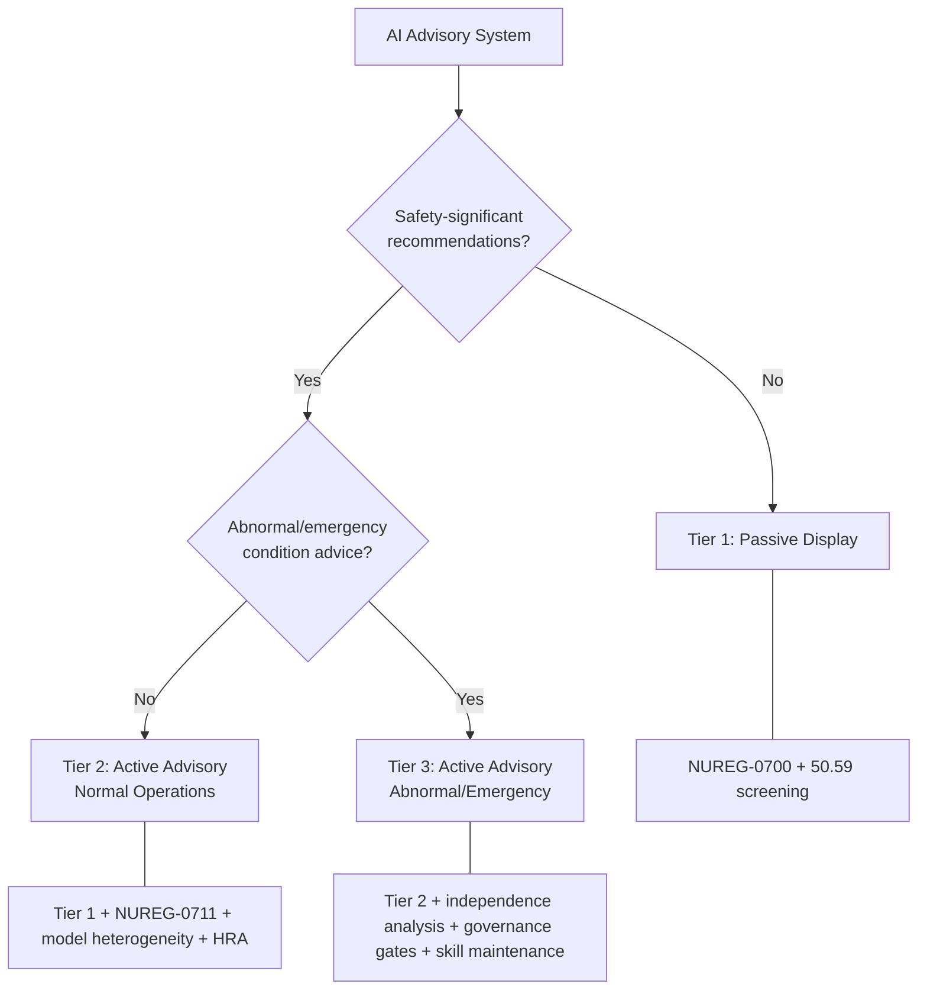

# AI Agents in the Nuclear Control Room: Regulation, Safety Assessment, Human Factors and Design Considerations

**Michael Hildebrandt**

**Draft, April 2026**

## Table of Contents

1. Introduction
2. Nuclear Operations as a Domain for Multi-Agent AI
3. Regulatory Implications
4. Implications for Safety Analysis
5. Implications for Control Room Design and Operation
6. Discussion
7. Conclusion
References

## 1. Introduction

### 1.1 The Design Space

AI advisory systems are being proposed for nuclear power plant control rooms in roles ranging from ambient parameter monitoring through alarm prioritisation to emergency response support. These proposals span a wide range of architectural complexity. A single monitoring agent with a heartbeat trigger is a different system from a multi-agent shared room with concurrent agents, model diversity, and human peer participation. The implications for regulation, safety analysis, and control room design differ accordingly.

This report examines what multi-agent AI means for nuclear operations under the NRC regulatory framework. It is structured around three perspectives: what the regulator needs to know about these systems (Section 3), what the safety analyst needs to assess (Section 4), and what the control room designer needs to build (Section 5). Section 2 first establishes why nuclear operations are a demanding domain for these architectural concepts.

These are observations from the perspective of a system designer examining how existing regulatory and safety analysis frameworks handle a new class of systems. They are not prescriptive regulatory guidance.

### 1.2 Scope

This report presents conceptual analysis. Nuclear qualification, software V&V under 10 CFR 50 Appendix B, and NRC licensing review lie beyond scope. The NRC is used as the reference regulatory framework because its structure is the most detailed and publicly documented, not because the gaps identified are unique to the US context.

A central limitation must be stated at the outset: the analysis in this report is conceptual. No empirical data from nuclear-domain evaluations of LLM-based advisory systems exists as of April 2026. All proposed extensions require validation through simulator studies and operational experience. Where quantitative values appear, they are illustrative and assumed, not measured.

Throughout this report, AI systems are treated as advisory only. They do not perform protection functions, do not actuate safety equipment, and do not provide inputs to protection system logic. The operator retains final decision authority for all safety-significant actions. This advisory-only assumption is foundational to every regulatory, safety analysis, and design consideration that follows.

### 1.3 Key Concepts

This report draws on two companion reports. The following table summarises key concepts used throughout the analysis; readers already familiar with LLM architecture and multi-agent systems may proceed directly to Section 2, while nuclear safety professionals will find enough context here to follow the argument without reading the companion reports.

**Table 1: Key concepts from companion reports**

| Concept | Definition | Source |
|---|---|---|
| Context window | The fixed-length token buffer that bounds what an LLM can attend to in a single inference; determines the agent's working memory limit | Report 1, §2 |
| Hallucination | Confident but factually incorrect LLM output with no surface-level indicator of error | Report 1, §4 |
| Calibration | The degree to which an LLM's expressed confidence matches its actual accuracy; instruction-tuned models are less calibrated than base models | Report 1, §4 |
| Sycophancy | The tendency of instruction-tuned LLMs to agree with the user's stated position rather than provide an independent assessment | Report 1, §4 |
| RAG (Retrieval-Augmented Generation) | A technique that retrieves external documents and injects them into the context window to ground the LLM's output in specific source material | Report 1, §5 |
| Knowledge graph | A structured representation of domain knowledge (entities and relations) used to constrain LLM output against verified facts | Report 1, §5 |
| Pattern 0 (Single Agent) | The simplest architecture: one LLM agent with tools, operating in a single context window | Report 2, §3 |
| Pattern 7 (Heartbeat Monitor) | A time-triggered monitoring agent that runs periodic assessments without operator initiation | Report 2, §3 |
| Pattern 9 (Shared Room) | The most complex pattern: concurrent agents with per-agent context isolation, role specialisation, and human peer participation in a shared communication space | Report 2, §3 |
| Epistemic independence | The property that two agents' reasoning errors are uncorrelated because they use different models, contexts, and information pathways | Report 2, §5 |
| Monoculture collapse | The failure mode in which agents sharing a single base model exhibit correlated systematic errors, defeating the purpose of redundancy | Report 2, §5 |
| Synthesiser | An agent role that aggregates outputs from multiple specialist agents into a coherent summary for human consumption | Report 2, §4 |
| SA Bridge | An agent role that translates between the multi-agent system's internal representations and the operator's situational awareness needs | Report 2, §4 |
| Governance gate | An architectural mechanism requiring human approval before any agent-recommended action with safety or licensing implications can proceed | Report 2, §6 |
| Soul prompt | The system-level instruction set that defines an agent's role, constraints, and behavioural boundaries within the multi-agent architecture | Report 2, §4 |
| Flow gate | A delivery mode control that queues agent outputs and releases them at operator-controlled intervals, preventing information flooding | Report 2, §6 |
| Room pause | A mechanism allowing any participant (human or agent) to halt all agent output in the shared room, providing immediate control over information flow | Report 2, §6 |

## 2. Nuclear Operations as a Domain for Multi-Agent AI

### 2.1 Characteristics and Architectural Implications

Nuclear power plant operations combine characteristics that make the domain a demanding test bed for multi-agent AI architecture. Each characteristic maps onto architectural concepts from the companion reports and carries specific implications.

**Table 2: Nuclear domain characteristics and architectural implications**

| Nuclear characteristic | Architectural concept | Implication |
|---|---|---|
| Defence-in-depth philosophy | Epistemic independence, common-cause failure, model heterogeneity | Model heterogeneity is not optional for verification roles; homogeneous agents violate defence-in-depth at the reasoning layer |
| Procedural formality (EOPs, AOPs, Tech Specs) | KG guardrails, Domain Expert role | Procedures and Technical Specifications as graph-structured knowledge; guardrail enforcement against LCO limits |
| Shift-based operations with handover | SA continuity, memory architecture, heartbeat | Persistent identity and episodic memory across shift boundaries; heartbeat-driven monitoring during handover |
| Time-critical decision-making | Delivery modes, human authority, SA Bridge role | Flow-gated delivery under time pressure; structural human authority via room pause |
| Regulatory independence requirements | Epistemic independence, model heterogeneity | NRC independence criteria have a direct epistemic analogue; reasoning independence is required for verification roles (see §3.3 for the full analysis) |
| Multi-unit SMR operation | Context divergence, SA scaling, Pattern 9 scaling | Agents must maintain SA across unit boundaries; cross-unit common-cause must be detectable |
| Conservative decision-making culture | Adversarial role, productive disagreement | Adversarial agents serve the questioning attitude; unresolved disagreement triggers conservative action |
| Change control (10 CFR 50.59) | Governance gate, human authority | AI-recommended actions affecting the licensing basis require formal screening |
| Emergency preparedness (10 CFR 50.47) | Pattern escalation, role transitions, authority transfer | Mode transitions from normal through abnormal to emergency with corresponding agent activation |
| Equipment qualification and V&V | Advisory vs authoritative distinction | AI outputs are advisory; qualified safety instrumentation is authoritative; display architecture must make this unambiguous |

The following diagram illustrates the graded regulatory pathway introduced in Table 3 (Section 3.2), showing how the operational role of an AI advisory system determines its regulatory tier and the corresponding review requirements.

Three characteristics deserve extended treatment.

**Defence-in-depth and epistemic independence.** The defence-in-depth philosophy structures nuclear safety around multiple independent barriers: fuel cladding, reactor coolant pressure boundary, containment. The independence of these barriers gives the layered approach its safety value; a common-cause failure that compromises multiple barriers defeats the strategy. If multiple AI agents are deployed as independent monitors but share a single base model, they share a common cause for their systematic errors. The barriers are not independent. Defence-in-depth at the reasoning layer requires model heterogeneity for the same reason that physical defence-in-depth requires design diversity.

**Conservative decision-making and productive disagreement.** Nuclear safety culture places high value on a "questioning attitude," the practice of challenging assumptions rather than accepting conditions at face value. The adversarial agent role is a direct implementation of this principle. When an adversarial agent running on a different base model challenges a forming consensus, and the challenge is grounded in separate reasoning, the disagreement serves the questioning attitude. When the adversarial agent runs on the same model as the agents it challenges, the "challenge" is generated from the same distributional base and carries no independent weight.

**Multi-unit SMR operations.** Traditional nuclear plants have one reactor, one control room, and a dedicated crew. Several SMR designs place multiple modules under a shared control room with smaller staff, relying on passive safety and increased automation. This multiplies the SA challenge: the operator must maintain awareness of four or more units simultaneously, distinguish unit-specific conditions from cross-unit patterns, and avoid unit confusion. Multi-agent architectures face an analogous design question: should each unit have its own agent team (maximising per-unit SA depth at the cost of cross-unit awareness), or should some agents span multiple units (enabling cross-unit pattern detection at the cost of per-unit context budget)?

### 2.2 Regulatory Framework Orientation

The NRC regulatory documents most relevant to AI advisory systems in control rooms are: 10 CFR 50 Appendix A (General Design Criteria, especially GDC 13, 19, 22, 24); NUREG-0700 Rev. 3 (HSI Design Review Guidelines); NUREG-0711 Rev. 3 (HFE Program Review Model); NUREG-1764 Rev. 1 (Changes to Human Actions); and the NRC AI Strategic Plan (SECY-23-0022, 2023). Section 3 develops the regulatory analysis against these documents.

## 3. Regulatory Implications

### 3.1 The Current NRC Framework for AI

The NRC regulatory framework for control rooms was developed for deterministic automation with statically allocated functions and human operators as the sole cognitive agents. The NRC AI Strategic Plan (SECY-23-0022, 2023) acknowledges the need to develop a framework for AI in licensed facilities but no prescriptive requirements have been issued.

NUREG-0700 Rev. 3 (2020) provides the most directly applicable criteria. Chapter 5 covers decision support systems with principles that predate LLM capabilities but apply directly: decision support outputs must be distinguishable from plant data, decision support is advisory only, the operator retains decision authority, and the system must provide transparency about how it arrives at recommendations. Chapter 8 addresses automation levels, requiring operator awareness of automation state and the ability to override.

NUREG-0711 Rev. 3 (2012) requires documented justification for function allocation between humans and automation. The current framework assumes static allocation: a function is assigned to the human, to automation, or to shared control, and the assignment is fixed at design time. AI advisory systems challenge this assumption. The AI does not take control actions (so it is not traditional automation), but it performs cognitive work that was previously the operator's (so it is not traditional human operation). A new allocation category, "human with AI cognitive support," may be needed.

### 3.2 The Regulatory Classification Problem

The central challenge is that AI advisory systems occupy a grey zone in the NRC classification framework. While the framework is often characterised as a binary between safety-related (Class 1E) and non-safety, the NRC also recognises intermediate categories: "important to safety" systems, and the risk-informed categorisation under 10 CFR 50.69 (RISC-1 through RISC-4).

AI advisory systems affect safety through the operator's decision-making. An operator who acts on an incorrect AI recommendation during a design-basis event may take an action that would not have occurred without the AI. An operator who relies on AI monitoring and misses a condition the AI failed to detect experiences a safety consequence flowing through the AI system.

NUREG-1764 Rev. 1 (2007) partially addresses this through its framework for evaluating changes to human actions with a graded approach proportionate to risk significance. But the guidance was written for modifications to procedures and displays, not for a cognitive partner generating novel analysis in real time.

This suggests a graded regulatory approach proportionate to the AI system's operational role:

**Table 3: Graded regulatory approach for AI advisory systems**

| Tier | Operational Role | Risk Significance | Review Depth | Example |
|---|---|---|---|---|
| 1: Ambient monitoring | Background trending; shift handover support | Low; operator does not depend on AI for safety actions | NUREG-1764 screening; limited HFE review | Pattern 7 monitoring agent |
| 2: Active advisory | Real-time diagnostic support; alarm prioritisation | Moderate; operator receives AI input during operational decisions | Full NUREG-0711 function allocation; ISV with AI | Pattern 9 during abnormal conditions |
| 3: Safety-critical advisory | Emergency response support; independent verification | High; AI output directly informs safety-significant actions | Full NUREG-0711 HFE programme; D3 analysis for AI CCF; model heterogeneity assessment | Pattern 9 with adversarial role in LOCA response |

Classification under this approach would be the licensee's responsibility, subject to NRC review, following the precedent of risk-informed categorisation under 10 CFR 50.69. The tier boundaries require further definition; the table above is a starting framework.

### 3.3 Independence, Diversity, and Defence-in-Depth

10 CFR 50 Appendix A establishes the General Design Criteria. GDC 22 requires protection system independence, redundancy, and testability. GDC 24 requires separation between protection and control systems. BTP 7-19 elaborates independence across four dimensions: functional, physical, electrical, and communications. This analogy is pedagogical rather than regulatory. GDC 22 applies to protection systems, not advisory displays.

The epistemic independence argument from Report 2 identifies a fifth dimension that the current framework does not address: reasoning independence. If two AI agents performing independent safety assessments share the same model weights, their systematic errors are correlated at the source. Same-model agents fail the reasoning independence test in the same way that safety channels sharing a common power supply fail the electrical independence test. This is the definitive statement of the reasoning independence principle as it applies to nuclear AI advisory systems: agents deployed in verification or independent assessment roles must use different base models with separate training pipelines to ensure that their systematic errors are uncorrelated, because correlated reasoning errors defeat the purpose of redundant assessment in the same manner that common-cause hardware failures defeat redundant safety channels. The architectural basis for this claim is developed in Report 2 (Section 5); the nuclear-specific implications are that any multi-agent advisory configuration in which one agent checks or verifies another's output requires model heterogeneity to provide genuine independence, and that this requirement becomes more stringent as the advisory tier increases from ambient monitoring to safety-critical advisory.

**Table 4: NRC independence dimensions and multi-agent AI analogues**

| NRC Dimension | Traditional Implementation | Multi-Agent AI Analogue | Regulatory Coverage |
|---|---|---|---|
| Functional | Different safety functions in separate systems | Different agent roles with distinct tools | Covered by role specialisation |
| Physical | Separate cabinets or rooms | Separate compute processes on independent infrastructure | Achievable; no gap |
| Electrical | Independent power supplies | Independent computational resources | Achievable; no gap |
| Communications | Isolated data paths preventing failure propagation | Separate agent processes; agents communicate only through the shared room. Note: closer to functional independence than NRC communications independence, which addresses data bus isolation | Partially addressed; NRC criteria do not map cleanly to LLM context boundaries |
| Reasoning (proposed) | Not in current framework | Different base models with separate training pipelines | Not addressed by any current NRC document |

BTP 7-19 requires a D3 (diversity and defence-in-depth) analysis demonstrating that software common-cause failure does not prevent required safety functions. NUREG/CR-7190 (2015) provides evidence of software CCF in nuclear digital I&C. A D3 analysis for multi-agent AI would need to address model-level common-cause failure, a category the current BTP does not contemplate.

The convergence between the architectural analysis and the NRC independence framework is suggestive rather than confirmatory: the NRC framework was developed for hardware and deterministic software, and extending it to reasoning-level diversity is this report's proposal, not established regulatory doctrine. But the structural parallel indicates that any future regulatory evaluation of AI-based independent verification will need to address reasoning independence as a dimension.

The single failure criterion (10 CFR 50 Appendix A, GDC 35) provides the regulatory foundation for the advisory-only design. If the AI advisory system fails entirely (a single failure), the operator must still perform all credited safety actions unaided, using qualified safety displays and plant procedures. The AI system cannot be credited as the sole means of accomplishing any safety function. This constraint is maintained across all scenarios in Report 4: qualified safety displays remain the authoritative information source independent of AI advisory, and the operator's ability to diagnose and respond without AI support is a maintained competency (Section 5.5, skill degradation and maintenance). The single failure criterion does not prevent AI advisory deployment; it requires that the plant's safety case does not depend on it.

### 3.4 Software Qualification and Non-Determinism

The NRC software lifecycle framework (RG 1.152, IEEE 7-4.3.2) assumes deterministic software with traceable requirements. LLMs are non-deterministic in practice: at temperature zero some implementations approach deterministic behaviour, but operational deployment uses non-zero temperature and the stochastic behaviour is by design. The nuclear V&V framework, from requirements traceability to test case coverage, is built on determinism assumptions that LLMs violate.

For safety-related (Class 1E) applications, this mismatch is likely disqualifying under current criteria. For advisory applications, ISV testing (NUREG-0711 Chapter 12) must include the AI system, but non-deterministic outputs mean multiple ISV runs of the same scenario produce different AI responses. A statistical ISV approach (evaluating outcome distributions rather than requiring identical results) is a potential adaptation, but no such protocol exists for nuclear.

Adaptive architectures compound the problem. A system that modifies its own behaviour based on operational experience is a moving target for V&V. Bounded adaptation within a pre-validated envelope is a potential approach.

### 3.5 Hardware Qualification and Physical Infrastructure

The software qualification challenges in Section 3.4 have a hardware counterpart. If AI inference hardware is co-located with control room equipment, environmental qualification under 10 CFR 50.49 applies (temperature, humidity, radiation for mild-environment locations). Seismic qualification (IEEE 344) applies if the hardware must survive a design-basis earthquake. Electrical separation per GDC 17 and IEEE 384 must be maintained between AI system power supplies and safety-related electrical buses.

In practice, the AI compute infrastructure is likely to be classified as non-safety, non-seismic, located outside the control room in a plant computer room or data centre. The communication pathway between the AI system and control room displays must then be qualified as an isolation device, ensuring that failures in the AI system cannot propagate to safety-related display systems. This is standard practice for non-safety digital systems interfacing with control room HSI (per NUREG-0800 BTP 7-19 guidance on isolation).

The hardware qualification path for AI advisory systems is not novel; it follows established patterns for non-safety computing connected to safety-related displays. The novelty lies in the software running on the hardware, not in the hardware itself.

### 3.6 Prompt Opacity and Deployment Model

When an LLM is accessed through a frontier API, the provider injects additional system-level instructions that the developer cannot see, inspect, or disable. Provider-side safety filters may modify model outputs before delivery, and model aliases may point to different checkpoints over time without notice to the developer. For NRC software qualification, these properties prevent requirements traceability (RG 1.152), undermine regression testing (since the provider can change behaviour without the licensee's knowledge), and make incident investigation impossible (the provider's hidden state at the time of inference may not be recoverable). Furthermore, two agents accessing the same frontier API share the provider's hidden system prompt and output filtering, creating a common-cause pathway through shared infrastructure that the licensee neither controls nor can characterise. These considerations reinforce the conclusion that any nuclear application subject to NRC oversight will require local model deployment for V&V, configuration management, and auditability reasons, in addition to the cybersecurity requirements of 10 CFR 73.54. For the full analysis, see Report 1, Section 7.5.

### 3.7 The 10 CFR 50.59 Change Evaluation

Introduction of an AI advisory system constitutes a digital modification subject to 10 CFR 50.59 change evaluation. Of the eight screening criteria, two are directly relevant; the remaining six (addressing design-basis limits, fission product barriers, and ex-core events) are less applicable, though a thorough screening evaluates all eight.

The first relevant criterion asks whether the change could increase the frequency of a previously evaluated accident. If the AI could lead an operator to take an incorrect action during a design-basis event, the change could increase accident frequency. The answer depends on AI reliability, which is not yet quantifiable to nuclear safety standards.

The second asks whether the change could alter a method of evaluation in the FSAR safety analyses. If the AI performs analyses that supplement credited operator actions, the change may alter the method of evaluation.

The remaining six criteria address: whether the change increases the consequence of a previously evaluated accident, creates a different type of accident, increases the probability of a malfunction of equipment important to safety, creates a different type of malfunction, reduces a margin of safety, or is inconsistent with a technical specification. For an AI advisory system that does not actuate equipment or modify setpoints, these criteria are less directly triggered. However, a thorough 50.59 screening (per NEI 96-07 implementation guidance) would evaluate each criterion against the specific AI system's operational role, since an advisory system that influences operator actions during design-basis events could indirectly affect any of these criteria through the operator's response.

For adaptive AI systems, each adaptation is potentially a new change requiring its own 50.59 screening. If the system adapts frequently, the cumulative burden may be prohibitive unless adaptation is bounded within a pre-screened envelope.

### 3.8 Identified Regulatory Gaps

Nine gaps where the current NRC framework does not address properties that the architectural analysis shows are consequential:

**Well-developed gaps (requiring new regulatory guidance):**
1. **Reasoning independence.** No NRC document addresses common-cause failure at the model or reasoning level (see §3.3 for the full analysis). BTP 7-19 covers functional, physical, electrical, and communications independence but not reasoning independence.
2. **AI model qualification.** No pathway for qualifying a non-deterministic model under existing software standards (IEEE 603, RG 1.152).
3. **Adaptive system governance.** No guidance for systems that change behaviour through operational experience. The intersection of 50.59 and continuous adaptation is unresolved.
4. **Multi-agent coordination evaluation.** No framework for evaluating multi-agent architectures as coordinated systems rather than individual software components.
5. **AI transparency and explainability.** No NRC-specific requirements beyond the general NUREG-0700 Chapter 5 transparency provision.

**Identified but not fully developed in this report:**
6. **AI-specific human factors criteria.** NUREG-0700 Chapter 5 predates LLM capabilities.
7. **SMR multi-unit AI monitoring.** NUREG/CR-7151 (2012) predates AI advisory concepts.
8. **AI-specific cybersecurity.** LLM-based systems introduce attack vectors that differ qualitatively from traditional digital I&C cybersecurity concerns addressed by 10 CFR 73.54 and NEI 08-09. (a) Critical Digital Asset determination: the AI system must be evaluated for CDA status under the plant's Cyber Security Plan. If it processes or displays information used in safety decisions, security decisions, or emergency preparedness, it is likely a CDA regardless of its non-safety classification. (b) Prompt injection: an attacker who can modify the system prompt, the data feeds, or the knowledge graph can cause the AI to produce arbitrary output without triggering traditional intrusion detection. Prompt injection is a natural-language attack that exploits the model's instruction-following behaviour rather than software vulnerabilities. NEI 08-09's defensive architecture does not address this vector. (c) Supply chain security: model weights encode patterns from training data. If training data is poisoned (deliberately including malicious patterns), the resulting model may behave normally on most inputs but produce targeted errors on specific trigger conditions. The supply chain extends from training data through fine-tuning to deployment. (d) Model exfiltration: model weights contain proprietary and potentially sensitive information. If an attacker gains access to the weights of a model fine-tuned on plant-specific data, they gain indirect access to the plant information embedded in the fine-tuning. (e) Air-gapping vs network segmentation: for locally deployed models, air-gapping the AI inference system eliminates network attack vectors but prevents model updates and remote monitoring. Network segmentation with qualified isolation devices is the more practical approach for systems requiring periodic maintenance access.
9. **Quality assurance for self-modifying systems.** How 10 CFR 50 Appendix B QA addresses systems whose behaviour changes with updates.

The NRC's own Regulatory Framework Gap Assessment for AI (ML24290A059, Pensado et al., 2024) reviewed over 500 regulatory guides for AI adequacy. That assessment identifies similar themes: AI software testing standards are underdeveloped, generative AI outputs may not be fully reproducible, and existing guidance does not address the non-deterministic properties of AI systems. This report's nine gaps overlap with but extend the NRC's analysis. The architectural perspective from Report 2 surfaces gaps that a general AI review does not reach, most significantly reasoning independence (Gap 1, see §3.3): the NRC's gap assessment does not address common-cause failure at the model level, because this concern becomes visible only when the multi-agent architecture is considered.

### 3.9 International Context

No international nuclear regulator has issued specific guidance on multi-agent AI in control rooms. IAEA-TECDOC-1952 (2021) surveys AI/ML in nuclear operations but does not address multi-agent coordination. IAEA SSG-51 addresses human factors for new reactor designs including increased automation but predates AI advisory concepts. IAEA SSG-39 (Design of Instrumentation and Control Systems for Nuclear Power Plants) provides the I&C design principles that any AI advisory system interfacing with plant instrumentation must satisfy, including requirements for system categorisation, qualification, and independence that parallel the NRC framework discussed in Sections 3.3-3.5. The NEA/CSNI Working Groups on Human and Organisational Factors (WGHOF) and Risk Assessment (WGRISK) have examined related topics but produced no guidance specific to multi-agent architectures.

The tri-regulator document ML24241A252 (NRC/CNSC/ONR, 2024) represents the first coordinated international position on AI in nuclear applications. The joint statement addresses training data quality, model interpretability, and validation challenges, establishing common ground across three regulatory traditions (prescriptive US, goal-setting UK, hybrid Canadian). That three regulators with different philosophical frameworks arrived at convergent positions on AI challenges suggests that the gaps identified in this report are structurally inherent to AI technology rather than artefacts of any single regulatory approach. The joint position does not address multi-agent coordination or reasoning independence, confirming that these architectural concerns remain ahead of regulatory attention internationally.

The EU AI Act (2024) would likely classify AI in nuclear safety applications as "high-risk" under Annex III, depending on whether such systems meet the definition of "safety components" as specified in the regulation. The specific high-risk requirements include: mandatory conformity assessment before deployment, a documented risk management system maintained throughout the AI system's lifecycle, data governance requirements for training and validation data, and prescribed human oversight measures including the ability to override or halt the system. These requirements create regulatory tension with the NRC framework. The NRC's performance-based approach allows licensees to propose methods for demonstrating safety; the EU AI Act prescribes specific process requirements regardless of the licensee's demonstration. A system deployed under both frameworks would need to satisfy both, and the EU's conformity assessment process has no NRC equivalent. The UK ONR has published guidance on computer-based safety systems (TAG-046 series) and is developing AI positions through the Generic Design Assessment process. The CNSC is developing guidance as part of advanced reactor licensing preparedness.

WENRA (Western European Nuclear Regulators Association) reference levels for I&C systems provide the basis for several European regulators' national requirements, including categorisation of I&C functions and requirements for computer-based system qualification. Any European deployment of AI advisory systems in control rooms would be evaluated against these reference levels, which share structural similarities with the NRC's GDC framework but differ in specific implementation requirements.

The gaps identified above are field-wide, not NRC-specific.

## 4. Implications for Safety Analysis

Current HRA methods cannot model AI-assisted operations without extension. This section shows where each method breaks, proposes the extensions needed, and identifies the empirical data required to support them.

### 4.1 HRA Methods and Their Assumptions

**Table 5: HRA methods and AI challenges**

| Method | Core Model | AI Challenge |
|---|---|---|
| THERP (NUREG/CR-1278) | Task decomposition with lookup-table HEPs and dependence model | No mechanism for AI advisory between sequential actions; dependence model does not account for AI recommendations |
| ATHEANA (NUREG-1624) | Error-forcing contexts driving errors of commission | An incorrect AI recommendation can itself constitute an error-forcing context, but ATHEANA's framework does not address AI-generated contexts |
| SPAR-H (NUREG/CR-6883) | Eight PSFs combined multiplicatively | No PSF for AI advisory quality, operator-AI trust, or AI system reliability |
| IDHEAS-ECA (NUREG-2199) | Five macrocognitive functions with cognitive failure modes | The "teamwork" function already models crew interactions; the gap is the absence of non-human cognitive agents in the team model |
| CREAM | Contextual Control Model with four control modes and Common Performance Conditions | AI advisory changes the context and could shift the operator between control modes; CPCs are a natural extension point for AI factors |

### 4.2 The Structural Gap

Every method in Table 5 models the operator as the sole cognitive agent. No method accounts for: an AI providing a diagnostic suggestion the operator may accept, reject, or partially integrate; the AI being wrong in ways correlated with the situation; multiple AI agents providing conflicting advice; or the operator's error probability being conditioned on whether they followed or overrode the AI.

The depth of this gap depends on the modelling approach. Treating the AI as a contextual factor (a new Performance Shaping Factor) can be accommodated within existing methods with moderate extension. Treating the AI as a cognitive team member requires more substantial development. In neither case can current methods be applied without modification: existing PSF frameworks lack AI-relevant factors, dependency models do not account for AI recommendations between sequential actions, and HFE definitions do not cover AI-specific failure modes.

### 4.3 Two Modelling Approaches

**Approach A: AI as Performance Shaping Factor.** Treat the AI as a context modifier analogous to "quality of procedures" or "HSI quality." A well-functioning AI reduces HEP; a failing AI increases it. Fits within existing frameworks. Limitation: treats the AI as a static modifier rather than a dynamic participant.

**Approach B: AI as cognitive team member.** Extend the framework to model human-AI joint cognitive activity with its own reliability characteristics, trust dynamics, and interaction effects. More accurate but requires methodological development beyond current practice. IDHEAS-ECA's macrocognitive framework with its "teamwork" function is the most promising starting point.

A pragmatic path: Approach A for near-term PSA applications, while developing Approach B for more accurate modelling as empirical data becomes available.

### 4.4 Comprehensive PSF and HFE Extensions

Table 6 consolidates the proposed extensions: new PSFs, new Human Failure Events, and design mitigations. HFEs are ordered by evidence base: automation bias and complacency are well-documented; reconciliation failure and trust recalibration delay are less studied.

Note: "AI system reliability" as a PSF simplifies a distributional property (LLM outputs fall on a spectrum of usefulness) into a single factor. "Multi-agent agreement" is an emergent system output rather than a contextual property in the traditional PSF sense. Both require care in quantitative application.

**Table 6: AI-related PSFs, HFEs, and mitigations**

| Factor / Failure Mode | Type | Definition | Effect / Consequence | Mitigation | Evidence |
|---|---|---|---|---|---|
| AI system reliability | PSF | How often the AI advisory is useful and accurate | High reliability reduces HEP but creates bias risk with prolonged reliability | Performance monitoring; uncertainty communication | Parasuraman and Manzey (2010) |
| Operator trust calibration | PSF | Match between trust and actual reliability | Over-trust causes bias; under-trust causes inappropriate override | Trust calibration training; AI failure exposure | Lee and See (2004) |
| AI transparency | PSF | Whether operator can determine what data AI used and why | Transparency supports verification; opacity forces accept/reject | Provenance indicators; reasoning access | Sarter and Woods (1995) |
| Communication quality | PSF | Clarity, timeliness, relevance of AI output | Poor quality increases workload and degrades SA | Alert thresholds; Synthesiser filtering | Ancker et al. (2017) |
| AI degradation mode | PSF | How AI behaves when it fails or receives degraded inputs | Silent failure increases risk | Failure annunciation; maintained manual baseline | Sittig and Singh (2010) |
| Multi-agent agreement | PSF | Whether agents agree or disagree | Disagreement creates reconciliation task | Synthesiser; disagreement basis displayed | Wu et al. (2025) |
| Automation bias error | HFE | Operator accepts incorrect AI recommendation without verification | Misdiagnosis; wrong procedural path | Advisory labelling; verification procedures; wrong-AI training scenarios | Mosier and Skitka (1996); well-documented |
| Inappropriate AI override | HFE | Operator overrides correct AI recommendation | Correct advice not acted on | Training on AI capabilities; post-event review | Less studied; primarily theoretical |
| Reconciliation failure | HFE | Operator cannot resolve conflicting multi-agent advice | Delayed response; ungrounded decision | Synthesiser role; model diversity to reduce false consensus | Multi-agent specific; limited data |
| AI transition failure | HFE | AI fails mid-event; operator resumes manual SA from degraded starting point | Delayed recovery; reduced SA during transition | AI-off drills; maintained manual procedures | Endsley and Kiris (1995) |
| Trust recalibration delay | HFE | After AI error, operator loses trust in all AI outputs | Degraded performance on tasks where AI advice would help | Performance feedback; graduated trust recovery | Lee and See (2004); limited nuclear data |
| AI output specificity | PSF | Degree to which AI advisory provides condition-specific, discriminating information versus generic, textbook-level assessments | Low specificity increases cognitive workload (operator must independently perform the discrimination the AI should have provided) and may induce disengagement over time | Structured output templates; specificity requirements in soul prompts; novelty filters | Shaib et al. (2025); Kommers et al. (2025) |
| Slop-induced disengagement | HFE | Operator reduces attentional investment in AI output after repeated exposure to generic, non-discriminating assessments; distinct from automation bias (which involves over-trusting specific recommendations) | Operator fails to evaluate a genuinely insightful or genuinely wrong AI assessment because prior experience has taught them that AI output adds little to their independent assessment | Specificity monitoring; operator training on slop recognition; periodic quality audits of AI output | Wickens et al. (2009) cry-wolf effect; limited direct data |

These failure modes affect different human roles differently. Automation bias is primarily a risk for the supervisor and peer participant roles. Reconciliation failure affects the authority holder most severely, since unresolved disagreement at a decision point demands the authority holder's judgement.

The PSFs and HFEs in Table 6 are defined at the conceptual level. For interim PSA application before empirical data is available, three approaches provide a defensible starting point. First, structured expert judgement per NUREG-1792: a panel of HRA analysts and nuclear human factors engineers estimates PSF multipliers and HFE probabilities using structured elicitation with calibration questions. Second, sensitivity analysis: vary AI-specific PSF multipliers across their plausible range (typically one to two orders of magnitude given absent data) and determine whether the AI contribution to core damage frequency is significant across the range. Third, bounding analysis: assume the most unfavourable values for AI-related PSFs and HFEs and evaluate whether the plant's safety case remains within acceptance criteria even under worst-case AI assumptions. Report 5 develops worked examples of these approaches. If the bounding case is acceptable, the AI system can be deployed with monitoring to collect operational data for future refinement.

### 4.5 The Dependency Modelling Problem

Current HRA dependency models (THERP's five-level model, SPAR-H's dependency assessment) adjust the HEP for a second action based on whether the first action succeeded or failed. With AI advisory, the dependency structure changes. The operator's second action is conditioned on: (a) the first action's outcome, (b) whether the AI recommendation was correct, and (c) whether the operator followed or overrode the AI. Widely used dependency models do not handle this three-way conditional. Bayesian network HRA methods (such as HUNTER) can in principle represent arbitrary conditional dependencies and would be a more natural framework, though no BN-based HRA application to AI-assisted operations has been published.

**Event tree illustration.** Consider a post-trip operator diagnosis: the operator must identify the trip cause within a specified time to select the correct recovery procedure. Without AI, the event tree has two branches at this node: correct diagnosis (success) or incorrect/delayed diagnosis (failure). With AI advisory, the tree expands to four branches:

*Figure 1: Event tree expansion for operator diagnosis with AI advisory. Green outcomes are correct diagnoses; red outcomes are incorrect. The overall HEP depends on conditional probabilities across all four branches, which in turn depend on the PSFs in Table 6. No current PSA model includes these branches because no current HRA method provides the conditional probabilities to populate them.*

### 4.6 Common-Cause Failure Between Human and AI

The common-cause failure analysis from Report 2 addresses model-level CCF between AI agents. A distinct category applies to the human-AI pair. The reasoning independence principle (§3.3) applies here as well: shared information pathways between human and AI create correlated errors that reduce the effective independence of the pair.

*Shared sensor data.* If a sensor fails, both operator and AI receive incorrect readings. The AI's confident assessment anchors the operator's interpretation: the operator who might have questioned a suspect reading independently is more likely to accept it when the AI analysis, also based on the bad reading, confirms it.

*Anchoring.* Even when the operator has independent information, the AI recommendation provides a cognitive anchor (Tversky and Kahneman, 1974) that biases the operator's assessment. The "independent" check is less independent than it appears.

*Shared mental models.* If operator training incorporates the AI's analytical patterns, the human and AI converge on the same systematic biases over time. The diversity that human judgement is supposed to provide erodes as the human adapts to the AI's reasoning patterns.

Each mechanism has a concrete nuclear manifestation. For shared sensor data: during a loss-of-coolant event, if a containment pressure transmitter fails high, both the operator and the AI will form a more severe situational picture than the plant condition warrants. The AI's confident projection of containment challenge reinforces the operator's interpretation, potentially leading to unnecessary or premature protective actions. For anchoring: an AI diagnostic recommendation of "feedwater malfunction" anchors the operator's investigation even if the operator has access to indications pointing toward an electrical fault (the anchoring effect documented by Tversky and Kahneman, 1974, shows this bias persists even when subjects are told the anchor is random). For shared mental models: if operators train with AI advisory for several years, their pattern recognition for plant transients will be shaped by the AI's analytical patterns, reducing the cognitive diversity that independent human judgement is supposed to provide. Aviation experience provides a partial analogue: the Asiana 214 accident (2013) involved pilots whose manual flying skills had atrophied through automation reliance, a form of skill convergence with the automation's capabilities.

Traditional CCF methods (beta-factor, alpha-factor) were developed for hardware redundancy. While these parametric models do not inherently require same-type components, their parameters have been estimated exclusively from hardware failure data, and no basis exists for human-AI pairs. Healthcare automation studies (for example, research on clinical decision support alert fatigue showing override rates of 49-96% for high-false-positive systems) provide data on human-automation interaction failure rates, but the transfer to nuclear operations requires careful justification given the different operational contexts, training levels, and consequence severities. A structured research programme to develop human-AI CCF parameters for nuclear PSA is among the most important gaps identified in this report.

### 4.7 Risk Reduction Potential

AI advisory systems should also reduce the probability of some existing HFEs. AI monitoring can catch deviations operators miss during high-workload periods. AI alarm prioritisation can reduce the cognitive burden of alarm cascades. AI diagnostic support can reduce diagnosis time for complex events.

The net safety effect depends on the balance between new failure modes and risk reductions. Neither the probabilities of new failure modes nor the magnitudes of risk reductions are available from operating experience. PSA treatment should present both sides: new failure modes as additional event tree branches, and risk reductions as modified HEPs, with uncertainty bounds reflecting absent data.

### 4.8 IDHEAS-ECA as Extension Framework

IDHEAS-ECA is the most promising candidate for extension to AI-assisted operations. Its macrocognitive framework (detection, understanding, decision-making, action execution, teamwork) can accommodate AI along several paths: the teamwork function extends to human-AI teaming; AI-specific cognitive failure modes map to each macrocognitive function; AI-specific crew-level factors incorporate into the existing factor structure; and conditional dependencies between operator performance and AI correctness can be modelled through the extended dependency structure. These extensions are conceptual; validation requires empirical data.

### 4.9 Knowledge Gaps and Research Needs

Five categories of data are needed:

1. **Empirical operator-AI interaction data.** Simulator studies with licensed operators using AI advisory under realistic conditions. Facilities capable of this research include the Halden Man-Machine Laboratory (IFE) and INL's Human Systems Simulation Laboratory.
2. **AI reliability characterisation.** Quantified reliability of LLM advisory outputs for nuclear tasks, under both normal and degraded input conditions. Must be statistical (probability distributions over quality) rather than deterministic.
3. **Trust dynamics data.** How operator trust evolves with experience and error exposure in nuclear-specific contexts.
4. **CCF modelling methodology.** Formal methods for human-AI CCF in event tree and fault tree frameworks.
5. **Validation of extended HRA methods.** Any method extended for AI-assisted operations must be validated against points 1-3.

The following table maps the regulatory tiers from Section 3.2 to the HRA scope required at each tier, connecting the regulatory classification to the safety analysis extensions developed in Sections 4.2-4.8:

**Table 7: Regulatory tier to HRA scope mapping**

| Regulatory Tier | HRA Scope Required | PSA Modification |
|---|---|---|
| Tier 1 (Ambient monitoring) | Screening: adjust existing HFE probabilities using AI reliability as a PSF modifier within SPAR-H | Modify HEP values for affected operator actions; no new event tree branches |
| Tier 2 (Active advisory) | Full: four-branch event tree expansion for AI-assisted operator actions; new HFEs from Table 6 | Add new event tree branches for AI-correct/incorrect and operator-follows/overrides; add automation bias and AI transition failure HFEs |
| Tier 3 (Safety-critical advisory) | Comprehensive: full event tree expansion, human-AI CCF analysis (Section 4.6), model diversity assessment, multi-agent coordination evaluation | Restructure affected event sequences; add new CCF cut sets for human-AI common cause; demonstrate model-level independence in D3 analysis |

### 4.10 Consolidated Research Roadmap

The research needs identified across this report (Sections 4.9, 5.5) and the companion reports (Report 4 Synthesis, Report 5 Discussion) are consolidated below in dependency order. Later items depend on earlier items; starting with later items before the foundations are in place produces results that cannot be validated.

**Table 8: Prioritised research roadmap for AI-assisted nuclear operations**

| Priority | Research Need | Dependencies | Key Facilities / Capabilities | Effort Scale | Referenced In |
|---|---|---|---|---|---|
| 1 (foundation) | Nuclear-domain LLM benchmarking: standardised tasks for plant state diagnosis, procedure interpretation, Tech Spec compliance checking, alarm prioritisation | None | Domain experts to define tasks and ground truth; NRC/industry collaboration for task validation | Small team, 6-12 months | R3 §5.5, R1 §7.5 |
| 2 (foundation) | AI reliability characterisation: statistical reliability of LLM advisory for benchmarked tasks under normal and degraded inputs | Benchmarks (1) | Computational infrastructure for large-scale evaluation runs | Small team, 6-12 months | R3 §5.5, R5 §9.2 |
| 3 (foundation) | Empirical operator-AI interaction data: simulator studies with licensed operators using AI advisory under realistic conditions | Benchmarks (1) for scenario design | IFE Halden Man-Machine Laboratory, INL Human Systems Simulation Laboratory | Multi-institution, 2-4 years | R3 §4.9, R5 §9.2 |
| 4 (building) | Trust dynamics characterisation: how operator trust evolves with experience and AI error exposure | Simulator data (3) | Analysis of simulator study data; longitudinal study design | Multi-institution, 2-4 years | R3 §4.9 |
| 5 (building) | Conditional HEP estimation: how AI correct/incorrect recommendations change operator error rates | Simulator data (3), reliability data (2) | HRA analyst teams applying extended methods to simulator data | Specialist team, 1-2 years | R5 §9.2 |
| 6 (building) | Human-AI CCF parameter estimation: beta-factor or equivalent parameters for shared-sensor, anchoring, and shared-mental-model CCF | Simulator data (3), cross-domain data from aviation/healthcare | PSA analyst teams; formal cross-domain transfer methodology | Multi-institution, 2-4 years | R3 §4.6 |
| 7 (integration) | HRA method validation: validate SPAR-H, IDHEAS-ECA, ATHEANA extensions against empirical data | Items 3-6 | HRA community engagement; formal benchmarking exercise | Multi-institution, 3-5 years | R5 §9.3 |
| 8 (integration) | Regulatory framework development: formalise graded classification (Table 3), develop acceptance criteria per tier | Items 1-2 for technical basis | NRC/industry engagement; regulatory research programme | Requires regulatory engagement, timeline uncertain | R3 §3.7 |

The most urgent near-term actions are items 1-3, which can proceed in parallel and provide the empirical foundations that all subsequent items require. Items 4-6 depend on simulator study data and can begin as soon as initial studies produce results. Items 7-8 are integration activities that require the foundations to be in place.

## 5. Implications for Control Room Design and Operation

### 5.1 Design Principles

Seven principles drawn from cross-industry and nuclear operating experience. Five cross-industry principles: (1) authority hierarchy must be explicit (TCAS/Uberlingen lesson); (2) operators must understand what the automation is doing (737 MAX/MCAS lesson); (3) manual competency must be maintained independently (AF447 lesson); (4) silent failure is more dangerous than loud failure (Sittig and Singh, 2010); (5) alert systems with high false-positive rates will be ignored (Ancker et al., 2017; ISA-18.2 principles).

Nuclear-specific (two): (6) Information overload during transients must be managed by design. TMI-2 (1979) demonstrated that operators presented with more information than they can process under stress miss critical indications. The SPDS was the design response. AI advisory systems that generate additional output during transients risk recreating the same overload. The Synthesiser role and delivery mode controls serve the same function. (7) Digital system failures can be subtle. The Forsmark-1 event (2006) involved a complex digital I&C cascade whose root cause was not immediately apparent. AI systems that continue producing outputs of degraded quality are similarly difficult to detect.

### 5.2 Function Allocation

The Parasuraman, Sheridan, and Wickens (2000) LOA framework provides the standard for function allocation in automated systems. The Fitts (1951) "men are better at / machines are better at" framework, while foundational, is now widely regarded as oversimplified (Dekker and Woods, 2002).

**Table 9: Levels of automation for nuclear AI advisory**

| LOA | Description | Multi-Agent Mapping | Nuclear Appropriateness |
|---|---|---|---|
| 1 | No computer assistance | No AI | Baseline |
| 2 | Computer offers alternatives | Agents present analyses without recommendation | All tiers |
| 3 | Computer narrows to few alternatives | Synthesiser prioritises | Tiers 1-3 |
| 4 | Computer suggests one alternative | SA Bridge recommends action | Tiers 1-2; governance gate for Tier 3 |
| 5 | Computer executes if human approves | Agent recommends, human approves, system executes | Non-safety actions only |
| 6-10 | Increasing automation | Not appropriate for safety-significant nuclear functions | Outside current NRC expectations |

Function allocation must address what happens when the AI degrades or fails: the allocation reverts to a fully manual baseline.

### 5.2a Decision Allocation: AI, Rule-Based, and Hybrid Systems

Function allocation (Section 5.2) addresses the question of how much autonomy the AI system has relative to the human operator. A complementary question, developed in Report 1, Section 4.5, addresses which technology should perform which type of decision-making within the AI advisory layer itself. Not every decision that an AI advisory system supports should be handled by an LLM. For some decision types, traditional rule-based systems, statistical methods, or knowledge graph traversal produce results that are faster, more reproducible, and more transparent than LLM-generated assessments. The decision allocation table below maps nuclear control room decision types to the technology best suited to each, based on the decision-type spectrum from Report 1.

**Table 9a: Decision allocation for nuclear control room AI advisory systems**

| Decision type | Nuclear examples | Recommended technology | Rationale |
|---|---|---|---|
| Protection logic | RPS trip actuation, ESFAS initiation, engineered safeguards actuation | Qualified digital I&C; no AI involvement | Deterministic, safety-grade, formally verified, regulatory requirement under IEEE 603 and 10 CFR 50.55a. AI advisory systems do not perform protection functions (Section 1.2). |
| Threshold monitoring and surveillance | Tech Spec LCO surveillance tracking, alarm setpoint evaluation, operability determination against quantitative criteria | Rule engine with alarm management logic | Fully specifiable decision logic. All inputs, conditions, and outputs are enumerated in Technical Specifications. Requires deterministic execution and auditable decision trail. LLM involvement adds latency and non-determinism with no benefit. |
| Quantitative trend detection | Chemistry parameter trending (boron concentration, coolant activity), vibration monitoring, heat rate tracking, condenser performance | Statistical process control (CUSUM, EWMA, Shewhart charts) or trained ML classifiers | Structured numerical data where detection sensitivity and false alarm rate must be characterised quantitatively. Statistical methods produce faster results with well-defined operating characteristics. LLM involvement appropriate only for interpreting detected trends, not for the detection itself. |
| Procedural compliance checking | EOP step verification, TS action time tracking, surveillance scheduling, procedure prerequisite checking | Knowledge graph traversal combined with rule engine | Procedure logic is structured and typed (Report 1, Section 8.2). KG encodes the relational structure; rule engine evaluates compliance. LLM contributes at the interpretive boundary: when operational conditions do not map cleanly to procedure assumptions, or when the operator needs a natural-language explanation of why a particular procedural path applies. |
| Diagnostic reasoning | Root cause analysis for equipment anomalies, failure mode identification, assessment of conflicting indications, integration of maintenance records with process data | LLM with knowledge graph grounding and guardrails | Requires synthesis across heterogeneous information sources under conditions that cannot be fully specified in advance. This is the primary value proposition for LLM advisory (Report 1, Section 4.4). KG guardrails (Report 1, Section 8.3) constrain the LLM's output against verified domain knowledge. |
| Operational planning and analysis | Outage scheduling, what-if analysis for power manoeuvres, refuelling strategy evaluation, operating experience review | LLM with simulation coupling (Report 1, Section 8.4) | Benefits from natural language reasoning over complex tradeoffs with multiple interacting constraints. Time pressure is low (hours to days), so inference latency is not a constraint. Output quality and explanation depth matter more than speed. |
| Emergency response advisory | LOCA diagnosis, fire response coordination, seismic event assessment, multi-system failure analysis | Multi-agent LLM with model diversity, KG grounding, pre-computed scenario libraries, and governance gates | Combines the diagnostic reasoning capability with time-critical delivery requirements (Report 1, Section 7.4a; Report 4, Section 11.7). Pre-computation and fast surrogates handle the latency constraint; LLM agents handle the contextual reasoning; governance gates preserve human authority. |
| Training and assessment | Scenario generation for simulator exercises, student performance evaluation, operating experience compilation | LLM with minimal constraints | Generative tasks where the output is used in a non-safety-critical context. The risk profile is lower because the output does not directly inform operational decisions. Quality review by qualified instructors replaces real-time KG guardrails. |

**The hybrid pipeline in nuclear context.** The table above implies that a nuclear AI advisory system is not a single technology but a layered architecture in which different technologies handle different decision types. The layering corresponds to the defense-in-depth model from Report 1, Section 8.6. The rule engine and KG layers provide deterministic constraint enforcement; the LLM layer provides contextual reasoning within those constraints; the human operator provides the final decision authority.

This layered architecture has a direct analogy in existing nuclear plant design. The instrumentation and control system handles threshold detection and actuation deterministically. The operator applies procedural guidance and diagnostic reasoning. An independent reviewer or shift supervisor provides verification. The AI advisory system extends this layered approach by adding an AI-assisted reasoning layer between the I&C system and the operator, without replacing either the deterministic systems below it or the human authority above it.

**Regulatory implications of decision allocation.** Changing which technology performs a given decision-support function is a change to the control room design that may require evaluation under 10 CFR 50.59 (Section 3.7). If a function currently performed by a rule-based alarm management system is replaced or supplemented by an LLM-based assessment, the change introduces non-determinism into a function that was previously deterministic. This change must be evaluated for its effect on the safety analysis, the operator's cognitive task, and the reliability characterisation of the affected function. The decision allocation table provides a starting framework for screening which technology changes require regulatory evaluation: changes within the same technology category (upgrading a rule engine, improving a statistical algorithm) have different screening characteristics than changes across categories (replacing a rule engine with an LLM, or adding LLM-based interpretation to a previously rule-only function).

### 5.3 Display Integrity and HSI Integration

The single most consequential design requirement for AI-augmented control rooms is the distinction between advisory and authoritative information. AI agent outputs are advisory; qualified safety instrumentation is authoritative. An operator under stress, with alarms sounding and multiple information sources competing for attention, must never mistake an AI-generated assessment for a qualified safety reading.

Design enforcement: AI advisory content uses a distinct visual treatment (different background colour, labelled border "AI ADVISORY", placement in designated advisory zones). Qualified safety displays use the plant's standard safety display format with no AI content. When AI advisory and qualified safety readings disagree, the disagreement is highlighted and the qualified reading is visually dominant. If the AI system fails or is paused, the operator's qualified displays are unaffected; no safety-relevant information is available only through the AI layer. These wireframes are conceptual illustrations, not design specifications; any implementation would require NUREG-0700 design review, NUREG-0711 HFE programme compliance, and integrated system validation.

The "shared room" of a Pattern 9 architecture maps onto physical control room infrastructure at three levels. The **large overview display** presents Synthesiser and SA Bridge agent outputs as a plant-level summary for ambient peripheral awareness, along with agent team status (which agents active, delivery mode, room paused/active). **Operator workstations** provide access to individual agent outputs organised by system: the reactor operator sees Reactor Core Monitor outputs, the balance-of-plant operator sees Secondary System outputs, with drill-down from summary to detailed assessment available on demand. **Safety displays** remain unchanged; qualified SPDS and safety-classified instrumentation operate as the authoritative source, and AI outputs do not appear on safety-classified displays, are not routed through safety-classified data paths, and are not used as protection system inputs.

Four AI-generated display types illustrate the range: *annotated P&ID segments* (simplified piping and instrumentation diagrams with AI-highlighted parameters, colour coded for normal, trending, or alarmed state), *trend displays with agent annotations* (standard parameter trends with projection overlays and uncertainty bounds from simulation tools where available), *alarm priority displays* (the Synthesiser's assessment of the alarm state, rendered as a prioritised summary complementing the plant alarm system), and *emergency procedure tracking* (during EOP execution, showing the current step, decision branch points ahead, and the agent team's assessment of which branch is likely).

The SA Bridge agent adapts output format to operational context. During **normal operations**: trend displays with annotations and periodic text summaries at configurable intervals. During **abnormal conditions**: highlighted P&ID segments, deviation alerts with quantified margins, and projected parameter trajectories, with text reduced to structured short-form statements. During **emergency conditions**: priority-ordered action support, EOP tracking prominent, time-critical parameters foregrounded with large-format presentation, and text minimised for rapid scanning.

The discussion above assumes visual display as the primary information channel, consistent with current NUREG-0700 guidelines. Control room operators frequently have their hands occupied with controls and their eyes on safety-classified displays. Voice-based AI interaction, where the operator queries the AI verbally and receives a spoken response, is a different modality with different human factors properties: hands-free and eyes-free, but introducing auditory workload and ambient noise challenges. Multimodal agents that perceive plant displays directly through computer vision rather than through data APIs represent a further architectural variant. Neither voice nor vision-based interaction is addressed by current HSI guidelines, and both would require human factors evaluation before control room deployment.

A display concept not yet explored in the nuclear HSI literature is the **canvas-based spatial advisory display**, where AI agent reasoning is presented as a spatial layout of connected elements rather than as sequential text. In this model, the advisory display presents nodes representing alarms, equipment states, parameter trends, agent assessments, and procedure steps, with edges showing causal, temporal, or procedural relationships between them. The operator sees the AI's interpretation of the plant state as a spatial map, where the topology of the map encodes the relational structure of the AI's reasoning.

This concept is distinct from traditional P&ID mimic displays. A mimic display shows the physical layout of plant equipment, which is fixed by design. A canvas-based advisory display shows the logical structure of the current situation, which changes as the situation evolves. During a routine monitoring period, the canvas might show a sparse network of stable parameters and satisfied conditions. During a complex transient with ambiguous indications (as in Report 4, Scenario 9), the canvas would show a dense network of competing hypotheses, supporting and contradicting evidence, and branching procedure paths. The spatial layout exploits the operator's visual-spatial processing channel (Wickens, 2002), which text-based AI advisory does not use, potentially reducing the cognitive-verbal bottleneck that arises when all AI output is delivered as natural language.

The JSON Canvas specification, an open format used by knowledge management tools such as Obsidian, provides one possible data model for this display type: nodes with typed content, directional edges with labels, and spatial coordinates. Whether this display paradigm is compatible with operator cognitive processes during high-stress events, and whether it introduces new mode confusion risks (the operator must now maintain a mental model of the spatial display's meaning in addition to the plant state), are human factors research questions that would require evaluation through simulator studies before any implementation.

The canvas display would be advisory only, subject to the same visual distinction requirements described above (labelled border, designated advisory zone, no overlap with qualified safety displays). Its value proposition is for complex multi-variable situations where the relational structure of the AI's reasoning contains information that sequential text delivery loses.

### 5.4 Cognitive Impact

AI advisory changes the operator's cognitive task at a structural level. Without AI, the operator gathers information from displays, integrates it mentally, and forms an assessment. With AI advisory, the operator receives pre-formed assessments and must evaluate whether they are correct. Woods and Hollnagel (2006) characterise this as a shift in the joint cognitive system: the human's role moves from information generation to information evaluation. This shift has several consequences. Evaluation requires different knowledge than generation: the operator must still hold deep domain knowledge (to detect when the AI is wrong), but additionally needs meta-cognitive skills for assessing uncertain, possibly erroneous machine-generated information. Roth, Mumaw, and Lewis (NUREG/CR-6208, 1994) found that expert nuclear operators use knowledge-driven (top-down) reasoning during emergencies, forming hypotheses about plant state and seeking confirming or disconfirming evidence. An AI advisory system that provides bottom-up pattern-matched assessments may not align with this expert reasoning process. The design requirement is that AI advisory should support hypothesis-driven reasoning (presenting evidence for and against the AI's assessment) rather than presenting conclusions that the operator must accept or reject without seeing the evidential basis.

Applied Cognitive Task Analysis methods (ACTA; Militello and Hutton, 1998) would need adaptation for AI-augmented operations. The task diagram must include AI interactions as explicit task segments. The knowledge audit must probe operator understanding of AI capabilities and limitations. Scenario-based interviews must include cases where AI provides incorrect or conflicting advice. No published CTA for AI-augmented nuclear control room operations exists; conducting one through simulator studies is among the research priorities in the roadmap (Section 4.10).

Three concrete design requirements flow from this analysis. First, AI advisory displays must present the evidential basis (which parameters, which trends, which procedure steps informed the assessment) alongside the conclusion, supporting the hypothesis-driven evaluation task that NUREG/CR-6208 documented as expert operator practice. Second, where the AI assessment conflicts with available plant indications, the conflicting evidence must be displayed explicitly rather than suppressed, preserving the operator's ability to form an independent hypothesis. Third, the CTA for AI-augmented operations must be completed before ISV testing (NUREG-0711 Chapter 12), because the task structure under AI advisory differs from the task structure the current control room design supports.

The cognitive task transformation connects directly to the SA framework from Report 2 (Section 6.2). The shift from gathering to evaluation corresponds to a shift in what determines Level 1 SA: without AI, the operator's own perception drives their situational picture; with AI, the agent's perception (bounded by its context window and tool access) pre-filters what the operator attends to. If the AI has a perception gap (a sensor it did not query, a trend it compressed away), the operator inherits that gap unless they maintain independent monitoring.

Wickens' Multiple Resource Theory (Wickens, 2002) provides the framework for analysing how AI advisory affects operator workload. Operator cognitive resources are limited across four dimensions: input modality (visual vs auditory), processing code (spatial vs verbal), processing stage (perception/cognition vs response), and visual channel (focal vs ambient). AI advisory primarily loads the cognitive-verbal channel (processing natural language recommendations) and the focal-visual channel (reading advisory displays). During normal operations, AI advisory may reduce workload by offloading routine monitoring. During abnormal conditions with agent disagreement, workload increases because the reconciliation task loads working memory: the operator must comprehend each recommendation, assess its basis, identify the source of disagreement, and decide which to follow while maintaining their own independent assessment. Cowan (2001) established that working memory capacity is approximately 4 chunks for unrelated items, and Halford et al. (2005) found that humans process interactions among at most 4 variables simultaneously. For multi-agent systems, these limits establish a design constraint: the number of independent agent outputs visible simultaneously should not exceed 3-4, and systems with more agents require aggregated summary views (the Synthesiser role from Report 2) rather than presenting all individual outputs.

The "clumsy automation" pattern (Wiener and Curry, 1980) is a specific risk: automation that reduces workload during low-demand periods (when it is least needed) but increases workload during high-demand periods (when help is most needed). If AI advisory helps most during routine monitoring but generates conflicting assessments and reconciliation demands during transients, it follows this pattern. Delivery mode controls (flow gating, priority queuing) from Report 2 are the architectural countermeasure, but their effectiveness under realistic workload conditions has not been empirically tested. The Onnasch et al. (2014) meta-analysis confirms the underlying dynamic: higher automation levels improve routine performance but worsen failure performance, with the gap widening as automation level increases.

Sarter and Woods (1995) defined mode confusion as a discrepancy between the operator's understanding of the system's state and the system's actual state. Multi-agent AI advisory amplifies mode confusion risk because the system state is combinatorial: each agent may be active, suspended, degraded, or in different confidence states. For N agents each in one of M states, the state space is M^N, and with 5 agents and 4 possible states each, the configuration space is 1,024 states. Operators cannot maintain mental models of this complexity. Degani and Heymann (2002) established that interfaces must be "fully informative" to prevent mode confusion, meaning they must provide sufficient information for the operator to determine the system's current state at all times. For multi-agent AI, this means the agent team status display (proposed in Section 5.3) is not optional but rather a mode awareness requirement. Given Cowan's (2001) capacity constraint of approximately 4 independent items in working memory, the status display must aggregate the N-agent state into no more than 3-4 salient categories rather than presenting each agent's state independently. Suitable categories: "all agents agree" / "agents disagree (see details)" / "one or more agents degraded" / "system paused."

Sarter (2006) established that mode transitions must produce salient transient indications, not just static state changes. When agents shift from agreement to disagreement, or when an agent enters a degraded state, the transition must be annunciated through an alerting-level indication in the operator's primary scan path. A status field that silently changes value is insufficient for safety-critical mode awareness. The architectural connection: the delivery mode system from Report 2 (flow gate, broadcast, room pause) represents mode transitions from the operator's perspective. Switching from flow gate to broadcast changes how agent outputs arrive, and the operator must be aware of this change. Pattern escalation (Report 4, Scenario 5: Pattern 7 to Pattern 9 during a LOCA) is a major mode transition during a high-stress event, requiring explicit annunciation and potentially a brief orientation display showing the operator what has changed.

AI advisory changes operator error modes in ways that interact with the cognitive impacts described above. Cognitive workload shifts from monitoring and pattern detection to evaluating pre-integrated assessments: is the AI's assessment consistent with my understanding, and does it account for conditions I know about that the AI might not? In multi-agent architectures, the operator acquires a reconciliation task when agents disagree that may be more demanding than the monitoring task the AI was meant to support. The error modes in Table 6 apply in the nuclear context with specific dynamics. Automation complacency risk is sharpened by the long steady-state periods of nuclear operations: an AI that has been correct for weeks produces a strong complacency baseline, and the operator's vigilance may be lowest when an off-normal condition finally develops. Mode confusion is amplified in multi-agent architectures where the operator must track which agents are active, what delivery mode is in effect, and whether agents are in agreement. The coordination challenges from Report 2 (flooding, staleness, context divergence) are, from the operator's perspective, modes of the AI system that affect how its outputs should be interpreted.

### 5.5 Trust and Skill Maintenance

Lee and See (2004) identify three bases of trust in automation: performance (does it work well?), process (do I understand how it works?), and purpose (is it designed to help me?). LLMs present unique calibration challenges on all three bases. Performance varies unpredictably across domains and query types, making stable performance-based calibration difficult. Process transparency is inherently limited: even with chain-of-thought explanations, the actual basis for an LLM output is opaque, undermining process-based trust. LLMs produce fluent, confident text regardless of accuracy, biasing toward over-trust in a way that traditional automation does not.

Trust is not static during an event. Merritt and Ilgen (2008) showed that trust updates asymmetrically: a single AI error reduces trust more than a single correct recommendation increases it. During an extended event, the operator's trust evolves with each interaction. If the AI provides a correct initial assessment but an incorrect projection later, trust may drop for all subsequent outputs, including correct ones. For multi-agent systems, trust dynamics become agent-specific: the operator may trust one agent while distrusting another, creating selective reliance patterns that may not correlate with actual agent reliability. Dzindolet et al. (2003) found that providing operators with information about why automation errs mitigates trust loss: operators who understood automation limitations maintained more appropriate trust.

Confidence indicators present a design tension. LLM self-reported confidence is not well calibrated (Kadavath et al., 2022; Tian et al., 2023). Displaying uncalibrated confidence scores could harm trust calibration by giving operators false precision. Provenance indicators (what data the AI used), limitation statements (conditions outside training distribution), and performance feedback (periodic accuracy information) are more defensible design features. Given the difficulty of stable trust calibration for LLMs, procedural safeguards (mandatory independent verification for safety-significant recommendations) may be more reliable than relying on operator trust judgement alone.

Three categories of operator skills are vulnerable to degradation when AI advisory handles tasks previously performed by the operator (Endsley, 2017; Parasuraman and Riley, 1997). Diagnostic reasoning from first-principles plant physics degrades when the AI provides pre-formed diagnoses. Independent alarm prioritisation degrades when AI management pre-filters what the operator attends to. Manual parameter trending and situation assessment degrade when AI-generated trend displays replace the operator's own pattern recognition. Arthur et al. (1998) found measurable cognitive skill degradation after as little as 30 days of non-use, with substantial degradation by 90-180 days. Casner et al. (2014) confirmed this for pilots' manual flying skills: higher-order skills (instrument scanning, multi-task management) degraded faster than basic control skills. For nuclear operations, diagnostic reasoning is the highest-order cognitive skill at risk.

Skill maintenance programme requirements (drawing on Salas et al., 2012; Kluge and Frank, 2014): monthly simulator exercises with AI advisory disabled or providing deliberately incorrect advice, forcing operators to exercise independent diagnostic skills. Quarterly emergency response exercises relying on manual diagnostic and procedural skills without AI support. Proficiency standards defining minimum acceptable performance without AI, distinct from standards with AI. The specific drill frequencies and proficiency thresholds require empirical calibration through the simulator studies in the research roadmap (Section 4.10). Kluge and Frank (2014) found that even structured mental walk-throughs produce measurable retention benefits, suggesting that plant walkdowns and system knowledge reviews between simulator sessions provide complementary skill maintenance.

### 5.6 Training and Qualification

The NRC operator licensing framework (10 CFR 55) requires competence on the plant's systems. If AI advisory is part of the control room, the training programme must address several dimensions that extend well beyond familiarisation with a new display system.

Simulator fidelity is the foundation. Training simulators must include AI models that produce both correct and incorrect outputs across the full range of plant conditions. The AI model used in training need not be the production model, but it must exhibit the same categories of behaviour: confident correct assessments, confident incorrect assessments, hedged assessments, and outright failures. If the training simulator's AI is more reliable than the production system (or less reliable), operators will develop miscalibrated trust that transfers poorly to the control room.

AI-off proficiency must be maintained as an independent competency. Operators must demonstrate the ability to diagnose plant conditions, prioritise alarms, and execute emergency procedures without AI advisory at intervals sufficient to prevent skill degradation (see Section 5.5). The licensing examination should include scenarios in which the AI system is unavailable from the outset, forcing the candidate to demonstrate unassisted competency. NUREG-1021 (Operator Licensing Examination Standards for Power Reactors) would require updating to specify AI-off examination scenarios and establish the conditions under which AI advisory may or may not be available during the operating test.

Failure recognition training addresses the specific challenge that LLM failures do not resemble traditional automation failures. An AI system that hallucinates produces output that is syntactically normal and confidently stated; there is no alarm, no error message, and no visible indication of malfunction. Operators must learn to recognise the signatures of AI degradation: recommendations that contradict available plant indications, assessments that fail to account for known conditions, and patterns of output that suggest the AI has lost track of the evolving plant state. Scenario-based training should include cases where the AI provides a plausible but incorrect diagnosis during a transient, requiring the operator to identify the error through independent assessment.

Trust calibration exercises expose operators to controlled AI failures under conditions where the consequences are instructional rather than operational. The goal is to develop appropriate scepticism: neither the uncritical acceptance that leads to automation bias nor the blanket rejection that leads to disuse. These exercises should vary the timing, severity, and subtlety of AI errors so that operators develop a realistic mental model of when and how the AI system can fail. Research on trust calibration in aviation automation (Parasuraman and Riley, 1997) suggests that exposure to automation failures under controlled conditions produces more appropriate trust than either verbal instruction about automation limitations or experience with a system that never fails during training.

Shift turnover procedures must incorporate AI system state as a formal turnover item: which agents are active, what delivery mode is in effect, whether any unresolved assessments or disagreements carry over, and whether the AI system has exhibited any anomalous behaviour during the outgoing shift. The incoming shift must confirm understanding of the AI system's current operational status before assuming the watch.

A separate training dimension concerns AI-assisted knowledge capture, where the AI helps operators write shift logs, tag entries with structured metadata, and cross-reference observations to related historical events. This assistance reduces documentation burden during high-workload periods without introducing the safety concerns associated with real-time operational advisory. The operator retains full editorial authority over every log entry; the AI's role is editorial assistant, not operational advisor. Training for this function focuses on appropriate reliance: operators should learn to review and edit AI-suggested metadata tags and cross-references rather than accepting them uncritically, because the AI may misclassify an event or suggest an irrelevant cross-reference. The knowledge capture function serves as a low-risk entry point for AI adoption, allowing operators and the organisation to develop experience with AI interaction in a context where the consequences of AI error are documentation quality rather than operational safety. Report 6 (Hildebrandt, 2026f), Section 6.1a develops the technical architecture for this capability.

Training should also address the recognition of vacuous AI output (sometimes termed 'slop' in the AI literature). Operators can learn to apply simple heuristics for identifying non-discriminating assessments: if the AI advisory would apply equally well to three different plant conditions, it is not adding value to the current situation; if the assessment lists possible causes without ranking them by the available evidence, the operator should treat it as incomplete rather than as a balanced analysis; if the advisory restates parameter values already visible on the qualified displays without offering additional interpretation, the advisory channel is carrying noise rather than signal. Periodic review of logged AI outputs against these criteria can identify whether the system's specificity is degrading over time, providing an operational surveillance mechanism analogous to instrument channel checks.

### 5.7 Operational Surveillance

The governance gate is the architectural enforcement of human decision authority (see §1.2). Procedures must define operation without AI support: AI loss is a degradation, not a cliff edge; removing the AI layer reveals a fully functional baseline HSI. AI system state (active agents, delivery mode, unresolved assessments) is part of shift turnover.

If the AI advisory system is part of the control room operational environment, the licensee will face questions about Technical Specification implications. Under the graded regulatory tiers proposed in Table 3, different surveillance expectations apply. Tier 1 (ambient monitoring) may require only periodic functional verification that the system is operating. Tier 2 (active advisory, included in the HFE programme) would require specified surveillance intervals to verify system performance, defined allowed outage times when the system is inoperable, and action statements describing any operational restrictions during outage. Tier 3 (safety-critical advisory, credited in safety analysis) would require surveillance comparable to other credited digital systems. In all tiers, the shift crew must know the AI system's current operational status, and shift turnover must include AI system state as a turnover item.

Configuration changes to AI agents (soul prompts, tool access, KG content, model versions) must follow the plant's configuration management programme. For Tier 3 functions, changes may require 50.59 evaluation. AI system updates must follow a management-of-change process efficient enough to handle regular updates.

Nuclear emergency response involves multiple organisational levels: the control room crew (initial response under the Shift Manager as Emergency Director), the Technical Support Center (TSC, activated typically within 30-60 minutes), and the Emergency Operations Facility (EOF, activated for major events). If AI advisory operates in the control room, its role during emergency escalation must be defined. Does the AI advisory transfer to the TSC when the TSC assumes technical analysis functions? Does the EOF receive AI-generated plant status summaries? If AI output informs Emergency Action Level (EAL) classification, incorrect AI advisory could lead to incorrect classification, with consequences ranging from unnecessary protective actions to delayed response. Report 4 Scenario 5 illustrates the authority transfer at T+30 minutes but does not extend to TSC/EOF activation. Whether AI advisory outputs contributed to operational decisions during an event may be reportable under 10 CFR 50.72/50.73 event reporting requirements.

AI systems introduce cybersecurity attack surfaces (adversarial inputs, model poisoning, prompt injection, supply chain vulnerabilities) that 10 CFR 73.54 and NEI 08-09 must address. A clear organisational owner must be responsible for AI system performance, with authority to take the system offline. The corrective action programme (10 CFR 50 Appendix B) extends to AI events.

The cybersecurity considerations argue strongly for a **local-first architecture** as a design principle rather than a deployment detail. When an AI agent system uses a cloud-hosted frontier model API, every query transmits plant-specific information (parameter values, alarm states, procedure references, operational context) to an external server. This transmission raises questions under 10 CFR 73.54 about whether the transmitted information constitutes safeguards information or security-related information that should not leave the plant's security boundary. Even if the information is unclassified, the pattern of queries (which parameters are being monitored, when anomalies are investigated, what operational conditions exist) constitutes operational intelligence that cybersecurity policy should protect.

Local-first architecture resolves several cybersecurity and operational concerns simultaneously. Model inference runs on plant-controlled hardware behind the security boundary, eliminating data transmission to external servers. The model version is fixed and configuration-managed; it does not change without an explicit update decision that flows through the management-of-change process. Response latency is deterministic and network-independent, eliminating the variable that cloud API calls introduce. The complete computational chain (model weights, system prompts, tool definitions, knowledge base content) is auditable by the licensee and inspectable by the regulator, resolving what Report 1 (Hildebrandt, 2026a) calls the "double opacity problem" (model opacity plus provider opacity).

The local-first principle does not prohibit the use of cloud APIs during the research and development phase. Report 6 (Hildebrandt, 2026f) describes Level 0 as a structured evaluation of frontier models using cloud APIs, which is appropriate when the data involved is generic nuclear knowledge from public sources rather than controlled plant-specific information. The principle requires that the production architecture be designed from the outset to operate locally, and that every component (vector stores, knowledge graph databases, embedding models, inference engines) be selected with local deployment as a requirement rather than an afterthought. The knowledge management ecosystem provides evidence that local-first architectures can support rich functionality: Obsidian, for example, operates on local files with no cloud dependency for core functionality while supporting synchronisation, collaboration, and an ecosystem of over 2,000 community extensions.

### 5.8 Capability Gaps

Eight gaps between current technology and nuclear deployment, ordered by dependency:

**Near-term (foundations):**
1. Nuclear-domain LLM benchmarking (no benchmark for nuclear-relevant tasks)
2. Deterministic response time bounds (LLM inference time is variable; time-critical functions need bounded response)
3. Qualified simulation tool integration (coupling to RELAP5/TRACE requires validated interfaces)

**Medium-term (building on 1-3):**
4. Safety classification framework (formalising the graded approach in Table 3)
5. ISV testing standards for non-deterministic AI
6. Operating experience database for AI-assisted nuclear operations
7. IV&V methodology for non-deterministic advisory systems (NUREG-0800 BTP 7-14, IEEE 1012)

**Longer-term:**
8. Regulatory acceptance criteria (the nine gaps in Section 3.8)

## 6. Discussion

### 6.1 What the Nuclear Application Reveals

Two synthesis observations emerge from applying the architectural framework to nuclear operations.

First, the architectural analysis and the NRC regulatory framework arrive at the same conclusion from independent starting points: independence requires diversity at the level where reasoning occurs (see §3.3 for the full analysis of reasoning independence). The convergence is suggestive rather than confirmatory (the NRC framework was built for hardware), but the structural parallel is strong enough that future regulatory evaluation of AI-based verification will need to address reasoning independence. The graded five-dimensional distinction from Report 2 can collapse into a practical binary at the point of regulatory decision-making: a 50.59 screening asks whether a change affects a margin of safety, and the answer may not admit gradation.

Second, the distance between what can be built and what can be assessed is the binding practical constraint on adoption. No current PSA can model the event tree branches that AI advisory introduces. No HRA method can quantify the conditional dependencies. No regulatory framework can evaluate reasoning independence. The three gaps (architectural, methodological, regulatory) must be closed together; progress on any one without the others leaves the system unevaluable even if buildable.

The HRA gap is not nuclear-specific. Every domain using probabilistic risk assessment that introduces AI advisory will encounter it. Nuclear makes the gap visible because the PSA framework is formal and quantitative; other domains will face the same problem less visibly.

### 6.2 Limitations and Emerging Work

This report presents conceptual analysis, not empirical validation. The HRA extensions are proposed at the conceptual level and require empirical data for validation. The regulatory analysis is interpretive: it identifies gaps and proposes mappings but does not constitute NRC-endorsed guidance. Report 4 (Hildebrandt, 2026d) develops worked scenarios grounding these concepts in specific operational situations; Report 5 (Hildebrandt, 2026e) walks through HRA method applications. Neither substitutes for empirical simulator studies, which are the most urgent near-term research need. The human factors constructs in Section 5 are applied to specific operational scenarios in Report 4, Section 13, which produces scenario-grounded findings that this report's theoretical treatment cannot generate.

Several nuclear utilities (including Constellation Energy, Duke Energy, and Southern Nuclear in the US) have publicly discussed exploring AI applications ranging from operating experience search to predictive maintenance. The most mature deployments use traditional machine learning for equipment condition monitoring rather than LLM-based advisory. No publicly reported deployment of LLM-based advisory systems in nuclear control rooms exists as of this writing. The analysis in this report addresses a technology that is being considered and piloted in adjacent applications, not one that has been deployed in the control room role described here.

Parallel work in the nuclear AI space is beginning to address some of the gaps identified in this report. The Electric Power Research Institute (EPRI) has initiated research programmes on AI applications for nuclear plant operations, including natural language processing for operating experience review and predictive maintenance optimisation. Idaho National Laboratory (INL) has conducted research on advanced human-machine interfaces for control rooms, including investigations of AI-assisted operator support in their Human Systems Simulation Laboratory. Li et al. (2025) provide a recent survey of AI and machine learning applications in nuclear engineering, covering reactor design optimisation, safety analysis support, and plant monitoring, though their review does not address multi-agent architectures or the human factors implications that are the focus of this report. The NRC has conducted internal pilot projects exploring AI for regulatory document review and inspection support (as noted in SECY-23-0022), providing the agency with first-hand experience of LLM capabilities and limitations that may inform future regulatory development. These efforts collectively indicate growing institutional engagement with nuclear AI, though none yet addresses the multi-agent advisory architecture or the reasoning independence considerations developed here.

The research programme in Section 4.10 is designed to provide the empirical basis that current experience does not yet offer.

## 7. Conclusion

The NRC regulatory framework was developed for deterministic automation with statically allocated functions. LLM-based AI advisory systems challenge each of these assumptions: they are non-deterministic, they perform cognitive work that defies the human-or-automation binary, and they introduce failure modes that no current safety analysis method can quantify.

Nine regulatory gaps are identified. The gap with the broadest implications is reasoning independence (see §3.3 for the full analysis): the NRC independence framework has no dimension for model-level diversity, yet the architectural analysis shows that same-model agents have correlated systematic errors in the same way that safety channels sharing a power supply have correlated failures. All current HRA methods contain a foundational assumption (the operator as sole cognitive agent) that AI advisory invalidates. The consolidated PSF/HFE table (Table 6) proposes the extensions needed; the event tree illustration (Figure 1) shows how the PSA model structure changes; but the numbers to populate these extensions do not yet exist.

The most urgent near-term needs are nuclear-domain LLM benchmarking (can we measure performance on nuclear-relevant tasks?), empirical operator-AI interaction data from simulator studies (can we observe how operators actually use AI advisory?), and regulatory engagement on the graded classification approach (can we establish what review depth is proportionate to what risk significance?). Without these, the build-vs-assess gap persists, and deployment decisions cannot be made on a defensible basis.

## References

Ancker, J.S. et al. (2017). Effects of Workload, Work Complexity, and Repeated Alerts on Alert Fatigue in a Clinical Decision Support System. *BMC Medical Informatics and Decision Making*, 17(1), 36.

Arthur, W., Bennett, W., Stanush, P.L., and McNelly, T.L. (1998). Factors That Influence Skill Decay and Retention: A Quantitative Review and Analysis. *Human Performance*, 11(1), 57-101.

Casner, S.M., Geven, R.W., Recker, M.P., and Schooler, J.W. (2014). The Retention of Manual Flying Skills in the Automated Cockpit. *Human Factors*, 56(8), 1506-1516.

Cowan, N. (2001). The magical number 4 in short-term memory: A reconsideration of mental storage capacity. *Behavioral and Brain Sciences*, 24(1), 87-114.

Degani, A. and Heymann, M. (2002). Formal Verification of Human-Automation Interaction. *Human Factors*, 44(1), 28-43.

Dekker, S.W.A. and Woods, D.D. (2002). MABA-MABA or Abracadabra? Progress on Human-Automation Co-ordination. *Cognition, Technology & Work*, 4(4), 240-244.

Dzindolet, M.T., Peterson, S.A., Pomranky, R.A., Pierce, L.G., and Beck, H.P. (2003). The role of trust in automation reliance. *International Journal of Human-Computer Studies*, 58(6), 697-718.

Endsley, M.R. (1995). Toward a theory of situation awareness in dynamic systems. *Human Factors*, 37(1), 32-64.

Endsley, M.R. (2017). From Here to Autonomy: Lessons Learned from Human-Automation Research. *Human Factors*, 59(1), 5-27.

Endsley, M.R. and Kiris, E.O. (1995). The Out-of-the-Loop Performance Problem and Level of Control in Automation. *Human Factors*, 37(2), 381-394.

EPRI (various). AI and Advanced Analytics for Nuclear Power Plant Operations. Electric Power Research Institute, Charlotte, NC.

European Union (2024). Regulation (EU) 2024/1689 (AI Act). *Official Journal of the European Union*.

Hildebrandt, M. (2026a). LLM Agents: Foundations, Capabilities, and Reliability. IFE Report.

Hildebrandt, M. (2026b). Multi-Agent LLM Systems: Architecture, Coordination, and Epistemic Properties. IFE Report.

Hildebrandt, M. (2026d). AI Agent Design Scenarios for Nuclear Control Rooms. IFE Report [forthcoming].

Hildebrandt, M. (2026e). Human Reliability Analysis for AI-Assisted Nuclear Operations: Scenarios and Method Walk-Throughs. IFE Report [forthcoming].

Halford, G.S., Baker, R., McCredden, J.E., and Bain, J.D. (2005). How many variables can humans process? *Psychological Science*, 16(1), 70-76.

Kadavath, S. et al. (2022). Language Models (Mostly) Know What They Know. arXiv:2207.05221.

Kluge, A. and Frank, B. (2014). Counteracting skill decay: Four refresher interventions and their effect on skill and knowledge retention in a simulated process control task. *Ergonomics*, 57(2), 175-190.

Kommers, C., Duede, E., Gordon, J., Holtzman, A., McNulty, T., Stewart, S., Thomas, L., So, R.J., and Long, H. (2025). Why Slop Matters. *ACM AI Letters*. arXiv:2601.06060.

Lee, J.D. and See, K.A. (2004). Trust in Automation: Designing for Appropriate Trust. *Human Factors*, 46(1), 50-80.

Li, J., Hou, J., Zhang, Y., and Wang, J. (2025). A Survey of Artificial Intelligence and Machine Learning in Nuclear Engineering. *Progress in Nuclear Energy*, 178, 105483.

Merritt, S.M. and Ilgen, D.R. (2008). Not All Trust Is Created Equal: Dispositional and History-Based Trust in Human-Automation Interactions. *Human Factors*, 50(2), 194-210.

Militello, L.G. and Hutton, R.J.B. (1998). Applied cognitive task analysis (ACTA): A practitioner's toolkit for understanding cognitive task demands. *Ergonomics*, 41(11), 1618-1641.

Mosier, K.L. and Skitka, L.J. (1996). Human Decision Makers and Automated Decision Aids: Made for Each Other? In R. Parasuraman and M. Mouloua (Eds.), *Automation and Human Performance*.

NRC (2007). Guidance for the Review of Changes to Human Actions. NUREG-1764, Rev. 1.

NRC (2012). Human Factors Engineering Program Review Model. NUREG-0711, Rev. 3.

NRC (2020). Human-System Interface Design Review Guidelines. NUREG-0700, Rev. 3.

NRC (2023). Artificial Intelligence Strategic Plan: Fiscal Year 2023-2027. SECY-23-0022.

NRC/CNSC/ONR (2024). Considerations for Developing Artificial Intelligence Systems in Nuclear Applications. ML24241A252.

NRC (2024). Regulatory Framework Gap Assessment for the Use of Artificial Intelligence in Nuclear Applications. ML24290A059. Pensado, O., LaPlante, P., Hartnett, M., Holladay, K. (Southwest Research Institute).

NRC. Guidance for Evaluation of Diversity and Defense-in-Depth in Digital Computer-Based I&C Systems. NUREG-0800, BTP 7-19.

NRC. HRA Methods: THERP (NUREG/CR-1278), ATHEANA (NUREG-1624), SPAR-H (NUREG/CR-6883), IDHEAS-ECA (NUREG-2199).

NRC. Human Factors Aspects of Operating with Automation in Nuclear Power Plants. NUREG/CR-6836 (2005).

NRC. Development of a HFE Program Review Model for SMRs. NUREG/CR-7151 (2012).

NRC. Analysis of Digital I&C Failures and Their Effect on Safety. NUREG/CR-7190 (2015).

NRC. Operator Licensing Examination Standards for Power Reactors. NUREG-1021.

Onnasch, L., Wickens, C.D., Li, H., and Manzey, D. (2014). Human Performance Consequences of Stages and Levels of Automation. *Human Factors*, 56(3), 476-488.

Parasuraman, R. and Manzey, D.H. (2010). Complacency and Bias in Human Use of Automation. *Human Factors*, 52(3), 381-410.

Parasuraman, R. and Riley, V. (1997). Humans and Automation: Use, Misuse, Disuse, and Abuse. *Human Factors*, 39(2), 230-253.

Roth, E.M., Mumaw, R.J., and Lewis, P.M. (1994). An Empirical Investigation of Operator Performance in Cognitively Demanding Simulated Emergencies. NUREG/CR-6208.

Salas, E., Tannenbaum, S.I., Kraiger, K., and Smith-Jentsch, K.A. (2012). The Science of Training and Development in Organizations. *Psychological Science in the Public Interest*, 13(2), 74-101.

Sarter, N.B. (2006). Multimodal information presentation in support of human-automation communication and coordination. In R. Parasuraman and M. Mouloua (Eds.), *Automation and Human Performance* (2nd ed.).

Shaib, C., Chakrabarty, T., Garcia-Olano, D., and Wallace, B.C. (2025). Measuring AI "Slop" in Text. arXiv:2509.19163.

Wickens, C.D. (2002). Multiple resources and performance prediction. *Theoretical Issues in Ergonomics Science*, 3(2), 159-177.

Wickens, C.D., Rice, S., Keller, D., Hutchins, S., Hughes, J., and Clayton, K. (2009). False Alerts in Air Traffic Control Conflict Alerting System: Is There a "Cry Wolf" Effect? *Human Factors*, 51(4), 446-462.

Wiener, E.L. and Curry, R.E. (1980). Flight-deck automation: Promises and problems. *Ergonomics*, 23(10), 995-1011.

Woods, D.D. and Hollnagel, E. (2006). *Joint Cognitive Systems: Patterns in Cognitive Systems Engineering*. CRC Press.

Parasuraman, R., Sheridan, T.B., and Wickens, C.D. (2000). A Model for Types and Levels of Human Interaction with Automation. *IEEE Transactions on Systems, Man, and Cybernetics, Part A*, 30(3), 286-297.

Reid, A., O'Callaghan, S., Carroll, L., and Caetano, T. (2025). Risk Analysis Techniques for Governed LLM-based Multi-Agent Systems. arXiv:2508.05687.

Sarter, N.B. and Woods, D.D. (1995). How in the World Did We Ever Get into That Mode? *Human Factors*, 37(1), 5-19.

Sittig, D.F. and Singh, H. (2010). A New Sociotechnical Model for Studying Health Information Technology in Complex Adaptive Healthcare Systems. *Quality and Safety in Health Care*, 19(Suppl 3), i68-i74.

Tian, K. et al. (2023). Just Ask for Calibration: Strategies for Eliciting Calibrated Confidence Scores from Language Models Fine-Tuned with Human Feedback. *EMNLP 2023*.

Tversky, A. and Kahneman, D. (1974). Judgment under Uncertainty: Heuristics and Biases. *Science*, 185(4157), 1124-1131.

Wu, H., Li, Z., and Li, L. (2025). Can LLM Agents Really Debate? A Controlled Study of Multi-Agent Debate in Logical Reasoning. arXiv:2511.07784.

### Regulatory and Standards Documents

Fitts, P.M. (1951). Human Engineering for an Effective Air Navigation and Traffic Control System. Ohio State University Research Foundation.

IAEA (2021). Human Factors Engineering Aspects of Instrumentation and Control System Design. IAEA-TECDOC-1952.

IEEE (2018). IEEE Std 603-2018. Standard Criteria for Safety Systems for Nuclear Power Generating Stations.

IEEE (2016). IEEE Std 7-4.3.2-2016. Standard for Digital Computers in Safety Systems of Nuclear Power Generating Stations.

IEEE (2012). IEEE Std 1012-2012. Standard for System, Software, and Hardware Verification and Validation.

IEEE. IEEE Std 344. Seismic Qualification of Equipment for Nuclear Power Generating Stations.

IEEE. IEEE Std 384. Independence of Class 1E Equipment and Circuits.

ISA (2016). ISA-18.2-2016. Management of Alarm Systems for the Process Industries.

NEI (2000). NEI 96-07 Rev. 1. Guidelines for 10 CFR 50.59 Implementation.

NEI (2010). NEI 08-09. Cyber Security Plan for Nuclear Power Reactors.

NRC. 10 CFR 73.54. Protection of Digital Computer and Communication Systems and Networks.

NRC (2011). NUREG-1021 Rev. 11. Operator Licensing Examination Standards for Power Reactors.

NRC (2004). NUREG-1792. Good Practices for Implementing Human Reliability Analysis.
