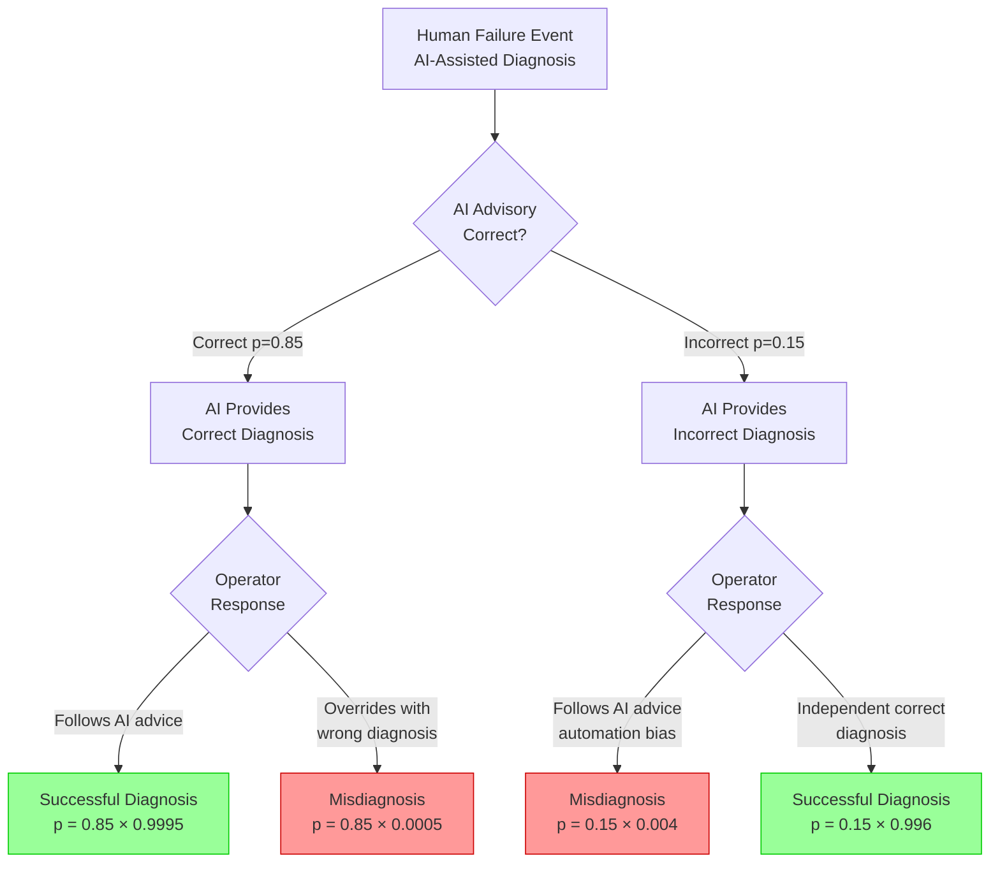

# Human Reliability Analysis for AI-Assisted Nuclear Operations: Scenarios and Method Walk-Throughs

**Michael Hildebrandt**

**Draft -- April 2026**

## Table of Contents

1. Introduction
2. Methods and Adaptation Approach
3. Scenario Definitions
4. Walkthrough 1: SPAR-H
5. Walkthrough 2: IDHEAS-ECA
6. Walkthrough 3: ATHEANA
7. Cross-Method Comparison
8. Implications for PSA Integration
   - 8.1 Event Tree for Scenario A
   - 8.2 Sensitivity Analysis
   - 8.3 Screening-Level Bounding Analysis
   - 8.4 Uncertainty Characterisation
   - 8.5 Human-AI Dependency and Common-Cause Considerations
9. Discussion
10. Conclusion
References

## 1. Introduction

### 1.1 Purpose

Practitioners using this report: PSA analysts modifying an existing PSA to account for AI advisory should start with Section 8 (event tree structure and sensitivity analysis), then consult Section 4 (SPAR-H) for quantification. Analysts screening which AI-related scenarios belong in the PSA should start with Section 6 (ATHEANA). Analysts developing cognitive failure models for AI-assisted operations should start with Section 5 (IDHEAS-ECA). Section 7 provides the cross-method comparison and recommended workflow.

Report 3 in this series (Hildebrandt, 2026c, Section 4) identified that current HRA methods cannot model AI-assisted operations without extension, and proposed the extensions needed: new performance shaping factors, new human failure events, and new dependency structures. This report demonstrates that claim concretely by walking through three established HRA methods applied to three scenarios where an AI advisory system is present.

Each walkthrough shows, step by step, where the standard method handles the AI interaction, where it cannot, and what the adapted method would look like. The walkthroughs are qualitative analyses with quantitative illustrations. All quantitative values in this report are illustrative and assumed, not measured. No empirical data from nuclear-domain evaluations of AI-assisted operations exists as of April 2026. The numerical examples demonstrate methodology and sensitivity, not operational HEPs.

### 1.2 Scope

Three methods: SPAR-H, IDHEAS-ECA, and ATHEANA. Three scenarios, each designed to exercise a specific aspect of the AI-HRA interaction. Six walkthroughs (each method applied to two of the three scenarios), plus a cross-method comparison using the common scenario. IDHEAS-ECA receives the most detailed treatment because it provides the most natural extension path for AI-assisted operations.

THERP (NUREG/CR-1278) is not included. Its nominal HEPs are pre-computed for specific task types, its dependence model uses discrete levels that do not accommodate the three-way conditional (prior action, AI recommendation, operator response), and its lookup-table structure is less adaptable than SPAR-H's continuous PSF multiplier model. SPAR-H covers similar ground with a more flexible framework. CREAM is not included because its extension path through Common Performance Conditions parallels SPAR-H's PSF extension and would not demonstrate a distinct modelling approach.

### 1.3 Foundations from Companion Reports

The walkthroughs in this report build on concepts and findings developed across the companion reports. Table 1 summarises the key terms and their sources; the reader is referred to the indicated sections for full treatment.

**Table 1: Key concepts from companion reports**

| Concept | Definition | Source |
|---------|-----------|--------|
| Hallucination | Fluent, confident output that is factually incorrect or fabricated | Report 1, §5.1 |
| Calibration | Degree to which expressed confidence matches actual accuracy | Report 1, §5.2 |
| Sycophancy | Tendency to agree with the user's position rather than provide independent assessment | Report 1, §5.5 |
| Pattern 9 (Shared Room) | Concurrent multi-agent architecture with enforced context isolation | Report 2, §4.2 |
| Epistemic independence | Decorrelated reasoning errors via model heterogeneity and context isolation | Report 2, §7 |
| Monoculture collapse | Common-cause failure where same-model agents fail simultaneously | Report 2, §7.4 |
| Automation bias | Tendency for operators to over-rely on automated recommendations without independent verification | HRA literature |
| Graded regulatory tiers | Three-tier framework matching AI advisory scope to regulatory requirements | Report 3, Table 2 |

These concepts recur throughout the walkthroughs. The hallucination and calibration properties of LLMs (Report 1) explain why AI advisory output cannot be taken at face value, which is the foundation of the automation bias mechanism analysed in Sections 4 through 6. The multi-agent architecture properties (Report 2) underpin Scenario C's treatment of conflicting agent recommendations and the common-cause dependency analysis in Section 8.5.

## 2. Methods and Adaptation Approach

### 2.1 SPAR-H

SPAR-H (NUREG/CR-6883) provides two HEP types: diagnosis (nominal HEP 1E-2) and action (nominal HEP 1E-3). Eight performance shaping factors modify the nominal HEP through multiplication: available time, stress/stressors, complexity, experience/training, procedures, ergonomics/HMI, fitness for duty, and work processes. A dependency assessment for sequential actions uses five levels (zero, low, moderate, high, complete) to adjust the HEP for later actions based on the outcome of earlier ones.

For AI-assisted operations, the PSF multiplier model can accommodate new factors (AI reliability, trust calibration) as additional multipliers. The question, addressed in the walkthroughs, is what multiplier values to assign when no lookup table or empirical basis exists. The dependency model cannot handle the three-way conditional (prior action outcome, AI recommendation correctness, operator follow/override decision) without structural extension.

### 2.2 IDHEAS-ECA

IDHEAS-ECA (NUREG-2199) decomposes operator performance into five macrocognitive functions: detection, understanding, decision-making, action execution, and teamwork. For each function, a set of cognitive failure modes (CFMs) is defined. For each CFM, performance-influencing factors (PIFs) determine whether the failure mode is active in the scenario being analysed. Crew-level factors modify the base assessment.

The "teamwork" function already models crew interaction: communication, authority relationships, shared understanding within the operating team. Extending it to human-AI teaming is the most natural adaptation path because the interaction structure (communication quality, authority relationships, shared or conflicting situation models) maps onto the existing teamwork CFMs. AI-specific CFMs can be defined for each macrocognitive function: automation bias as a decision-making CFM, alert fatigue as a detection CFM, mode confusion as an understanding CFM, reconciliation failure as a teamwork CFM. The PIF framework can incorporate AI-specific factors.

IDHEAS-ECA distinguishes cognitive failure modes from performance-influencing factors more cleanly than SPAR-H distinguishes HFEs from PSFs, which makes it easier to add AI-specific failure modes without restructuring the method.

### 2.3 ATHEANA

ATHEANA (NUREG-1624) identifies "unsafe actions" (errors of commission) by searching for "error-forcing contexts" (EFCs): combinations of plant conditions and performance-shaping factors that make the wrong action appear correct to the operator. The method is qualitative to semi-quantitative; its strength is identifying scenarios where commission errors are likely rather than computing precise HEPs.

An incorrect AI recommendation can constitute an error-forcing context. If the AI confidently recommends the wrong procedure during an ambiguous plant condition, and the operator's training and the AI's presentation make the recommendation seem reasonable, the combination creates an EFC for following the wrong procedure. ATHEANA's framework provides the richest vocabulary for describing how AI creates conditions for operator error. Its weakness is quantification: it was designed for qualitative analysis and does not produce HEP estimates through the same algorithmic process as SPAR-H or IDHEAS-ECA, relying instead on structured expert judgment. ATHEANA is also focused on commission errors; the inappropriate AI override HFE (operator fails to act on correct AI advice) is closer to an omission-type failure that ATHEANA does not naturally capture.

### 2.4 Extensions Applied in These Walkthroughs

The walkthroughs use the PSFs and HFEs from Report 3 (Table 5). The SPAR-H and ATHEANA walkthroughs use Approach A from Report 3 (AI as PSF: the AI's effect is absorbed into existing PSF categories or EFC factors). The IDHEAS-ECA walkthrough explores elements of Approach B (AI as cognitive team member: the AI maps onto the teamwork macrocognitive function with its own CFMs).

The assumed PSF multiplier values in the SPAR-H walkthroughs are selected by analogy with existing PSF values for comparable human factors (for example, AI reliability treated analogously to procedure quality; trust calibration treated analogously to training quality). They are not the product of expert elicitation or empirical measurement, and should be understood as plausible illustrations rather than defensible estimates. Different analysts using different assumptions would produce different numbers, which is itself a finding about the method's current limitations.

### 2.5 AI-Specific PSF Operationalisation

Report 3 (Table 5) proposed six AI-specific PSFs. For the walkthroughs in this report to be reproducible, each PSF requires a definition, discrete states, observable indicators, and an illustrative multiplier range. Table 2 provides this operationalisation. The multiplier ranges are assumed (see Section 1.1), derived by analogy with existing SPAR-H PSF ranges for comparable human factors, and are not empirically validated.

**Table 2: Operationalisation of AI-specific performance shaping factors**

| PSF | Definition | States/Levels | Observable indicators | Illustrative SPAR-H multiplier range |
|---|---|---|---|---|
| AI system reliability | Probability that the AI advisory produces a correct output for the task type under analysis | High (>95%), Moderate (80-95%), Low (<80%) | Historical accuracy rate for comparable task types; known failure modes for the scenario conditions; validation test results | High: 0.5 (analogous to good procedures); Moderate: 1 (nominal); Low: 5 (analogous to poor procedures) |
| Operator trust calibration | Degree to which the operator's reliance on the AI matches the AI's actual reliability | Well-calibrated, Over-trust, Under-trust | Frequency of independent verification checks; response latency when AI recommends (immediate acceptance suggests over-trust); override rate relative to AI error rate | Well-calibrated: 1 (nominal); Over-trust: 3 (analogous to inadequate training, reduced checking); Under-trust: 2 (analogous to poor work processes, benefit of correct AI is reduced) |
| AI transparency | Degree to which the operator can access the reasoning behind the AI recommendation | High (reasoning visible and interpretable), Moderate (partial reasoning or confidence indicators), Low (recommendation only, no reasoning) | Availability of explanation interface; interpretability of displayed reasoning; operator's reported ability to evaluate AI basis | High: 0.5 (supports independent checking); Moderate: 1 (nominal); Low: 3 (operator cannot evaluate recommendation, increasing automation bias risk) |
| Human-AI communication quality | Effectiveness of the information exchange between operator and AI system | Good (clear, timely, unambiguous), Nominal, Poor (delayed, ambiguous, or cluttered) | Display design quality; alarm clarity; integration with existing HMI; time to locate and interpret AI output | Good: 0.5; Nominal: 1; Poor: 5 (analogous to poor ergonomics/HMI) |
| AI degradation mode | Whether the AI system has annunciated its own degraded performance to the operator | Annunciated degradation, Silent degradation, Normal operation | Presence of AI self-monitoring indicators; whether operator is alerted when AI confidence drops or inputs are degraded; design of degradation annunciation | Normal: 1; Annunciated degradation: 2 (operator aware but must compensate); Silent degradation: 10 (analogous to misleading indications, operator unaware of unreliable input) |
| Multi-agent agreement pattern | Degree of agreement among multiple AI agents advising on the same decision | Full agreement (all agents concur), Partial agreement (majority concurs), Full disagreement (agents provide conflicting recommendations) | Number of agents; concordance of recommendations; whether agents share base models (indicating correlated rather than independent agreement) | Full agreement (independent models): 0.5 (reinforcing evidence); Full agreement (shared model): 1 (potential monoculture, agreement may not indicate independence); Full disagreement: 5 (operator must reconcile conflicting advice under time pressure) |

## 3. Scenario Definitions

Three HRA-focused scenarios, each simpler than Report 4's operational scenarios. Each focuses on one operator, one action, and one AI advisory interaction, keeping the HRA analysis tractable.

Scenario A (post-trip diagnosis) corresponds to the diagnostic phase of Report 4 Scenario 2 (RCS temperature anomaly) and Scenario 5 (LOCA Phase 1), simplified to isolate the HRA-relevant decision. Scenario B (degraded AI alarms) corresponds to a condition that could arise in any Report 4 transient if the AI system partially fails mid-event. Scenario C (conflicting multi-agent advice at an EOP branch point) corresponds to the decision point in Report 4 Scenario 5 Phase 3. Report 4 provides the full operational context; this report isolates the decision points for method application.

**Mapping to Report 4 scenarios.** Each R5 scenario simplifies the corresponding R4 scenario to a single operator decision point while retaining the HRA-relevant features. The following table summarises the mapping.

**Table 3: Mapping of Report 5 scenarios to Report 4 source scenarios**

| R5 Scenario | R4 Source | What was simplified | Key HRA feature retained |
|---|---|---|---|
| A (post-trip diagnosis) | S2 (temperature anomaly), S5 (LOCA Phase 1) | Reduced to single decision point; removed multi-agent coordination detail and the phased event progression | AI recommendation present at a diagnostic decision; operator must evaluate recommendation against own assessment |
| B (degraded AI alarms) | S4 (safety verification), general transient conditions | Reduced to binary alarm response check; removed procedure-level verification steps and multi-system coordination | AI-generated prioritisation operating in degraded mode; operator must detect degradation and compensate |
| C (emergency with AI transition) | S5 Phase 3 (simulation-supported projection) | Isolated single projection assessment from multi-phase event; removed the earlier diagnostic and monitoring phases | Multi-agent disagreement at a safety-significant procedural branch point; operator must reconcile conflicting AI advice |

### 3.1 Scenario A: Post-Trip Diagnosis with AI Advisory

*This is the common scenario applied in all three method walkthroughs, enabling the cross-method comparison in Section 7.*

**Plant context.** Reactor trip from full power. The cause is ambiguous: indications are consistent with either a feedwater control system malfunction or an electrical bus fault. Both causes have been seen at this plant. The correct diagnosis determines which recovery procedure to enter.

**Operator task.** Diagnose the trip cause within 15 minutes to select the correct recovery procedure.

**AI involvement.** An AI advisory system provides a diagnosis recommendation. In Variant 1, the recommendation is correct (feedwater malfunction). In Variant 2, the recommendation is incorrect (the AI recommends the electrical fault procedure when the actual cause is a feedwater malfunction). Both variants are analysed in each walkthrough.

**Why this scenario.** It exercises the core AI-HRA interaction in its simplest form: one operator, one diagnosis, one AI recommendation, right or wrong. The four-branch event tree (Report 3, Figure 1) maps directly onto this scenario.

### 3.2 Scenario B: Alarm Response During AI System Degradation

**Plant context.** Loss of instrument air transient. Multiple alarms across several systems. The AI alarm prioritisation system is operating in degraded mode: some prioritisations are correct, others are missing, and the system has not annunciated its degraded state.

The operator's alarm display shows AI-prioritised alarms for some systems and raw, unprioritised alarms for others. The transition between prioritised and unprioritised segments is not flagged. An operator accustomed to seeing all alarms prioritised may not notice that some prioritisations are absent rather than indicating low priority.

**Operator task.** Identify and respond to the highest-priority alarms within the Technical Specification required action time.

**AI involvement.** The AI alarm prioritisation is partially functional with silent degradation (no annunciation of its degraded state). The operator does not know which prioritisations to trust.

**Why this scenario.** It exercises the AI transition failure HFE and the AI degradation mode PSF. Chosen for the IDHEAS-ECA walkthrough because the detection macrocognitive function maps directly onto the operator's task of identifying which alarms are safety-significant in the presence of unreliable prioritisation.

### 3.3 Scenario C: Emergency Procedure Execution with Conflicting AI Advice

**Plant context.** Small-break LOCA. The operator is executing EOP E-1 (Loss of Reactor Coolant) and reaches a branch point: whether to transition to ES-1.2 (Post-LOCA Cooldown and Depressurisation) or remain in E-1. The discriminating condition is whether RCS pressure has stabilised below a specific threshold. The current pressure readings show a downward trend with intermittent oscillations.

The cognitive demands of this scenario extend beyond the branch point decision itself. In the Westinghouse EOP framework, the operator is simultaneously monitoring Critical Safety Function Status Trees (CSFSTs) for all six critical safety functions, tracking continuous applicability requirements on the procedure's foldout page (which may direct transitions to other procedures if additional symptoms develop), and interpreting the two-column procedure format where each step has both an expected-response path and a Response Not Obtained contingency path. The AI advisory arrives on top of this existing cognitive load. The baseline HEP for the branch point decision reflects not merely the difficulty of interpreting the pressure trend, but the full attentional burden of parallel procedure monitoring, foldout page requirements, and CSFST evaluation under time pressure. The AI's effect on operator error probability must be evaluated against this operationally realistic baseline rather than against a simplified model of a single binary decision.

**Operator task.** Evaluate the branch point conditions and select the correct procedural path.

**AI involvement.** Two AI agents, running on different base models, provide assessments. Agent 1 assesses that RCS pressure is stable and trending down, and recommends transition to ES-1.2. Agent 2 notes the oscillations in the pressure trend and assesses that they could indicate continued break flow, recommending the operator remain in E-1 until the trend is clearer. Their disagreement reflects the ambiguity in the plant conditions.

A variant of this scenario is worth noting for the ATHEANA analysis. If both agents produce hedge-heavy, non-discriminating assessments rather than clearly opposing recommendations (for instance, both listing LOCA and non-LOCA as possibilities without committing to either, and both recommending 'continued monitoring'), the operator faces a qualitatively different cognitive challenge. Instead of reconciling conflicting specific advice, the operator must extract a decision-relevant signal from two sources that are technically non-contradictory but operationally uninformative. This 'slop' variant (Report 1, Section 5.10) exercises a different error-forcing context in the ATHEANA framework: the operator's independent assessment is neither reinforced nor challenged by the AI, leaving them in the same epistemic position as if the AI were absent but with the added cognitive burden of having read and evaluated the vacuous output.

**Why this scenario.** It exercises the reconciliation failure HFE and the multi-agent agreement PSF. Because the agents run on different models, their disagreement signals real ambiguity rather than monoculture consensus. The operator must reconcile conflicting advice at a safety-significant procedural branch point. Chosen for the ATHEANA walkthrough (the conflicting recommendation creates an error-forcing context) and SPAR-H (the multi-agent disagreement tests the dependency model).

The cross-method comparison in Section 7 uses Scenario A (common to all three methods) as its primary basis. Scenarios B and C each appear in two walkthroughs, providing partial but not complete cross-method comparison for those scenarios.

## 4. Walkthrough 1: SPAR-H

*Applied to Scenarios A and C.*

### 4.1 Scenario A: Standard SPAR-H Analysis (No AI)

The HFE: operator fails to correctly diagnose the trip cause within 15 minutes.

Type: diagnosis. Nominal HEP: 1E-2.

PSF assessment:

**Table 4: SPAR-H PSF assessment for Scenario A baseline (no AI)**

| PSF | Assessment | Multiplier |
|---|---|---|
| Available time | Adequate (15 min for a task typically taking 5-8 min) | 0.1 |
| Stress | Moderate (post-trip, but no immediate safety challenge) | 2 |
| Complexity | Moderately complex (ambiguous indications, two plausible causes) | 2 |
| Experience/training | High (experienced operator, both failure modes seen before) | 0.5 |
| Procedures | Detailed diagnostic procedures available | 0.5 |
| Ergonomics/HMI | Good (modern digital I&C) | 1 |
| Fitness for duty | Nominal | 1 |
| Work processes | Good (crew communication protocols) | 1 |

Adjusted HEP: 1E-2 x 0.1 x 2 x 2 x 0.5 x 0.5 x 1 x 1 x 1 = 1E-3.

### 4.2 Scenario A: Adapted SPAR-H Analysis (With AI)

Same HFE. Same nominal HEP. The AI advisory system provides a diagnosis recommendation.

**AI reliability definition.** AI reliability is defined here as the probability that the AI advisory produces a correct diagnosis recommendation for this specific event type (ambiguous trip with two candidate causes). This is a conditional probability for the scenario at hand, not a general system reliability figure. The value 0.85 is assumed; no empirical measurement exists for LLM-based diagnosis of nuclear plant trip events.

**Which standard PSFs change.** Procedures: the AI recommendation functions as a supplementary procedural aid. If correct (Variant 1), it reinforces the diagnosis; the procedures multiplier improves to 0.3. If incorrect (Variant 2), it provides misleading guidance; the procedures multiplier worsens to 3 (conflicting guidance is worse than no guidance because the operator must resolve the conflict).

**Proposed AI PSFs.** AI system reliability (0.85 assumed) and operator trust calibration (assumed well-calibrated: the operator trusts the AI proportionate to its actual reliability). With well-calibrated trust, the multiplier is neutral (1). With over-trust, it would worsen; with under-trust, the AI's benefit would be reduced.

**Variant 1 (AI correct):** procedures multiplier improves to 0.3. Net adjusted HEP: 1E-2 x 0.1 x 2 x 2 x 0.5 x 0.3 x 1 x 1 x 1 = 6E-4. The AI improves diagnosis.

**Variant 2 (AI incorrect):** procedures multiplier worsens to 3. Additionally, automation bias risk: the probability that the operator follows the incorrect recommendation without independent verification, conditioned on trust calibration. With the procedures PSF worsened to 3, the base calculation gives: 1E-2 x 0.1 x 2 x 2 x 0.5 x 3 x 1 x 1 x 1 = 6E-3. However, this does not yet account for the automation bias effect. An additional adjustment is needed: the probability that the operator follows the incorrect AI recommendation without independent verification. This is not a standard SPAR-H PSF; it is an ad hoc modification that illustrates where the method breaks.

The derivation of the adjusted HEP (~5E-3) from the base 6E-3 proceeds as follows. Of the base 6E-3, we assume 80% (4.8E-3) is attributable to the operator following the incorrect AI recommendation without independent verification (the automation bias component), and 20% (1.2E-3) is attributable to independent misdiagnosis (the operator would have erred regardless of AI input, as in the no-AI baseline). A trust calibration adjustment factor of 0.8 is applied to the AI-attributable component, reflecting the assumption that a well-calibrated operator performs some independent checking that partially offsets the misleading AI: 4.8E-3 x 0.8 = 3.8E-3. The independent misdiagnosis component is unaffected by trust calibration: 1.2E-3. Combined: 3.8E-3 + 1.2E-3 = 5.0E-3. The precise value depends on the assumed split between AI-attributable and independent error, and on the trust calibration adjustment factor, both of which are unquantified parameters at the heart of the AI-HRA gap. The AI degrades diagnosis.

The independent error component of 1.2E-3 in the AI-incorrect branch exceeds the baseline no-AI HEP of 1E-3. This is consistent with the hypothesis that the presence of incorrect AI advice degrades independent reasoning through attention redirection: operators who have read an AI recommendation, even one they ultimately reject, may allocate cognitive resources differently than operators working without AI input. This attention-redirection effect would itself be an AI-induced phenomenon rather than a truly independent error source, which is why the overall decomposition should be treated as a modelling approximation rather than a precise causal partition.

The overall HEP (across both variants) depends on the AI reliability: P(correct) x HEP_variant1 + P(incorrect) x HEP_variant2 = 0.85 x 6E-4 + 0.15 x 5E-3 = 5.1E-4 + 7.5E-4 = 1.26E-3. Section 8 develops this calculation in the event tree framework.

### 4.3 Scenario C: SPAR-H with Multi-Agent Disagreement

The HFE: operator selects the wrong EOP branch at the LOCA decision point.

The dependency challenge: the operator's decision depends on (a) the ambiguous plant conditions, (b) Agent 1's recommendation (transition to ES-1.2), and (c) Agent 2's recommendation (remain in E-1). Standard SPAR-H dependency assesses dependence between sequential human actions, not between human actions and AI recommendations.

**Assumed values.** Model the multi-agent disagreement through the complexity PSF. Agreeing agents reduce complexity (clearer picture). Disagreeing agents increase complexity (the operator must reconcile conflicting advice, a cognitive task that does not exist without AI). With disagreement: complexity multiplier increases from 2 to 5 (high complexity).

The increase from 2 to 5 is illustrative. No guidance exists for mapping multi-agent disagreement to SPAR-H complexity levels. The value was selected to represent "high complexity" on the SPAR-H scale, reflecting the added cognitive burden of reconciling conflicting AI recommendations on top of existing task complexity. Different analysts might reasonably select different values, which is itself a finding about the method's limitations for AI-assisted scenarios.

### 4.4 Where SPAR-H Breaks

Three limitations exposed by these walkthroughs:

**No lookup table for AI-related PSF multipliers.** The analyst must estimate multiplier values for AI reliability and trust calibration without guidance. Different analysts will produce different estimates, reducing inter-analyst consistency. Inter-analyst variability, already a known challenge in standard HRA, is expected to be worse for AI-assisted scenarios until empirical calibration data exists.

**PSF independence assumption.** The multiplier model assumes PSFs are independent. But AI reliability and trust calibration are correlated: prolonged high reliability produces over-trust, which increases automation bias risk when the AI eventually errs. The multiplicative model cannot capture this interaction without ad hoc adjustments.

**The dependency model.** SPAR-H's five-level dependency model assesses dependence between sequential human actions. It provides no mechanism for conditioning on the AI's correctness. The three-way conditional (prior action, AI recommendation, operator response) cannot be represented.

## 5. Walkthrough 2: IDHEAS-ECA

*Applied to Scenarios A and B.*

### 5.1 Scenario A: Standard IDHEAS-ECA Analysis (No AI)

The critical task: diagnose the trip cause within 15 minutes.

Macrocognitive function decomposition:

**Table 5: IDHEAS-ECA macrocognitive function decomposition for Scenario A**

| Function | Task Component |
|---|---|
| Detection | Perceive trip indications and relevant parameter changes |
| Understanding | Comprehend which indications point to feedwater malfunction vs electrical fault |
| Decision-making | Select the diagnosis based on the understood pattern |
| Action execution | Enter the correct recovery procedure |
| Teamwork | Communicate the diagnosis to the shift team for verification |

Cognitive failure modes assessed:
- Detection: failure to perceive a key secondary indicator that discriminates between the two causes. Risk: moderate (indications are available but require active search).
- Understanding: misinterpretation of ambiguous indications. Risk: this is the primary failure mode for this scenario. The indications do support two interpretations.
- Decision-making: choosing the wrong diagnosis despite correct understanding. Risk: low (if the operator correctly understands the indications, the diagnosis follows).
- Action execution: entering the wrong procedure despite correct diagnosis. Risk: low (procedure selection is a straightforward action).
- Teamwork: failure to communicate diagnosis for team verification. Risk: low (standard crew communication protocols).

The overall HEP is driven by the understanding CFM. Illustrative estimate: approximately 1E-3, consistent with the SPAR-H baseline.

### 5.2 Scenario A: Adapted IDHEAS-ECA Analysis (With AI)

Same critical task. The AI advisory recommendation enters the macrocognitive process.

**How AI maps onto the five functions:**

*Detection.* The AI highlights relevant parameters and may draw operator attention to indications they would otherwise miss. If the AI is correct (Variant 1), it improves detection by focusing attention on the discriminating indicators. If incorrect, it may focus attention on the wrong parameters.

*Understanding.* The AI provides a pre-formed interpretation. If the operator accepts the AI's understanding, they bypass their own comprehension process. If they evaluate the AI's interpretation against their own, the AI becomes an input to their comprehension.

*Decision-making.* If the operator accepts the AI recommendation, decision-making collapses to accept/reject rather than independent diagnosis. Automation bias is a failure of this function: accepting the AI recommendation without evaluating it (Mosier and Skitka, 1996).

*Action execution.* Not affected by AI advisory in this scenario. The operator's physical execution of the selected procedure is independent of how the diagnosis was reached.

*Teamwork.* The AI is a team member. The human-AI interaction maps onto the teamwork function: communication quality, authority relationships (operator vs AI advisory), shared or conflicting situation understanding.

**New cognitive failure modes with AI present:**
- Detection: alert fatigue (too many AI-highlighted parameters reduce attention to any single one).
- Understanding: mode confusion (operator does not know whether the AI is in its normal mode or operating with degraded inputs).
- Decision-making: automation bias (accepting AI recommendation without verification). This is the primary new CFM for this scenario.
- Teamwork: trust miscalibration (over- or under-reliance on AI).

**Illustrative assessment.** The decision-making CFM "automation bias" is evaluated using PIFs. The AI transparency PIF (can the operator see why the AI reached its conclusion?) and the trust calibration PIF determine whether automation bias is active. For Variant 2 (AI incorrect), if the AI provides a confident recommendation with limited visible reasoning, and the operator has moderate trust, the automation bias CFM is assessed as active. This increases the probability that the operator selects the wrong diagnosis.

For the decision-making macrocognitive function specifically: the relevant CFM is "automation bias" (accepting AI recommendation without independent verification). The PIFs assessed for this CFM are: AI transparency (the AI provides its recommendation but limited visible reasoning, assessed as moderate transparency, making independent verification harder), operator trust calibration (moderate trust, based on several months of experience with the system, assessed as neither strongly over- nor under-trusting), and available time (15 minutes, adequate for independent verification if the operator chooses to perform it). With moderate transparency and moderate trust, the automation bias CFM is assessed as plausibly active but not dominant: the operator may follow the AI without checking, but the time available and the ambiguity of the indications also create an opportunity for independent assessment. For Variant 2, where the AI is incorrect, the activation of this CFM increases the failure probability for the decision-making function from the baseline (driven by understanding failure) to an elevated level reflecting both the original diagnostic ambiguity and the AI-induced anchoring effect.

**IDHEAS-ECA decision tree structure for the decision-making macrocognitive function.** The standard IDHEAS-ECA decision tree for decision-making follows a branching structure that evaluates contextual factors to determine cognitive failure probability. For AI-assisted operations, the existing tree requires extension to accommodate the conditional branching on AI recommendation correctness and operator response. The following diagram presents the extended decision tree for the AI-assisted diagnosis case.

**Figure 1.** Extended IDHEAS-ECA decision tree for AI-assisted diagnosis. Red branches contribute to the overall HEP; green branches represent successful outcomes. Branch probabilities shown are assumed Scenario A values. The four-branch structure makes the automation bias mechanism explicit: when AI advice is incorrect (right side), the operator's conditional probability of following wrong advice (0.004) versus diagnosing independently (0.996) determines whether the AI degrades or merely challenges human performance.

The four AI sub-branches map directly onto the four-branch event tree structure from Report 3 and Section 8.1 of this report. Each sub-branch has identifiable PIFs that determine its probability, and each corresponds to a specific HFE (automation bias, inappropriate override) or success mode (correct follow, independent correction). The existing IDHEAS-ECA PIF framework (trust calibration, AI transparency, available time, experience/training) provides the assessment structure for each branch without requiring new quantification methods, only new PIF definitions and calibration data. No other HRA method provides this degree of structural compatibility with the AI-modified event tree.

**Worked quantification through the extended decision tree.** To illustrate the quantification path through the extended decision tree, consider Scenario A with the four AI sub-branches:

1. AI correct, operator follows AI, leading to successful diagnosis. Branch probability: 0.85 x 0.9995 = 0.8496. Conditional HEP contribution: effectively zero (both AI and operator reach correct diagnosis).

2. AI correct, operator overrides AI with wrong diagnosis. Branch probability: 0.85 x 0.0005 = 0.000425. This represents the rare case where the operator rejects correct AI advice and errs independently. Using the IDHEAS-ECA crew failure mode for decision-making (CFM-D2: incorrect assessment of current state), the conditional HEP is 1.0 for this branch by definition.

3. AI incorrect, operator follows AI, leading to misdiagnosis. Branch probability: 0.15 x 0.004 = 0.0006. The conditional HEP of 0.004 (following incorrect AI advice) is derived from the IDHEAS-ECA assessment of decision-making under misleading cues, adjusted upward from the standard value to account for automation bias.

4. AI incorrect, operator independently diagnoses correctly. Branch probability: 0.15 x 0.996 = 0.1494. Conditional HEP contribution: effectively zero (operator overcomes wrong AI advice).

Overall HEP = (0.000425 x 1.0) + (0.0006 x 1.0) = 1.025E-3

This result is comparable to the SPAR-H estimate (1.26E-3) but arrives through a different decomposition that makes the automation bias mechanism explicit at each branch rather than encoding it in aggregate PSF multipliers.

Illustrative HEP for Variant 1 (AI correct): approximately 5E-4 (the AI supports detection and understanding, reducing the primary failure mode).

HEP for Variant 2 (AI incorrect): approximately 4E-3, corresponding to the conditional probability (0.004) of following incorrect AI advice in the decision tree above. This is lower than the SPAR-H Variant 2 estimate of 5E-3 because the IDHEAS-ECA framework allows for the possibility that the operator detects the AI's error through the detection and understanding cognitive functions, a granularity that SPAR-H's coarser PSF model does not provide.

### 5.3 Scenario B: IDHEAS-ECA with Degraded AI

The critical task: identify and respond to the highest-priority alarms during a loss of instrument air transient with partially functional AI alarm prioritisation.

The detection macrocognitive function is the focus. Without AI, the operator scans all alarms and mentally prioritises. With functional AI, the prioritisation is provided. With degraded AI (Scenario B), the operator receives a mix of correct and absent prioritisations without knowing the AI is degraded.

**Detection CFMs with degraded AI:**

*Failure to detect AI degradation.* The operator does not know the prioritisation is unreliable. PIF assessment for this CFM:
- AI degradation mode PIF: the AI has failed silently (no annunciation). This PIF is at its most adverse value: the system provides no cue that its outputs are unreliable.
- Training PIF: if the operator has not been trained to recognise AI degradation patterns (some alarms prioritised, others raw), the failure to detect degradation is more likely.
- Available time PIF: during a transient with many alarms, the operator has less cognitive capacity to notice that the AI's behaviour has changed.

All three PIFs point in the adverse direction. The "failure to detect AI degradation" CFM is assessed as active with high probability.

*Failure to detect high-priority alarms the AI did not prioritise.* The operator, habituated to AI-prioritised alarms, may not apply the manual scanning process they would use without AI. Alarms that the degraded AI failed to prioritise are effectively invisible unless the operator actively scans for them.

This scenario illustrates the AI transition failure HFE from Report 3: the operator is working with degraded AI support without realising it, and their own monitoring skills have been partially displaced by reliance on the AI's prioritisation function (Endsley and Kiris, 1995; Parasuraman and Manzey, 2010).

IDHEAS-ECA handles this through the detection function's CFMs and the AI degradation mode PIF. The method's macrocognitive structure provides specific categories for each aspect of the failure, which is its advantage over SPAR-H's more aggregated PSF approach.

### 5.4 Trust Recalibration Delay: A Sequential Walkthrough

Report 3 (Table 5) defines trust recalibration delay as an HFE: after an AI error is discovered, the operator loses trust in all AI outputs, including correct ones. Table 7 flags this as poorly handled by all three methods. This subsection demonstrates it using IDHEAS-ECA.

Consider the continuation of Scenario A: the operator followed the incorrect AI recommendation in Variant 2 and selected the wrong recovery procedure. Five minutes into the wrong procedure, plant indications clarify and the operator recognises the error. The operator corrects course and enters the correct procedure.

At the next decision point (10 minutes later), the AI advisory provides a new recommendation about adjusting safety injection flow. This recommendation is correct. The operator's cognitive state has changed: the teamwork PIF for trust calibration has shifted from "moderate trust" (the pre-error baseline) to "low trust" (the post-error state). Merritt and Ilgen (2008) showed that trust updates asymmetrically: a single error reduces trust more than a single success increases it.

The IDHEAS-ECA assessment for this second decision point: the decision-making CFM shifts from "automation bias" (the risk in the first decision) to "inappropriate AI override" (the risk now). The operator, having just been burned by incorrect AI advice, is disposed to reject the AI recommendation regardless of its content. The trust calibration PIF, now at its adverse value, increases the probability that the operator ignores correct advice and relies on their own (possibly less complete) assessment.

The HEP for this second action is elevated not because the AI is wrong but because the operator's trust has been damaged by the prior error. The dependency between the two actions runs through the trust state, not through the plant conditions or the AI's correctness. This is the three-way dependency that standard models cannot represent: the second HEP depends on (a) the first action's outcome, (b) the AI's correctness at the second decision point, and (c) the operator's trust state, which is conditioned on the first action's outcome.

For illustration, consider the safety injection flow adjustment that follows the initial diagnosis. Baseline HEP without AI: 5E-3. With correct AI advisory and well-calibrated trust: 2E-3 (the operator benefits from AI confirmation of the correct flow rate, reducing the probability of an adjustment error). With correct AI advisory but damaged trust (following the discovery that the AI was wrong about the initial diagnosis): 8E-3 (the operator second-guesses the AI's now-correct recommendation, may reject it or delay action, and falls back on manual assessment under time pressure with reduced confidence in available information sources). The damaged-trust HEP (8E-3) exceeds the no-AI baseline (5E-3) because active distrust is worse than having no advisory at all: the operator expends cognitive resources evaluating and rejecting AI input rather than focusing on the task.

The complementary process, trust inflation after repeated AI successes, is at least as important for long-term risk. Operators who experience months or years of reliable AI advisory may develop complacency that exceeds the warranted trust level. This is the classical automation complacency pathway described in the aviation human factors literature (Parasuraman and Manzey, 2010): accumulated positive experience with automation reduces the frequency and depth of independent verification. In the HRA context, trust inflation gradually shifts the Variant 2 conditional HEP upward over time, because operators who have stopped actively checking AI outputs are more likely to follow incorrect advice when the rare AI failure occurs. This temporal evolution of the automation bias PSF is not captured by the static analysis in Section 4 and represents a limitation that longitudinal simulator studies would need to address.

### 5.5 Where IDHEAS-ECA Extends Well and Where It Does Not

**Strengths.** The teamwork function accommodates human-AI interaction without structural changes. The CFM structure provides specific categories for each AI-related failure mode. The PIF framework can incorporate AI-specific factors. The five-function decomposition allows the analyst to identify which cognitive process is affected and why, which supports targeted design mitigation.

**Limitations.** IDHEAS-ECA's quantification (the decision tree that produces HEP estimates) has specific branching rules. Adding new CFMs and PIFs extends the decision tree in ways that need validation. The current decision tree does not include branches for "AI recommendation correctness" or "operator trust calibration." Adding these branches is structurally consistent with the method but produces a more complex tree whose validity cannot be established without empirical data.

## 6. Walkthrough 3: ATHEANA

*Applied to Scenarios A and C.*

### 6.1 Scenario A: Standard ATHEANA Analysis (No AI)

The unsafe action: operator selects the wrong recovery procedure (entering the electrical fault procedure when the cause is a feedwater malfunction).

Error-forcing context search: what combination of plant conditions and PSFs makes this wrong action appear correct to the operator?

- Plant condition: ambiguous indications. Both causes produce similar initial trip signatures. The discriminating indications develop over minutes, not immediately.
- PSF: time pressure (the operator wants to enter the correct procedure quickly rather than waiting for discriminating indications).
- PSF: prior experience (if the operator's most recent trip was an electrical fault, recency bias may tilt toward the same diagnosis).

The EFC: ambiguous conditions + time pressure + recency bias make the electrical fault diagnosis appear plausible despite the actual feedwater malfunction.

### 6.2 Scenario A: ATHEANA with AI Advisory

Same unsafe action. The AI provides a diagnosis recommendation.

**Variant 2 (AI incorrect: the AI recommends the electrical fault procedure).**

The AI recommendation becomes part of the error-forcing context. The EFC is now: ambiguous conditions + time pressure + recency bias + a confident AI recommendation pointing to the electrical fault. The AI recommendation reinforces the EFC by providing an additional, authoritative-seeming reason to believe the wrong diagnosis.

ATHEANA's framework captures this naturally. The AI recommendation is a factor that makes the wrong action appear correct, which is exactly what an error-forcing context is. The AI recommendation anchors the operator's reasoning (Tversky and Kahneman, 1974): even if the operator attempts independent verification, the AI's confident recommendation shifts their analytical starting point toward the AI's conclusion.

**Variant 1 (AI correct: the AI recommends the feedwater procedure).**

The AI recommendation opposes the EFC. It provides a correct counterweight to the recency bias and time pressure. The operator who follows the correct AI recommendation avoids the unsafe action.

But the mechanism is identical in both variants: the operator is following the AI rather than reasoning independently. If the AI happens to be right, the outcome is correct; if wrong, the outcome is incorrect. The operator's cognitive process (accept the AI recommendation) is the same. This observation is important for HRA: the same operator behaviour produces a correct outcome when the AI is right and an incorrect outcome when the AI is wrong. The HEP for the diagnosis node depends on the AI's reliability as much as on the operator's cognitive process. This challenges the traditional HRA framing where HEP is a property of the operator's cognition alone.

**ATHEANA error-forcing context assessment.** Table 6 provides a structured assessment of how AI advisory shifts the error-forcing context profile across the three conditions: no AI, correct AI, and incorrect AI.

**Table 6: ATHEANA Error-Forcing Context Assessment With and Without AI Advisory**

| EFC Factor | Without AI | With AI (Correct) | With AI (Incorrect) |
|---|---|---|---|
| Procedure adequacy | Moderate (EOPs cover scenario) | Improved (AI supplements with context) | Degraded (AI advice conflicts with EOP) |
| Training adequacy | Adequate (standard scenario) | Improved (familiar with AI-assisted response) | Degraded if operator untrained in AI failure recognition |
| Human-system interface | Standard HSI | Enhanced (additional AI-generated displays) | Misleading (displays reflect incorrect analysis) |
| Workload and stress | High (emergency conditions) | Reduced (AI handles information gathering) | Increased (operator must resolve AI-procedure conflict) |
| Time pressure | Present (procedural timeline) | Reduced (AI pre-analyses accelerate comprehension) | Increased (time spent evaluating wrong advice) |
| Organisational factors | Standard (shift staffing, procedures) | Neutral | Potential negative (over-reliance culture) |

This assessment illustrates ATHEANA's strength in identifying the qualitative shift in error-forcing conditions that AI advisory introduces. When the AI is correct, most EFC factors improve. When the AI is incorrect, the EFC profile degrades across multiple dimensions simultaneously, and the degradation is worse than the no-AI baseline because operators must now resolve a conflict between AI advice and their own assessment or the written procedure.

### 6.3 Scenario C: ATHEANA with Conflicting Multi-Agent Advice

The unsafe action: operator selects the wrong EOP branch at the LOCA decision point (transitioning to ES-1.2 when remaining in E-1 would be correct, or vice versa).

**Error-forcing context with conflicting AI advice.** Two agents on different models disagree. Agent 1 recommends ES-1.2 (pressure stable, trending down). Agent 2 recommends remaining in E-1 (oscillations may indicate continued break flow). The plant conditions are ambiguous (both assessments are defensible).

The EFC: ambiguous plant conditions + conflicting AI advice + time pressure (the operator must decide within minutes) + the cognitive load of reconciling two opposing recommendations from sources the operator has been trained to consult.

The operator, under time pressure with conflicting advice, may resolve the conflict by: (a) defaulting to the recommendation from the agent they find more credible (possibly based on irrelevant factors like response speed or output fluency), (b) following their own pre-AI assessment (which may be biased by whichever recommendation they read first, per the anchoring mechanism), or (c) waiting for conditions to clarify (which may delay a time-sensitive transition).

The reconciliation failure HFE from Report 3 manifests as an ATHEANA error-forcing context: the conflicting advice creates cognitive overload that increases the probability of the unsafe action. The multi-agent disagreement, which architecturally signals real ambiguity (Report 2, Section 7), becomes an operational burden for the operator who must act despite unresolved disagreement.

### 6.4 Where ATHEANA Provides Insight the Other Methods Do Not

ATHEANA's error-forcing context framework is the best fit for modelling how AI creates conditions for operator error. It does not just ask "what is the probability of error?" (as SPAR-H does) or "which cognitive function fails?" (as IDHEAS-ECA does). It asks "what combination of factors makes the wrong action appear correct?" This question directly addresses AI-specific failure modes: an incorrect AI recommendation makes the wrong action appear correct in the same way that ambiguous instrumentation or misleading procedures do.

ATHEANA's weakness is quantification. It was designed for qualitative-to-semi-quantitative analysis of commission errors. Its quantification process differs from the numerical HEP estimation that PSA event trees typically require, making integration less direct. For PSA integration, ATHEANA-identified scenarios must be quantified using SPAR-H or IDHEAS-ECA.

ATHEANA's focus on commission errors also means it does not naturally capture the inappropriate AI override HFE, where the operator fails to act on correct AI advice. This omission-type failure is better handled by SPAR-H (through a procedures PSF reflecting available but unused guidance) or IDHEAS-ECA (through a teamwork CFM reflecting authority conflict between human and AI).

## 7. Cross-Method Comparison

### 7.1 Comparison Table

**Table 7: How each method handles AI-related HFEs**

| AI-Related HFE | SPAR-H | IDHEAS-ECA | ATHEANA |
|---|---|---|---|
| Automation bias | Indirectly through procedures PSF | Decision-making CFM with AI-specific PIFs | Error-forcing context (incorrect AI + operator trust) |
| Inappropriate AI override | Indirectly through complexity PSF | Teamwork CFM (authority conflict between human and AI) | Not naturally captured (commission-error focus) |
| Reconciliation failure | Complexity PSF increase when agents disagree | Teamwork CFM (reconciliation failure) | EFC (conflicting advice + time pressure + cognitive overload) |
| AI transition failure | Ergonomics/HMI PSF degradation | Detection CFMs (failure to detect AI degradation) | EFC change (AI that was opposing EFC is now absent) |
| Trust recalibration delay | Not naturally captured (no dynamic trust model) | Partially through evolving PIF assessment across tasks | Not naturally captured (single decision point focus) |

### 7.2 What Each Method Captures That the Others Miss

SPAR-H captures the quantitative impact of AI on error probability through PSF multipliers, but misses the mechanism. It tells you the HEP changed; it does not tell you why. Its computational simplicity and wide adoption make it the practical choice for screening-level quantification.

IDHEAS-ECA captures which cognitive function is affected and how, providing the most detailed mechanistic account. It can distinguish between an AI failure that causes a detection problem (the operator misses an alarm because the AI's prioritisation was absent) and one that causes a decision-making problem (the operator follows an incorrect recommendation). This specificity identifies which design mitigations would be most effective.

ATHEANA captures the situational dynamics that make errors likely, providing the richest qualitative understanding of how AI creates error-forcing conditions. It is the best method for identifying scenarios that should be screened into the PSA: scenarios where AI involvement makes commission errors more likely than they would be without AI.

No single method covers all AI-related failure modes adequately. A practical workflow: use ATHEANA for scenario identification (which AI-related error-forcing contexts should be in the PSA?), IDHEAS-ECA for mechanistic analysis (which cognitive function fails and why? what design mitigation addresses it?), and SPAR-H for quantification (what HEP should the PSA use?).

This three-method workflow is a recommendation from this analysis, not established regulatory practice. No current NRC regulatory guide or NUREG recommends using three HRA methods in sequence for the same PSA. Its acceptance would require NRC engagement and demonstration that the workflow produces consistent, defensible results across a range of AI-assisted scenarios. Interim applications should document the methodological basis for the combined approach and justify its use in the HRA notebook, including a discussion of how conflicting results between methods are resolved and which method's output takes precedence for the final HEP estimate.

### 7.3 The Dependency Modelling Problem

All three methods struggle with the three-way conditional dependency. SPAR-H's five-level model is the most constrained: it assesses dependence between sequential human actions and provides no mechanism for conditioning on AI input. IDHEAS-ECA's PIF assessment can represent the AI recommendation as a contextual factor but does not explicitly model the conditional branching. ATHEANA's EFC search can identify the dependency but does not quantify it.

The event tree from Report 3 provides the structural solution: the four-branch expansion makes the dependency explicit at the PSA level, with each branch representing a specific combination of AI correctness and operator response. The HRA method's job is to provide the conditional probabilities for each branch. Section 8 develops this for Scenario A.

### 7.4 Quantitative Comparison for Scenario A

Side-by-side HEP estimates from all three methods, with and without AI.

**Table 8: HEP estimates for Scenario A**

| Condition | SPAR-H | IDHEAS-ECA | ATHEANA |
|---|---|---|---|
| No AI (baseline) | 1E-3 | ~1E-3 | Qualitative: moderate risk |
| AI correct (Variant 1) | ~6E-4 | ~5E-4 | Low risk: AI opposes EFC |
| AI incorrect (Variant 2) | ~5E-3 | ~3E-3 | High risk: AI reinforces EFC |

The methods produce different estimates because they model different aspects of the interaction. SPAR-H produces the highest Variant 2 estimate because its PSF multiplier approach treats the incorrect AI recommendation as a large negative factor applied uniformly. IDHEAS-ECA produces a lower Variant 2 estimate because its CFM assessment allows for the possibility that the operator detects the AI's error through independent checking (a detection-level mitigation that SPAR-H's model does not distinguish). ATHEANA provides directional assessment rather than precise numbers.

All three methods agree qualitatively: AI advisory reduces HEP when correct and increases HEP when incorrect. The overall HEP depends on the AI reliability rate.

## 8. Implications for PSA Integration

AI advisory can be incorporated into an existing PSA in two ways: (a) modifying the HEP values for existing human failure events to reflect AI support (the AI-as-PSF approach from Report 3; simpler but less accurate), or (b) adding new event tree branches that make the AI-human interaction explicit (the four-branch expansion; more accurate but requires restructuring the event tree). The walkthroughs in Sections 4-6 support approach (a); this section demonstrates approach (b).

### 8.1 Event Tree for Scenario A

Without AI, the event tree node for post-trip diagnosis has two branches: correct diagnosis (success, probability 1 - HEP) and incorrect diagnosis (failure, probability HEP = 1E-3).

With AI advisory (reliability 0.85), the tree expands to four branches. Each branch probability combines the AI reliability rate with the conditional HEPs from the SPAR-H walkthrough (Section 4.2).

The Variant 1 HEP (6E-4) is used as a proxy for the conditional probability that the operator reaches an incorrect diagnosis despite the AI being correct. This includes operators who override the AI and operators who err through independent reasoning despite the AI's correct input. The Variant 2 HEP (5E-3) is used as a proxy for the conditional probability of incorrect diagnosis when the AI is incorrect, including both operators who follow the wrong AI recommendation and operators who err independently. To be precise, the Variant 2 HEP of 5E-3 represents the total conditional failure probability given incorrect AI advice, encompassing both automation bias (operators following wrong AI advice without independent checking) and independent misdiagnosis (operators who check independently but still err). Branch 4 is the complement: operators who overcome incorrect AI advice through successful independent diagnosis.

**Four-branch calculation:**

**Table 9: Four-branch event tree for Scenario A with AI advisory**

| Branch | Condition | Probability | Outcome |
|---|---|---|---|
| 1 | AI correct, operator diagnoses correctly | 0.85 x (1 - 6E-4) = 0.849 | Correct |
| 2 | AI correct, operator diagnoses incorrectly | 0.85 x 6E-4 = 5.1E-4 | Incorrect (inappropriate override) |
| 3 | AI incorrect, operator diagnoses incorrectly | 0.15 x 5E-3 = 7.5E-4 | Incorrect (includes both automation bias and independent error) |
| 4 | AI incorrect, operator diagnoses correctly | 0.15 x (1 - 5E-3) = 0.149 | Correct (operator catches error) |

Overall HEP with AI = P(Branch 2) + P(Branch 3) = 5.1E-4 + 7.5E-4 = 1.26E-3.

Baseline HEP without AI = 1E-3.

In this illustration, AI advisory with 85% reliability slightly increases the overall HEP (1.26E-3 vs 1E-3). This is not a general conclusion; it depends entirely on the assumed values.

### 8.2 Sensitivity Analysis

Varying AI reliability from 0.50 to 0.99 while holding all other values fixed:

**Table 10: Sensitivity of overall HEP to AI reliability**

| AI Reliability | Branch 2 (correct AI, operator errs) | Branch 3 (incorrect AI, operator follows) | Overall HEP | vs Baseline |
|---|---|---|---|---|
| 0.50 | 3.0E-4 | 2.5E-3 | 2.8E-3 | 2.8x worse |
| 0.70 | 4.2E-4 | 1.5E-3 | 1.9E-3 | 1.9x worse |
| 0.85 | 5.1E-4 | 7.5E-4 | 1.26E-3 | 1.3x worse |
| 0.90 | 5.4E-4 | 5.0E-4 | 1.04E-3 | Approximately equal |
| 0.95 | 5.7E-4 | 2.5E-4 | 8.2E-4 | 0.82x (18% better) |
| 0.99 | 5.9E-4 | 5.0E-5 | 6.4E-4 | 0.64x (36% better) |

The crossover point, where AI advisory produces a net benefit rather than a net cost, falls in the range of approximately 85% to 95% reliability depending on the conditional HEP assumptions (Table 11). Below that, the errors introduced when the AI is wrong outweigh the improvements when it is right. Above that, the benefits dominate.

The crossover depends on the assumed conditional HEPs. If the operator is more susceptible to automation bias (higher Variant 2 HEP), the crossover moves to a higher reliability threshold. If the operator is less susceptible (lower Variant 2 HEP, perhaps due to effective trust calibration training), the crossover moves lower.

The crossover point is also sensitive to the Variant 2 conditional HEP assumption. Table 11 shows how the crossover AI reliability threshold changes when both AI reliability and the Variant 2 conditional HEP are varied simultaneously.

**Table 11: Crossover AI reliability threshold as a function of Variant 2 conditional HEP**

| | Variant 2 HEP = 3E-3 | Variant 2 HEP = 5E-3 | Variant 2 HEP = 1E-2 |
|---|---|---|---|
| Crossover AI reliability | ~85% | ~90% | ~95% |

With a lower Variant 2 HEP (3E-3, reflecting an operator who performs more independent checking despite the incorrect AI), the crossover drops to approximately 85%: the AI need only be moderately reliable to provide a net benefit. With a higher Variant 2 HEP (1E-2, reflecting strong automation bias where the operator nearly always follows incorrect AI), the crossover rises to approximately 95%: the AI must be highly reliable before its benefits outweigh the harm from its errors. This two-dimensional sensitivity confirms that the conditional HEP (which encodes the operator's susceptibility to automation bias) is as important as the AI reliability rate in determining whether AI advisory improves or degrades safety performance.

The key finding for PSA practitioners: AI advisory is not a uniform benefit. Its effect on HEP depends on AI reliability, and there is a reliability threshold below which AI advisory makes things worse. Any PSA incorporating AI advisory must characterise this reliability-dependent behaviour rather than assuming a uniform HEP reduction.

### 8.3 Screening-Level Bounding Analysis

For near-term applications, a bounding analysis may be defensible even without empirical data. The following procedure produces a conservative screening estimate using the event tree framework from Section 8.1:

1. Identify the relevant HFE in the existing PSA event tree (e.g., "operator fails to correctly diagnose trip cause").
2. Determine whether AI advisory affects this HFE: does the operator receive AI input before or during the action? If no AI input is relevant, the existing HEP is unchanged.
3. Assume conservative AI reliability (e.g., 70%, the lowest plausible value from Table 10 that still reflects a functional system).
4. Compute the AI-modified HEP using the four-branch structure from Section 8.1, with the less favourable Variant 2 conditional HEP (6E-3 from the SPAR-H base calculation without the trust-calibration offset, rather than the adjusted 5E-3). With these conservative inputs: P(Branch 2) = 0.70 x 6E-4 = 4.2E-4; P(Branch 3) = 0.30 x 6E-3 = 1.8E-3; overall bounding HEP = 2.2E-3.
5. Compare the AI-modified HEP to the original HEP; compute the bounding ratio. In this example: 2.2E-3 / 1E-3 = 2.2 (the AI-modified HEP is 2.2 times the no-AI baseline).
6. Evaluate whether the change in CDF is significant per RG 1.174 acceptance guidelines. Apply the bounding factor to the relevant HFE in the existing PSA model and recompute CDF. If the change in CDF exceeds the RG 1.174 threshold for the applicable region (e.g., 1E-6/yr for Region II), the AI system's contribution warrants the detailed analysis described in Sections 4-7.

This procedure is not a validated HRA; it is a screening tool that errs on the side of conservatism while empirical data is being developed. The conservative assumptions (low AI reliability, high conditional HEP) mean the bounding HEP is likely to overestimate the actual AI impact, which is appropriate for screening purposes.

### 8.4 Uncertainty Characterisation

Every HEP in this report is a point value. Standard NUREG-1855 guidance requires uncertainty characterisation for HEPs used in regulatory PSA. AI-specific PSF multipliers currently carry uncertainty ranges of at least one order of magnitude (compared to roughly half an order of magnitude for well-characterised conventional PSFs such as available time or experience/training). For any PSA application, AI-related parameters should use lognormal distributions with error factors of 10 or greater until empirical data is available.

The dominant source of uncertainty is not parameter estimation (the usual HRA uncertainty driver) but model uncertainty: the existing HRA methods were not designed for AI-assisted operations, and the structural adequacy of any adaptation is itself uncertain. The four-branch event tree in Section 8.1 assumes conditional independence between AI correctness and operator response, which may not hold if the same factors that cause AI error (ambiguous plant conditions) also increase operator error probability independently. The PSF multiplier ranges in Table 2 are derived by analogy rather than calibration. Sensitivity analysis (Section 8.2) should therefore explore not just parameter variation but structural alternatives (e.g., whether automation bias is better modelled as a PSF modifier applied to the existing HEP, or as a separate HFE with its own event tree branch). Until empirical calibration data is available, uncertainty bounds on AI-modified HEPs should be treated as at least an order of magnitude in either direction from the point estimate.

### 8.5 Human-AI Dependency and Common-Cause Considerations

If the same AI system advises on multiple operator actions in an accident sequence, the correctness of its recommendations may be correlated. A model that misdiagnoses the initial plant state (as in Scenario C) will likely provide incorrect guidance for subsequent actions that depend on the diagnosis. In PSA terms, HFEs at sequential decision points in the same event sequence are not independent when the same AI system informs both decisions. This is the AI equivalent of common-cause failure in hardware reliability. The monoculture collapse pattern from Report 2 Section 7.4 applies: agents sharing a base model have correlated systematic errors that manifest across multiple decision points within the same accident sequence.

Reid et al. (2025) provide a systematic framework for risk analysis of governed multi-agent systems that could inform the dependency structures discussed here.

For PSA modelling, the dependency between AI-influenced HFEs at successive decision points should be treated as complete dependency (the beta factor approach with beta = 1) unless the AI system is structurally different between decisions (e.g., different models for diagnosis vs. procedure tracking, or independent retraining between decision support functions). Where the same model provides advice at multiple points, the conditional probability of the second AI output being incorrect, given the first was incorrect, should be assumed to be 1.0 rather than the marginal AI unreliability rate. Partial credit for independence requires demonstrated architectural separation between the AI systems providing advice at each decision point.

## 9. Discussion

### 9.1 IDHEAS-ECA as the Most Promising Framework

Among the three methods examined in this report, IDHEAS-ECA provides the most natural extension path for AI-assisted operations. Its macrocognitive framework maps AI effects to specific cognitive functions, the teamwork function provides a structural home for human-AI interaction, and the CFM and PIF structures accommodate AI-specific failure modes without requiring fundamental changes to the method. The extended decision tree developed in Section 5.2 demonstrates that the four-branch AI event tree integrates directly into the IDHEAS-ECA quantification structure. SPAR-H's computational simplicity makes it the practical choice for screening-level quantification, while ATHEANA's error-forcing context framework remains the best tool for identifying which AI-related scenarios warrant inclusion in the PSA. The three-method workflow proposed in Section 7.2 uses each method's strengths while compensating for their individual limitations.

### 9.2 What Remains Unquantifiable

Every quantitative value in this report is assumed. Four categories of empirical data are needed:

1. AI reliability rates for nuclear-relevant diagnosis tasks under normal and degraded input conditions.
2. Conditional HEPs: how much does a correct AI recommendation reduce the operator's error rate? How much does an incorrect one increase it? These depend on trust, transparency, and task complexity.
3. Trust calibration dynamics: how does trust evolve within a single event as the operator observes AI performance?
4. Reconciliation behaviour: when agents disagree, what strategies do operators use, and how do those strategies affect decision quality?

Simulator studies with licensed operators using AI advisory systems under realistic conditions are the only path to obtaining this data (Report 3, Section 4.9).

### 9.3 The Principle-to-Practice Gap

These walkthroughs demonstrate that extending current HRA methods to handle AI-assisted operations is possible in principle. The method structures accommodate new PSFs, new CFMs, new EFCs, and new event tree branches. The adapted methods produce qualitatively sensible results (AI helps when correct, hurts when incorrect, with a reliability-dependent crossover).

But the gap between principle and defensible regulatory PSA is wide. The adapted methods rely on assumed values. The sensitivity analysis shows that conclusions are sensitive to AI reliability, which is the parameter with the least empirical basis. An analyst using assumed multipliers in a regulatory PSA would face legitimate challenge. The screening-level bounding analysis in Section 8.3 provides a conservative interim approach, but even this requires assumed conditional HEPs that lack empirical grounding.

The path to closing the principle-to-practice gap runs through the research programme in Report 3 Section 4.9: simulator studies to produce conditional HEPs, AI reliability characterisation, and method validation against empirical data.

### 9.4 Proxy Data Sources for AI-Specific PSF Calibration

Potential proxy data sources for initial PSF calibration include: healthcare clinical decision support studies (which provide alert override rates of 49-96% for systems with high false-positive rates, analogous to AI recommendation override behaviour in settings where the operator must decide whether to follow or reject system output); aviation automation studies (which provide data on pilot trust calibration following automation failures, manual skill degradation timelines after prolonged automation use, and mode confusion rates when automation state is ambiguous); military human-AI teaming research (which provides data on human decision-making with AI advisors under time pressure and high-consequence conditions); and existing nuclear HRA data (where procedure quality effects on operator performance may serve as a partial proxy for AI recommendation quality effects, and where the dependence model for crew interactions may inform human-AI dependency modelling).

Each proxy source has limitations: the operational context, training levels, and consequence severities differ from nuclear control room operations. Healthcare alert fatigue data comes from settings with far higher alert volumes and lower individual-alert consequences. Aviation automation data reflects a different authority structure (pilot authority over automation is more clearly defined than operator authority over AI advisory). Military data involves different time horizons and team structures. Transfer of any proxy data to nuclear HRA requires careful justification of the analogy and explicit documentation of the differences, but these sources provide a defensible starting point that is preferable to purely assumed values.

### 9.5 Inter-Analyst Variability

HRA methods are known to produce different results when different analysts apply them to the same scenario. Adding AI-related PSFs with assumed values increases this variability because the AI parameters have no empirical anchor. Different analysts applying the adapted SPAR-H to Scenario A would use different AI reliability assumptions, different trust calibration multipliers, and different complexity adjustments for multi-agent disagreement. The resulting HEP spread would be wider than for the same scenario without AI. Inter-analyst consistency, already a known challenge in HRA, is expected to be worse for AI-assisted scenarios until calibration data becomes available.

Until empirical data is available, a structured expert elicitation protocol could provide defensible interim values. A panel of HRA analysts and human-AI interaction researchers, presented with the PSF definitions from Report 3 (Table 5) and the scenario descriptions from this report, could produce consensus ranges for AI-related PSF multipliers. This approach, analogous to the expert elicitation used in NUREG-1150 for conventional HRA parameters, would not replace empirical calibration but would provide a principled basis for the values that individual analysts currently assume without guidance.

### 9.6 Time-Varying AI Reliability

A further source of uncertainty that the static analysis in Sections 4 through 6 does not capture is the time-varying nature of AI system reliability over the course of an extended event. The HEP calculations in this report assume a fixed AI reliability parameter (0.85 in the base case). In practice, AI advisory quality degrades as the agent's context window fills with accumulated tool results, agent messages, and conversational history. Du et al. (2025) demonstrated that context length alone degrades LLM performance by 13.9% to 85% even when all relevant information is perfectly retrieved, an effect that is architectural rather than incidental. In the Scenario A LOCA response, where Report 4 estimates that multi-agent room activity generates several thousand tokens per minute, the agent's context window may approach saturation within 20 to 40 minutes of full room operation. An AI system that begins the event at 85% diagnostic accuracy may be operating at substantially lower accuracy by the time the most complex diagnostic decisions arise later in the event sequence. The sensitivity analysis in Table 10 shows that reducing AI reliability from 85% to 70% nearly doubles the overall HEP, indicating that context-driven reliability degradation is not a second-order effect. For PSA applications, AI reliability should be treated as a distribution with a temporal component rather than a fixed point value, and the sensitivity analysis should explore the HEP consequences of reliability degradation curves rather than fixed-reliability assumptions alone.

## 10. Conclusion

Three HRA methods were walked through on three scenarios with AI advisory support. Each can be adapted to handle AI-related failure modes, but each adapts differently and each has limitations the others do not share.

SPAR-H accommodates AI through PSF multipliers but cannot represent the mechanisms by which AI affects operator cognition. IDHEAS-ECA provides the most natural extension path through its macrocognitive framework and teamwork function but requires decision tree extension that has not been validated. ATHEANA captures how AI creates conditions for operator error through its error-forcing context framework but cannot quantify the result. The practical workflow recommended in Section 7.2 (ATHEANA for scenario screening, IDHEAS-ECA for mechanistic analysis, SPAR-H for quantification) provides a path forward, subject to empirical validation.

The sensitivity analysis reveals that AI advisory is not a uniform benefit. Below a reliability threshold (in the 85% to 95% range depending on the operator's susceptibility to automation bias, per Table 11, and scenario-dependent in practice), AI advisory increases the overall HEP rather than decreasing it. Any PSA incorporating AI advisory must characterise this reliability-dependent behaviour. For near-term screening applications, conservative bounding analysis is a defensible interim approach.

All quantitative values in this report are illustrative and assumed; the walkthroughs demonstrate that adapted methods work in principle, but empirical simulator data is the prerequisite for moving from principle to practice.

## References

Ancker, J.S. et al. (2017). Effects of Workload, Work Complexity, and Repeated Alerts on Alert Fatigue. *BMC Medical Informatics and Decision Making*, 17(1), 36.

Endsley, M.R. and Kiris, E.O. (1995). The Out-of-the-Loop Performance Problem and Level of Control in Automation. *Human Factors*, 37(2), 381-394.

Du, Y., Tian, M., Ronanki, S., Rongali, S., Bodapati, S., Galstyan, A., Wells, A., Schwartz, R., Huerta, E.A., and Peng, H. (2025). Context Length Alone Hurts LLM Performance Despite Perfect Retrieval. *Findings of EMNLP 2025*. arXiv:2510.05381.

Hildebrandt, M. (2026a). LLM Agents: Foundations, Capabilities, and Reliability. IFE Report.

Hildebrandt, M. (2026b). Multi-Agent LLM Systems: Architecture, Coordination, and Epistemic Properties. IFE Report.

Hildebrandt, M. (2026c). AI Agents in the Nuclear Control Room. IFE Report.

Huang, J. et al. (2023). Large Language Models Cannot Self-Correct Reasoning Yet. *ICLR 2024*. arXiv:2310.01798.

Lee, J.D. and See, K.A. (2004). Trust in Automation: Designing for Appropriate Trust. *Human Factors*, 46(1), 50-80.

Merritt, S.M. and Ilgen, D.R. (2008). Not All Trust Is Created Equal: Dispositional and History-Based Trust in Human-Automation Interactions. *Human Factors*, 50(2), 194-210.

Mosier, K.L. and Skitka, L.J. (1996). Human Decision Makers and Automated Decision Aids: Made for Each Other? In R. Parasuraman and M. Mouloua (Eds.), *Automation and Human Performance*.

NRC. SPAR-H: Standardized Plant Analysis Risk-Human Reliability Analysis Method. NUREG/CR-6883.

NRC. ATHEANA: A Technique for Human Event Analysis. NUREG-1624.

NRC. IDHEAS-ECA: Integrated Decision-Tree Human Event Analysis System. NUREG-2199.

NRC. THERP: Technique for Human Error Rate Prediction. NUREG/CR-1278.

Parasuraman, R. and Manzey, D.H. (2010). Complacency and Bias in Human Use of Automation. *Human Factors*, 52(3), 381-410.

Reid, A., O'Callaghan, S., Carroll, L., and Caetano, T. (2025). Risk Analysis Techniques for Governed LLM-based Multi-Agent Systems. arXiv:2508.05687.

Sarter, N.B. and Woods, D.D. (1995). How in the World Did We Ever Get into That Mode? *Human Factors*, 37(1), 5-19.

Sittig, D.F. and Singh, H. (2010). A New Sociotechnical Model for Studying Health Information Technology. *Quality and Safety in Health Care*, 19(Suppl 3), i68-i74.

Tversky, A. and Kahneman, D. (1974). Judgment under Uncertainty: Heuristics and Biases. *Science*, 185(4157), 1124-1131.
